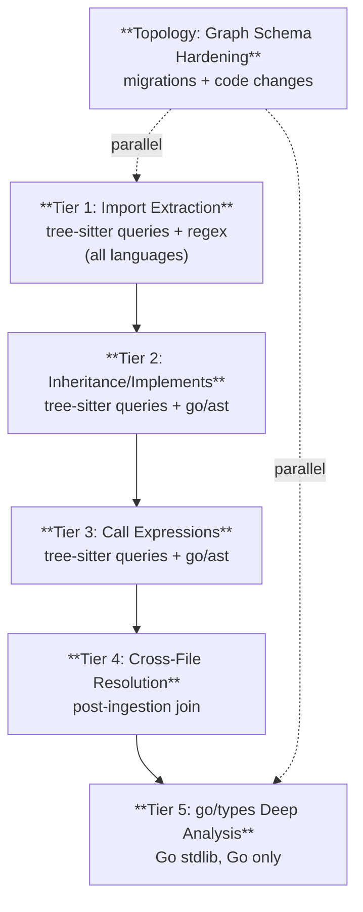

# MDEMG Agent Handoff Document

**Date:** 2026-02-06
**Branch:** `mdemg-dev01`
**Repository:** `/Users/reh3376/mdemg`
**Purpose:** Complete context for continuing development of the MDEMG framework

---

## Table of Contents

1. [Project Overview](#1-project-overview)
2. [Architecture Summary](#2-architecture-summary)
3. [Environment Setup](#3-environment-setup)
4. [Phase Numbering Convention](#4-phase-numbering-convention)
5. [Phase Registry](#5-phase-registry)
6. [Completed Phases (31-33)](#6-completed-phases-31-33)
7. [In-Progress Phases (34+)](#7-in-progress-phases-34)
8. [Planned Phases (35-40)](#8-planned-phases-35-40)
9. [Core Infrastructure Phases (41-52)](#9-core-infrastructure-phases-41-52)
10. [Governance & Testing Frameworks](#10-governance--testing-frameworks)
11. [File Inventory by Domain](#11-file-inventory-by-domain)
12. [Development Principles](#12-development-principles)
13. [Known Issues & Technical Debt](#13-known-issues--technical-debt)
14. [Quick Reference Commands](#14-quick-reference-commands)

---

## 1. Project Overview

**MDEMG** (Multi-Dimensional Emergent Memory Graph) is a long-term memory system for AI agents, built on Neo4j with native vector indexes. It implements a retrieval-augmented memory graph with spreading activation and Hebbian learning.

### Core Purpose

MDEMG provides AI agents with the **ANN equivalent of human internal dialog** — persistent cognitive context that survives across sessions. It stores:

- **Task History** — Decisions made, problems solved, work performed
- **SME Domain Knowledge** — Organization-specific procedures, institutional memory, tribal knowledge

It does **NOT** store general knowledge that LLMs already possess.

### Read First (in order)

| Document | Path | Purpose |
|----------|------|---------|
| Vision | `VISION.md` | Core purpose, architecture philosophy, emergent layer design |
| Architecture | `CLAUDE.md` | Commands, directory structure, environment variables, retrieval pipeline |
| Development Roadmap | `docs/development/DEVELOPMENT_ROADMAP.md` | Feature tracks, benchmarks, retrieval improvements (v4→v11) |
| API Reference | `docs/development/API_REFERENCE.md` | All HTTP endpoints (1,268 lines) |
| Collaboration Plan | `docs/specs/development-space-collaboration.md` | Master plan for DevSpace phases (the Space Transfer pipeline) |

### Technical Invariants (Do NOT Violate)

- **Vector index = recall** (fast candidate generation)
- **Graph = reasoning** (typed edges with evidence)
- **Runtime = activation physics** (spreading activation computed in-memory, NEVER persisted)
- **DB writes = learning deltas only** (bounded, no per-request activation writes)

---

## 2. Architecture Summary

### Technology Stack

| Component | Technology | Notes |
|-----------|-----------|-------|
| Graph DB | Neo4j 5.x | Docker: `docker compose up -d` |
| Backend | Go (latest stable) | Service at `cmd/server/main.go` |
| gRPC | Protocol Buffers | `api/proto/*.proto` |
| Embeddings | OpenAI `text-embedding-3-small` (1536d) / Ollama (768d) | Configurable |
| Plugins | Binary sidecar via gRPC Unix sockets | `plugins/*/` |

### Directory Structure

```
api/
  proto/                    # Proto definitions
    mdemg-module.proto      # Plugin/module protocol
    space-transfer.proto    # Space transfer service
    devspace.proto          # DevSpace hub + messaging
  modulepb/                 # Generated Go (mdemg-module)
  transferpb/               # Generated Go (space-transfer)
  devspacepb/               # Generated Go (devspace)
cmd/
  server/                   # Main MDEMG server
  mcp-server/               # MCP tool server for IDEs
  ingest-codebase/          # Codebase ingestion CLI
  consolidate/              # Consolidation CLI
  decay/                    # Edge weight decay CLI
  space-transfer/           # Space transfer CLI (export/import/serve/pull)
  reset-db/                 # DB cleanup tool
internal/
  api/                      # HTTP handlers + middleware
  anomaly/                  # Anomaly detection on ingest
  ape/                      # Active Participant Engine scheduler
  backup/                   # Neo4j backup & restore (full dump, partial space, scheduler, retention)
  config/                   # Environment-based configuration
  consulting/               # Agent consulting service
  conversation/             # CMS (observe, recall, resume, correct)
  db/                       # Neo4j driver + schema validation
  devspace/                 # DevSpace hub (catalog, broker, server)
  domain/                   # Domain types
  embeddings/               # Embedding clients (OpenAI/Ollama)
  gaps/                     # Capability gap detection
  hidden/                   # Hidden layer abstraction/consolidation
  jobs/                     # Background job tracking
  learning/                 # Hebbian learning (CO_ACTIVATED_WITH)
  models/                   # Request/response types
  observations/             # Observation service
  plugins/                  # Plugin manager + scaffold
  retrieval/                # Core retrieval pipeline (vector + activation + scoring + cache)
  scraper/                  # Web scraper ingestion (types, service, store, parser, dedup)
  summarize/                # LLM summary service
  symbols/                  # Symbol extraction (tree-sitter)
  transfer/                 # Space Transfer (exporter, importer, format, validate, grpc_server)
  validation/               # Request validation
plugins/
  linear-module/            # Linear integration plugin
  reflection-module/        # APE reflection plugin
  keyword-booster/          # Sample reasoning plugin
migrations/                 # Neo4j Cypher migrations (V0001-V0013)
tests/
  integration/              # Integration tests (Neo4j required)
  udts/                     # UDTS contract tests (gRPC)
docs/
  specs/                    # Feature specifications (per-phase)
  architecture/             # Architecture docs (00-14 numbered)
  development/              # Dev guides, roadmap, API reference
  api/api-spec/             # UATS + UDTS specs, schemas, runners
  lang-parser/              # UPTS parser specs (27 languages)
  research/                 # Research papers (GAT, edge attention, etc.)
  benchmarks/               # Benchmark results and scripts
```

### Graph Schema (Core Labels)

| Label | Purpose |
|-------|---------|
| `:TapRoot` | Singleton per `space_id` |
| `:MemoryNode` | Main memory nodes with embeddings (1536-dim default) |
| `:Observation` | Append-only events linked to MemoryNodes |
| `:SymbolNode` | Extracted code symbols (constants, functions, classes) |
| `:SchemaMeta` | Schema version tracking |
| `:CapabilityGap` | Identified retrieval gaps |
| `:InterviewPrompt` | Gap interview prompts |

### Key Relationship Types

| Type | Category | Description |
|------|----------|-------------|
| `ASSOCIATED_WITH` | Associative | Semantic relationship |
| `CO_ACTIVATED_WITH` | Learned | Hebbian-strengthened co-activation |
| `CAUSES`, `ENABLES` | Causal | Causal chains |
| `TEMPORALLY_ADJACENT` | Temporal | Time proximity |
| `ABSTRACTS_TO`, `INSTANTIATES` | Hierarchy | Layer abstraction |
| `HAS_OBSERVATION` | Structural | Node → observation link |
| `DEFINED_IN` | Symbol | Symbol → file link |
| `IMPLEMENTS_CONCERN` | Cross-cutting | Node → concern node |
| `COMPARED_IN` | Comparison | Module → comparison node |
| `IMPLEMENTS_CONFIG` | Config | File → config summary |
| `GENERALIZES` | Hierarchy | Hidden layer generalization |

### Retrieval Pipeline (`internal/retrieval/service.go`)

1. **Vector recall** — Query `memNodeEmbedding` vector index for top-K candidates
2. **Symbol search** — Pattern-match query for symbol names (exact, prefix, fuzzy)
3. **Bounded expansion** — Iterative 1-hop fetch with caps (max depth=3, per-node limit)
4. **Spreading activation** — In-memory computation with decay
5. **Scoring + ranking** — Combine vector similarity (α=0.55), activation (β=0.30), recency (γ=0.10), confidence (δ=0.05), hub penalty (φ=0.08), redundancy (κ=0.12)
6. **Caching** — TTL-LRU cache (98.9% latency improvement on repeated queries)

---

## 3. Environment Setup

### Start Neo4j

```bash
docker compose up -d
# Browser: http://localhost:7474 (neo4j/testpassword)
```

### Apply Migrations

```bash
for f in migrations/V*.cypher; do
  echo "Applying $f"
  docker exec -i mdemg-neo4j cypher-shell -u neo4j -p testpassword < "$f"
done
```

### Run the Go Service

```bash
cd /Users/reh3376/mdemg
export NEO4J_URI=bolt://localhost:7687
export NEO4J_USER=neo4j
export NEO4J_PASS=testpassword
export REQUIRED_SCHEMA_VERSION=4
export VECTOR_INDEX_NAME=memNodeEmbedding
go run ./cmd/server
```

### Run Tests

```bash
# Unit tests
go test ./internal/... -v

# Integration tests (Neo4j must be running)
go test -tags=integration ./tests/integration/... -v

# UDTS contract tests (server must be running on port 50051/50052)
UDTS_TARGET=localhost:50052 go test ./tests/udts/... -v

# Full build check
go build ./... && go vet ./...
```

### Run Space Transfer

```bash
# Export a space to file
go run ./cmd/space-transfer export -space-id demo -output demo.mdemg

# Serve gRPC for remote pulls (+ DevSpace hub)
go run ./cmd/space-transfer serve -port 50052 -enable-devspace -devspace-data-dir ./devspace-data

# Pull from remote
go run ./cmd/space-transfer pull -remote localhost:50052 -space-id demo -output demo.mdemg
```

### Environment Variables

Full list in `CLAUDE.md` — key ones:

| Variable | Default | Description |
|----------|---------|-------------|
| `NEO4J_URI` | required | Bolt connection |
| `NEO4J_USER` / `NEO4J_PASS` | required | Auth |
| `REQUIRED_SCHEMA_VERSION` | required | Must match latest migration |
| `VECTOR_INDEX_NAME` | `memNodeEmbedding` | Vector index name |
| `SCORING_ALPHA` | 0.55 | Vector similarity weight |
| `SCORING_BETA` | 0.30 | Activation weight |
| `QUERY_CACHE_ENABLED` | true | Result caching toggle |
| `QUERY_CACHE_TTL_SECONDS` | 300 | Cache TTL |

---

## 4. Phase Numbering Convention

Phases are organized into **numbered series** to group related work:

| Series | Range | Domain |
|--------|-------|--------|
| **30s** | 31-40 | **Space Transfer & DevSpace Collaboration** — The multi-agent collaboration pipeline |
| **40s** | 41-43 | **Core Engine** — Original infrastructure phases (cleanup, self-ingest, CMS) |
| **50s** | 44-52 | **Advanced Features** — Modular intelligence, symbols, incremental updates, caching, LLM SDK, public readiness |
| **70s** | 70-79 | **Operations & Reliability** — Backup, restore, disaster recovery, monitoring, operational tooling |
| **80s** | 80-89 | **Meta-Cognition & Self-Improvement** — ANN meta-cognition, self-assessment enforcement, adaptive learning |

### Mapping from Old to New

| Old Phase # | New Phase # | Name | Status |
|-------------|-------------|------|--------|
| Phase 1 (Space Transfer) | **Phase 31** | Space Transfer | ✅ Complete |
| Phase 2 (DevSpace Hub) | **Phase 32** | DevSpace Hub + Out-of-Band Distribution | ✅ Complete |
| Phase 3 (Inter-Agent Comms) | **Phase 33** | Inter-Agent Communications | ✅ Complete |
| Phase 4 (Incremental Sync) | **Phase 34** | Incremental Sync (Delta Export) | ✅ Complete |
| Phase 5 (CRDT + Lineage) | **Phase 35** | CRDT for Learned Edges + Space Lineage | ✅ Complete |
| Phase 7 (Observation Forwarding) | **Phase 36** | Selective Observation Forwarding (CMS) | 📋 Planned |
| Phase 8 (Agent Health) | **Phase 37** | Agent Health / Heartbeat / Presence | ✅ Complete |
| — (UNTS) | **Phase 38** | Hash Verification (UNTS / Nash Verification) | 📋 Spec Complete |
| Phase 1 (Cleanup) | **Phase 41** | Space Cleanup | ✅ Complete |
| Phase 2 (Self-Ingest) | **Phase 42** | Self-Ingest MDEMG Codebase | ✅ Complete |
| Phase 3A (CMS Enforcement) | **Phase 43A** | CMS Agent Enforcement | ✅ Complete |
| Phase 3B (CMS Quality) | **Phase 43B** | CMS Quality & Retrieval Improvements | ✅ Complete |
| Phase 3C (Multi-Agent CMS) | **Phase 43C** | Multi-Agent CMS Support | ✅ Complete |
| Phase 4 (Linear CRUD) | **Phase 44** | Linear Integration — Full CRUD + Workflows | ✅ Complete |
| Phase 6 (Modular Intelligence) | **Phase 45** | Modular Intelligence & Active Participation | 🔄 Partial |
| Phase 8 (Symbols) | **Phase 46** | Symbol-Level Indexing | ✅ Complete (8.5-8.6 archived) |
| Phase 9 (Incremental Updates) | **Phase 47** | Incremental Update & Re-Ingestion | 🔄 Partial |
| Phase 10 (Query Optimization) | **Phase 48** | Query Optimization & Caching | ✅ Complete (10.1-10.2) |
| Phase 11 (LLM SDK) | **Phase 49** | LLM Plugin SDK & Self-Improvement | 🔄 Partial |
| Phase 7 (Public Readiness) | **Phase 50** | Public Readiness & Open Source Hardening | 📋 Planned |
| — (Web Scraper) | **Phase 51** | Web Scraper Ingestion Module | ✅ Complete |
| — (CMS Advanced II) | **Phase 60** | CMS Advanced Functionality II | ✅ Complete |
| — (RSIC) | **Phase 60b** | Recursive Self-Improvement Cycle | ✅ Complete |
| — (Constraint Nodes) | **Phase 45.5** | Constraint Detection & Consolidation | ✅ Complete |
| — (Pipeline Registry) | **Phase 46-PR** | Dynamic Pipeline Registry | ✅ Complete |
| — (Skill Registry) | **Phase 48-SR** | CMS Skill Registry API | ✅ Complete |
| — (Neo4j Backup) | **Phase 70** | Neo4j Backup (Full & Partial) with Scheduler | ✅ Complete |
| — (Relationship Extraction) | **Phase 75** | Cross-File Relationship Extraction & Graph Topology Hardening | ✅ Complete |
| — (Neo4j Monitor) | **Phase 76** | Neo4j State Monitor & Space Overview | 📋 Planned |
| — (CMS Meta-Cognition) | **Phase 80** | CMS ANN Meta-Cognition & Self-Improvement Enforcement | ✅ Complete |

---

## 5. Phase Registry

### Status Legend

| Icon | Meaning |
|------|---------|
| ✅ | Complete — implemented, tested, verified |
| 🔄 | In Progress — partially implemented |
| 📋 | Planned — spec exists, no implementation |
| 📦 | Archived — deferred or superseded |

### Quick Status Table

| Phase | Name | Status | Spec File |
|-------|------|--------|-----------|
| 31 | Space Transfer | ✅ | `docs/specs/space-transfer.md` |
| 32 | DevSpace Hub | ✅ | `docs/specs/phase-devspace-hub.md` |
| 33 | Inter-Agent Comms | ✅ | `docs/specs/phase3-inter-agent-comms.md` |
| 34 | Incremental Sync | ✅ | `docs/specs/phase4-incremental-sync.md` |
| 35 | CRDT + Lineage | ✅ | `docs/specs/development-space-collaboration.md` §Phase 5 |
| 36 | Observation Forwarding | 📋 | `docs/specs/development-space-collaboration.md` §Phase 7 |
| 37 | Agent Health / Presence | ✅ | `docs/specs/development-space-collaboration.md` §Phase 8 |
| 38 | UNTS Hash Verification | 📋 | `docs/specs/unts-hash-verification.md` (spec complete, implementation not started) |
| 41 | Space Cleanup | ✅ | `docs/specs/phase1-space-cleanup.md` |
| 42 | Self-Ingest | ✅ | `docs/specs/phase2-self-ingest.md` |
| 43A | CMS Enforcement | ✅ | `docs/specs/phase3a-cms-enforcement.md` |
| 43B | CMS Quality | ✅ | `docs/specs/phase3b-cms-quality.md` |
| 43C | Multi-Agent CMS | ✅ | `docs/specs/phase3c-multi-agent.md` |
| 44 | Linear CRUD | ✅ | `docs/specs/phase4-linear-crud.md` |
| 45 | Modular Intelligence | 🔄 | `docs/development/DEVELOPMENT_ROADMAP.md` §Phase 6 |
| 46 | Symbol Indexing | ✅ | `docs/development/DEVELOPMENT_ROADMAP.md` §Phase 8 |
| 47 | Incremental Updates | 🔄 | `docs/development/DEVELOPMENT_ROADMAP.md` §Phase 9 |
| 48 | Query Optimization | ✅ | `docs/development/DEVELOPMENT_ROADMAP.md` §Phase 10 |
| 49 | LLM Plugin SDK | 🔄 | `docs/development/DEVELOPMENT_ROADMAP.md` §Phase 11 |
| 50 | Public Readiness | 📋 | `docs/development/repo-to-public-roadmap.md` |
| 51 | Web Scraper Ingestion | ✅ | `docs/specs/phase51-web-scraper-ingestion.md` |
| 60 | CMS Advanced II | ✅ | `docs/specs/phase60-cms-advanced-ii.md` |
| 60b | Recursive Self-Improvement Cycle (RSIC) | ✅ | `docs/specs/phase60b-rsic.md` |
| 45.5 | Constraint Detection & Consolidation | ✅ | `internal/hidden/constraint_nodes.go`, `internal/conversation/constraint_detector.go` |
| 46-PR | Dynamic Pipeline Registry | ✅ | `docs/development/REGISTRY.md` |
| 70 | Neo4j Backup (Full & Partial) with Scheduler | ✅ | `docs/specs/phase70-neo4j-backup.md` |
| 75 | Cross-File Relationship Extraction & Graph Topology Hardening | ✅ | `docs/specs/phase75-relationship-extraction.md` |
| 75C | L5 Emergent Layer — Unblock Emergence | ✅ | `docs/features/l5-emergent-layer.md` |
| 76 | Neo4j State Monitor & Space Overview | 📋 | Planned |
| 80 | CMS ANN Meta-Cognition & Self-Improvement Enforcement | 📋 | Planned |

---

## 6. Completed Phases (31-33)

### Phase 31: Space Transfer ✅

**Spec:** `docs/specs/space-transfer.md`
**Master Plan:** `docs/specs/development-space-collaboration.md` §Phase 1

**What it does:** Enables sharing mature MDEMG space_id graphs between developer environments via gRPC streaming or file export/import.

**Key files:**

| File | Purpose |
|------|---------|
| `api/proto/space-transfer.proto` | gRPC service definition (Export, Import, ListSpaces, SpaceInfo) |
| `api/transferpb/*.pb.go` | Generated Go code |
| `internal/transfer/exporter.go` | Neo4j → chunks (with ProgressFunc, delta support) |
| `internal/transfer/importer.go` | Chunks → Neo4j (skip/overwrite/error conflict modes) |
| `internal/transfer/format.go` | File I/O (`.mdemg` JSON format) |
| `internal/transfer/validate.go` | Schema version validation |
| `internal/transfer/grpc_server.go` | gRPC SpaceTransfer server |
| `internal/transfer/format_test.go` | Unit tests (round-trip, embeddings, ExportFromRequest, Phase 34 delta) |
| `cmd/space-transfer/main.go` | CLI (export, import, list, info, serve, pull, profiles, git check) |
| `tests/integration/transfer_test.go` | Integration tests |
| `tests/udts/contract_test.go` | UDTS contract tests (ListSpaces, SpaceInfo, ExportDelta) |
| `docs/api/api-spec/udts/specs/space_transfer_*.udts.json` | UDTS specs |

**Capabilities:**
- File export/import with `.mdemg` format
- gRPC streaming (serve/pull)
- Export profiles: `full`, `codebase`, `cms`, `learned`, `metadata`
- Conflict modes: `skip`, `overwrite`, `error`
- Progress reporting, pre-export git check
- Schema version validation

---

### Phase 32: DevSpace Hub + Out-of-Band Distribution ✅

**Spec:** `docs/specs/phase-devspace-hub.md`
**Master Plan:** `docs/specs/development-space-collaboration.md` §Phase 2

**What it does:** Named collaboration groups ("DevSpaces") with registered agents. Agents publish exports to the hub; other members list and pull exports.

**Key files:**

| File | Purpose |
|------|---------|
| `api/proto/devspace.proto` | DevSpace service (RegisterAgent, ListExports, PullExport, Connect) |
| `api/devspacepb/*.pb.go` | Generated Go code |
| `internal/devspace/catalog.go` | In-memory catalog (agents, exports) |
| `internal/devspace/server.go` | gRPC DevSpace server |
| `internal/devspace/broker.go` | Message broker for inter-agent messaging (Phase 33) |
| `cmd/space-transfer/main.go` | `-enable-devspace` flag, `-devspace-data-dir` |
| `docs/api/api-spec/udts/specs/devspace_*.udts.json` | UDTS specs (register_agent, list_exports, pull_export) |

**RPCs:** `RegisterAgent`, `DeregisterAgent`, `ListExports`, `PublishExport`, `PullExport`

---

### Phase 33: Inter-Agent Communications ✅

**Spec:** `docs/specs/phase3-inter-agent-comms.md`
**Master Plan:** `docs/specs/development-space-collaboration.md` §Phase 3

**What it does:** Bidirectional gRPC streaming for agent-to-agent messaging within a DevSpace. Agents connect to the hub and exchange `AgentMessage` payloads (context, bugs, notifications).

**Key files:**

| File | Purpose |
|------|---------|
| `api/proto/devspace.proto` | `Connect(stream AgentMessage) returns (stream AgentMessage)` |
| `internal/devspace/broker.go` | In-memory message broker; routes by `dev_space_id` + optional `topic` |
| `internal/devspace/server.go` | `Connect` handler |
| `docs/api/api-spec/udts/specs/devspace_connect.udts.json` | UDTS spec |
| `tests/udts/contract_test.go` | `TestDevSpaceConnect` |

---

## 7. Recently Completed Phases

### Phase 34: Incremental Sync (Delta Export) ✅

**Completed:** 2026-02-06
**Spec:** `docs/specs/phase4-incremental-sync.md`
**Master Plan:** `docs/specs/development-space-collaboration.md` §Phase 4

**What it does:** Export/import only changes since a given timestamp or cursor, reducing payload for frequent syncs.

**All tasks complete:**
- [x] Proto: `ExportRequest` extended with `since_timestamp` (field 9) and `since_cursor` (field 10)
- [x] Proto: `TransferSummary` extended with `next_cursor` (field 8)
- [x] Exporter: All `fetch*Batch` functions filter by `updated_at`/`created_at`/`timestamp` when `since` is set
- [x] Exporter: `countEntities` filters by since for accurate delta counts
- [x] Exporter: Summary chunk sets `next_cursor = completedAt` for delta exports
- [x] CLI: `-since-timestamp` and `-since-cursor` flags; prints "Next cursor for delta" to stderr
- [x] Unit test: `TestExportFromRequest_Phase4Delta` (passes)
- [x] Integration test: `TestTransferDeltaExport` (passes)
- [x] UDTS spec: `space_transfer_export_delta.udts.json` (added)
- [x] UDTS test: `TestSpaceTransferExportDelta` (added)
- [x] Import idempotency verified: Uses MERGE for nodes/edges (no duplicates)
- [x] Run UDTS test against live server: 7/7 tests pass
- [x] User verification of delta export/import end-to-end

**Key files:**

| File | Purpose |
|------|---------|
| `internal/transfer/exporter.go` | Delta filtering in `countEntities`, `fetchNodeBatch`, `fetchEdgeBatch`, `fetchObservationBatch`, `fetchSymbolBatch`; `NextCursor` in summary |
| `internal/transfer/importer.go` | Idempotent MERGE for nodes (node_id) and edges (relationship keys) |
| `internal/transfer/format_test.go` | `TestExportFromRequest_Phase4Delta` |
| `tests/integration/transfer_test.go` | `TestTransferDeltaExport` |
| `tests/udts/contract_test.go` | `TestSpaceTransferExportDelta` |
| `docs/api/api-spec/udts/specs/space_transfer_export_delta.udts.json` | UDTS spec |
| `cmd/space-transfer/main.go` | `-since-timestamp`, `-since-cursor` flags |

---

### UOBS: Embedding Health Monitor ✅

**Added:** 2026-02-06

Extended the UOBS (Universal Observability Specification) framework to include embedding model health monitoring with active probe validation.

**Components:**

| Component | Path | Description |
|-----------|------|-------------|
| Schema | `docs/tests/uobs/schema/uobs.schema.json` | Added "dependency" test type |
| Spec | `docs/tests/uobs/specs/embedding_health.uobs.json` | Embedding health validation spec |
| Handler | `internal/api/handlers.go` | `handleEmbeddingHealth()` function |
| Runner | `docs/tests/uobs/runners/uobs_runner.py` | Added `run_dependency_test()` |

**API Endpoint: `GET /v1/embedding/health`**

Returns embedding provider health status with active probe validation.

```json
{
  "status": "healthy",
  "provider": "openai",
  "model": "text-embedding-ada-002",
  "dimensions": 1536,
  "latency_ms": 923,
  "cache_enabled": true,
  "success_rate_24h": 100,
  "error_count_24h": 0,
  "circuit_breaker": "closed",
  "configured_env_var": true
}
```

**Health Checks (8 total):**
- `embedding_connectivity` — Endpoint reachable
- `embedding_status` — Status is healthy/degraded
- `embedding_active_probe` — Actually generates embedding
- `embedding_latency_threshold` — Latency <= 2000ms
- `embedding_success_rate` — Success rate >= 99%
- `embedding_error_rate` — Error rate <= 1%
- `embedding_configuration` — Env vars and dimensions valid
- `embedding_circuit_breaker` — Circuit breaker closed

---

## 8. Recently Completed DevSpace Phases (35-38)

### Phase 35: CRDT for Learned Edges + Space Lineage ✅

**Completed:** 2026-02-06
**Master Plan:** `docs/specs/development-space-collaboration.md` §Phase 5

**What it does:** CO_ACTIVATED_WITH edges merge with CRDT semantics (max weight, sum evidence_count) so concurrent updates from multiple agents don't lose data. Space lineage tracks origin, merges, and who shared what.

**Key Files:**

| Component | Location | Description |
|-----------|----------|-------------|
| CRDT conflict mode | `api/proto/space-transfer.proto` | `CONFLICT_CRDT = 3` enum value |
| Lineage messages | `api/proto/space-transfer.proto` | `Lineage`, `LineageEvent` messages |
| CRDT importer | `internal/transfer/importer.go` | Merge logic for edges |
| Exporter lineage | `internal/transfer/exporter.go` | Records origin in exports |
| Tests | `internal/transfer/crdt_test.go` | 7 test functions |
| UDTS spec | `docs/api/api-spec/udts/specs/space_transfer_crdt.udts.json` | Contract tests |

**CRDT Merge Semantics:**
- `evidence_count`: Sum (additive)
- `weight`: Max (last-writer-wins for dimension weights)
- `dim_temporal`, `dim_semantic`, `dim_causal`: Preserved in EdgeData

---

### Phase 36: Selective Observation Forwarding (CMS) 📋

**Master Plan:** `docs/specs/development-space-collaboration.md` §Phase 7

**Goal:** Agents mark observations as "team-visible" or forward selected observations into a shared DevSpace feed.

**Deliverables:**
- Proto: `ForwardObservation` or extend CMS observe with `visibility: team` and DevSpace target
- Implementation: store/route observations to DevSpace feed; recall filters by visibility
- UDTS specs and tests

**Dependencies:** Phase 32 (DevSpace) and existing CMS (Phase 43A-C).

---

### Phase 37: Agent Health / Heartbeat / Presence ✅

**Completed:** 2026-02-06
**Master Plan:** `docs/specs/development-space-collaboration.md` §Phase 8

**What it does:** Agents in a DevSpace have online/away/offline status via heartbeat. Bounded offline queue for disconnected agents.

**Key Files:**

| Component | Location | Description |
|-----------|----------|-------------|
| Proto definitions | `api/proto/devspace.proto` | `Heartbeat`, `GetPresence`, `SetQueueConfig`, `QueueMessage`, `DrainQueue` RPCs |
| Catalog storage | `internal/devspace/catalog.go` | `last_heartbeat` per agent |
| Server handlers | `internal/devspace/server.go` | Presence endpoint, queue management |
| Tests | `internal/devspace/presence_test.go` | 39 test functions (100% coverage) |
| UDTS spec | `docs/api/api-spec/udts/specs/devspace_presence.udts.json` | Contract tests |

**Presence Thresholds:**
- Online: < 30 seconds since heartbeat
- Away: 30 seconds - 5 minutes
- Offline: > 5 minutes

**Offline Queue:** Configurable max size (disabled, limited, unlimited)

---

### Phase 38: UNTS Hash Verification (Nash Verification) ✅

**Completed:** 2026-02-06
**Spec:** `docs/specs/unts-hash-verification.md`

**What it does:** Central registry + API for hash verification of all framework-protected files. Current + historical (last 3) hashes per file. Revert capability.

**Key Files:**

| Component | Location | Description |
|-----------|----------|-------------|
| Proto definitions | `api/proto/unts.proto` | 7 RPCs for hash verification |
| Generated code | `api/untspb/` | Generated Go code |
| Registry | `docs/specs/unts-registry.json` | JSON registry format |
| Scanners | `internal/unts/scanner.go` | Ingest from manifest.sha256 and UDTS specs |
| Core logic | `internal/unts/registry.go` | VerifyNow, UpdateHash, RevertToPreviousHash |
| gRPC server | `internal/unts/server.go` | Service implementation |
| Tests | `internal/unts/registry_test.go` | 10 test functions |
| UDTS spec | `docs/api/api-spec/udts/specs/unts_hash_verification.udts.json` | Contract tests |

**gRPC RPCs:**
- `ListVerifiedFiles` — List all tracked files
- `GetFileStatus` — Get current hash and status
- `GetHashHistory` — Get last 3 hashes
- `RevertToPreviousHash` — Roll back to previous hash
- `UpdateHash` — Update current hash
- `VerifyNow` — Trigger verification
- `RegisterTrackedFile` — Add new file to tracking

---

### Phase 60: CMS Advanced Functionality II ✅

**Completed:** 2026-02-07
**Spec:** `docs/specs/phase60-cms-advanced-ii.md`

**What it does:** Enhanced CMS with structured observations, intelligent resume, and context window optimization for LLM coding agents.

**Key Files:**

| Component | Location | Description |
|-----------|----------|-------------|
| Templates Service | `internal/conversation/templates.go` | Template CRUD with JSON Schema validation |
| Snapshot Service | `internal/conversation/snapshot.go` | Task context snapshot capture |
| Relevance Scoring | `internal/conversation/relevance.go` | Recency, importance, task-relevance scoring |
| Smart Truncation | `internal/conversation/truncation.go` | Tiered resume with token budget |
| Org Review Service | `internal/conversation/org_review.go` | Flag/approve/reject workflow |
| API Handlers | `internal/api/server.go` | Route registration for all Phase 60 endpoints |
| UATS Specs | `docs/api/api-spec/uats/specs/cms_*.uats.json` | 15 API contract tests |

**Features Implemented (All P0):**

| Feature | Description |
|---------|-------------|
| **Observation Templates** | Predefined schemas stored in Neo4j sub-space with JSON Schema validation |
| **Task Context Snapshots** | Auto-capture task state before compaction/session end with manual trigger |
| **Resume Relevance Scoring** | Score by recency (0.3), importance (0.4), task-relevance (0.3) with configurable weights |
| **Smart Truncation** | Tiered resume (critical/important/background), token budget enforcement |
| **Org-Level Flagging** | Alert user for review before org-level ingestion with approve/reject workflow |

**API Endpoints (15 total):**

Templates:
- `GET/POST /v1/conversation/templates` — List/Create templates
- `GET/PUT/DELETE /v1/conversation/templates/{id}` — Get/Update/Delete template

Snapshots:
- `GET/POST /v1/conversation/snapshots` — List/Create snapshots
- `GET /v1/conversation/snapshots/{id}` — Get snapshot
- `GET /v1/conversation/snapshots/latest` — Get latest for session
- `DELETE /v1/conversation/snapshots/{id}` — Delete snapshot
- `POST /v1/conversation/snapshots/cleanup` — Clean up old snapshots

Org Reviews:
- `GET /v1/conversation/org-reviews` — List pending reviews
- `GET /v1/conversation/org-reviews/stats` — Review statistics
- `POST /v1/conversation/org-reviews/flag` — Flag for review
- `POST /v1/conversation/org-reviews/decision` — Approve/reject decision

**UATS Test Coverage:** 15/15 specs passing (100% conformance)

**Relevance Scoring Formula:**
```
score = (recency_weight × recency_score) +
        (importance_weight × importance_score) +
        (task_relevance_weight × task_relevance_score)
```

**Truncation Tiers:**
- Critical (40% budget): Corrections, errors, recent decisions
- Important (35% budget): Task context, active learnings
- Background (25% budget): Older observations, summarized

---

### Phase 60b: Recursive Self-Improvement Cycle (RSIC) ✅

**Completed:** 2026-02-07
**Priority:** Critical (Highest)
**Spec:** `docs/specs/phase60b-rsic.md`
**Dependencies:** Phase 60 (CMS Advanced II), Phase 43A (CMS Enforcement), Phase 45.5 (APE Scheduler)

**What it does:** Forces LLM coding agents to run programmatically-defined recursive self-improvement cycles. The system assesses its own knowledge quality, reflects on gaps and degradation, plans remediation, delegates execution to background agents, and validates improvement — all autonomously within defined safety bounds. A decay watchdog enforces cycle compliance: if the agent fails to complete a cycle within the configured period, escalating pressure forces execution automatically.

**Design Philosophy:**
- **Layered approach**: Enforced discipline first (mandatory cycles), architected toward autonomous cognition as trust increases
- **MDEMG-first, portable later**: Deep integration with Neo4j/learning/hidden layer now; clean `SelfImprovementCycle` interface for future protocol abstraction
- **Full autonomy within safety bounds**: System prunes, merges, re-weights, and restructures without human approval, bounded by per-cycle limits and protected space rules

#### Core Loop: 5-Stage RSIC

```
ORCHESTRATOR (main agent)              BACKGROUND AGENTS
─────────────────────────              ─────────────────
  1. ASSESS   (inline)
  2. REFLECT  (inline)
  3. PLAN     (inline)
         │
         ├── dispatch ──────────→  Agent 1: prune_decayed_edges
         ├── dispatch ──────────→  Agent 2: trigger_consolidation
         ├── dispatch ──────────→  Agent 3: fill_knowledge_gap
         │
         │   ← progress report ──  Agent 1: 50% complete
         │   (user interaction continues)
         │   ← final report ─────  Agent 2: COMPLETE
         │   ← final report ─────  Agent 1: COMPLETE
         │   ← final report ─────  Agent 3: COMPLETE
         │
  4. VALIDATE (reviews reports + checks metrics)
  5. RECORD   (persists cycle outcome as CMS observation)
         │
         └── reset watchdog decay timer
```

Stages 1-3 and 5 run **inline** on the orchestrator. Stage 4 (Execute) is **delegated** to background agents via standardized task specs. The orchestrator monitors progress via periodic summary reports while remaining available for user interaction.

#### Three Cycle Tiers

| Tier | Period | Trigger | Scope |
|------|--------|---------|-------|
| **Micro** | Per-session (start + end) | `session_start`, `session_end` | Quick health pulse: distribution stats, volatile counts, correction rate since last session |
| **Meso** | Every N sessions or T hours (default: 6hr / 5 sessions) | APE cron + session counter | Full self-assessment: retrieval quality, knowledge gaps, edge health, calibration update |
| **Macro** | Daily (default: `0 3 * * *`) | APE cron | Comprehensive: memory structure review, hidden layer re-consolidation, topology optimization, long-term trend analysis |

#### Stage 1: ASSESS (`internal/ape/self_assess.go`)

Gathers quantitative metrics from all subsystems into a `SelfAssessmentReport`:

**Retrieval Quality Metrics:**
- Relevance score distribution (P25/P50/P75/P95) from recent queries
- Knowledge gap count and trend (from `/v1/system/capability-gaps`)
- Cache hit ratio trend
- Recall coverage (% of queries returning >= threshold results)

**Task Performance Metrics:**
- Correction rate: `corrections / total_observations` (rolling window)
- Re-work rate: observations that correct previous observations
- Decision reversal rate: decisions that contradict earlier decisions
- User satisfaction signal: implicit from correction frequency decay

**Memory Health Metrics:**
- Learning phase and edge count (from distribution stats)
- Orphan node ratio (unconnected / total)
- Volatile observation backlog (pending graduation)
- Consolidation freshness (time since last hidden layer rebuild)
- Embedding coverage (% nodes with valid embeddings)
- Edge weight entropy (healthy = distributed, unhealthy = clustered at extremes)

**Self-Reported Confidence:**
- Per-observation confidence scores (predicted utility)
- Validated against: was the observation recalled? Was it corrected?
- Calibration score: correlation between predicted and actual utility

#### Stage 2: REFLECT (`internal/ape/self_reflect.go`)

Analyzes the assessment report to identify actionable patterns:

- **Degradation detection**: Metrics trending downward across cycles
- **Blind spot identification**: Topics with high gap counts but low observation coverage
- **Saturation detection**: Learning phase approaching/at saturation
- **Stale knowledge detection**: High-confidence nodes not accessed or validated recently
- **Structural imbalance**: Hub nodes with excessive edges, orphan clusters
- **Calibration drift**: Self-reported confidence diverging from actual outcomes

Uses the existing `/v1/memory/reflect` endpoint internally for topic-specific introspection. Produces `ReflectionInsights` — a prioritized list of findings with severity and recommended action category.

#### Stage 3: PLAN (`internal/ape/improvement_plan.go`)

Generates concrete `ImprovementAction` items and builds standardized `RSICTaskSpec` for each:

| Action Type | Trigger Condition |
|------------|-------------------|
| `prune_decayed_edges` | Edge count > saturation threshold or low-weight accumulation |
| `prune_excess_edges` | Hub nodes exceeding per-node edge cap |
| `graduate_volatile` | Stable volatile observations past threshold |
| `tombstone_stale` | Observations not accessed in N days with low importance |
| `trigger_consolidation` | Orphan ratio > threshold or consolidation stale |
| `re_weight_scoring` | Calibration drift detected |
| `fill_knowledge_gap` | High-priority gap identified |
| `merge_redundant_concepts` | Hidden layer concepts with high cosine similarity |
| `refresh_stale_edges` | Stale co-activation edges need recalculation |
| `adjust_cycle_period` | Meso/macro frequency tuning based on change velocity |

**Safety Bounds (hardcoded):**
- Max nodes pruned per cycle: 5% of total
- Max edges pruned per cycle: 10% of total
- Protected spaces (`mdemg-dev`) never modified destructively
- All actions logged with before/after snapshots
- Rollback window: last 3 cycles retained

#### Standardized Task Specification (RSICTaskSpec)

Every background agent receives a fully self-contained task spec:

```go
type RSICTaskSpec struct {
    // Identity
    TaskID             string              // "rsic-meso-20260207-prune-01"
    CycleID            string              // parent cycle ID
    ActionType         string              // "prune_decayed_edges"

    // Purpose
    Purpose            string              // human-readable rationale
    TriggerInsight     string              // reflection insight that caused this
    AssessmentContext   *AssessmentSummary  // relevant metrics snapshot

    // Scope
    TargetSpaceID      string
    Scope              TaskScope           // nodes, edges, or graph region

    // Tools (explicit allowlist)
    AllowedEndpoints   []EndpointSpec      // method, path, purpose, allowed params

    // Safety
    SafetyBounds       SafetyBounds        // max affected, protected spaces, dry_run_first, require_snapshot

    // Deliverables
    Deliverables       []Deliverable       // name, description, format (json/markdown/metric), required
    SuccessCriteria    []Criterion         // metric, operator, threshold

    // Reporting
    ReportingSchedule  ReportSchedule      // interval_type (time/progress/milestone), interval, milestones

    // Constraints
    Timeout            time.Duration
    Priority           string              // "low" | "medium" | "high"
    RollbackPlan       string              // instructions if things go wrong
    BaselineMetrics    map[string]float64  // before-state for validation
}
```

**Agent Progress Reports** (periodic, at intervals defined in task spec):

```go
type RSICProgressReport struct {
    TaskID           string
    CycleID          string
    Timestamp        time.Time
    Status           string              // "in_progress" | "completed" | "failed" | "blocked"
    ProgressPct      int                 // 0-100
    Milestone        string              // current milestone
    ActionsCompleted int
    ActionsRemaining int
    Summary          string              // human-readable narrative
    MetricsDelta     map[string]float64  // running comparison vs baseline
    Warnings         []string
    Errors           []string
    Deliverables     map[string]any      // final reports only
    RollbackNeeded   bool
}
```

The orchestrator reads these reports while remaining available for user interaction. It can cancel, redirect, or escalate agents based on report content.

#### Stage 4: VALIDATE (`internal/ape/calibration.go`)

After all background agents complete, the orchestrator:

- **Immediate validation**: Collects final reports, checks `SuccessCriteria` for each task
- **Metric comparison**: Compares `BaselineMetrics` → current metrics across all actions
- **Deferred validation**: Next cycle checks if improvements held (no regression)
- **Calibration update**: Adjusts confidence in each action type based on historical success rate
- **Meta-learning**: Tracks which action types consistently produce improvement — future planning prioritizes proven actions

#### Decay Watchdog (`internal/ape/watchdog.go`)

A background goroutine enforces cycle compliance. If the agent doesn't complete a self-improvement cycle within the configured period, escalating pressure forces execution.

**Decay Function:**
```
decay_score = (time_since_last_cycle / cycle_period) * decay_rate
```
Ranges from 0.0 (just completed) to 1.0 (fully overdue). Persisted on TapRoot node (`rsic_last_cycle` property) so it survives server restarts.

**Escalation Levels:**

| Level | Decay Range | Behavior |
|-------|------------|----------|
| **0 — Nominal** | 0.0–0.3 | No action. System healthy. |
| **1 — Nudge** | 0.3–0.6 | Injects `rsic_overdue: true` into `/v1/conversation/resume` response. Agent sees "Self-improvement cycle due" in restored context. |
| **2 — Warn** | 0.6–0.9 | Session health score penalized. `X-MDEMG-Warning: rsic-overdue` header on all API responses. APE fires `rsic_overdue` event. |
| **3 — Force** | ≥ 0.9 | Watchdog auto-dispatches full RSIC cycle via APE scheduler. No agent cooperation required. Forced execution logged as `error` observation. |

Completing any cycle tier resets the watchdog to Level 0.

#### API Endpoints (7 new)

| Method | Path | Purpose |
|--------|------|---------|
| `POST` | `/v1/self-improve/assess` | Trigger on-demand assessment (specify tier) |
| `GET` | `/v1/self-improve/report` | Latest assessment report |
| `GET` | `/v1/self-improve/report/{cycle_id}` | Specific cycle report |
| `POST` | `/v1/self-improve/cycle` | Trigger full RSIC cycle (assess→validate) |
| `GET` | `/v1/self-improve/history` | Cycle history with outcomes |
| `GET` | `/v1/self-improve/calibration` | Calibration metrics and confidence scores |
| `GET` | `/v1/self-improve/health` | Aggregate self-improvement health score + watchdog status |

#### Portability Interface

The cycle is defined as a clean Go interface for future protocol abstraction:

```go
type SelfImprovementCycle interface {
    Assess(ctx context.Context, tier CycleTier) (*AssessmentReport, error)
    Reflect(ctx context.Context, report *AssessmentReport) (*ReflectionInsights, error)
    Plan(ctx context.Context, insights *ReflectionInsights) ([]ImprovementAction, error)
    Dispatch(ctx context.Context, actions []ImprovementAction) ([]TaskHandle, error)
    Monitor(ctx context.Context, handles []TaskHandle) (<-chan ProgressReport, error)
    Validate(ctx context.Context, results []ExecutionResult) (*CycleOutcome, error)
}
```

MDEMG implements this natively. Future portable spec (USIC — Universal Self-Improvement Cycle) would define the interface at the protocol level for adoption by any LLM coding agent.

#### Key Files

| File | Purpose |
|------|---------|
| `internal/ape/self_assess.go` | Assessment engine — gathers metrics from all subsystems |
| `internal/ape/self_reflect.go` | Reflection engine — pattern detection, gap analysis |
| `internal/ape/improvement_plan.go` | Planning engine — generates task specs from insights |
| `internal/ape/task_spec.go` | RSIC Task Specification types and builder |
| `internal/ape/task_dispatch.go` | Dispatches task specs to background agents, tracks active tasks |
| `internal/ape/task_monitor.go` | Reads progress reports, aggregates status, alerts on failures |
| `internal/ape/calibration.go` | Validation engine — calibration, meta-learning |
| `internal/ape/watchdog.go` | Decay watchdog — timer, escalation, forced trigger |
| `internal/ape/cycle.go` | Cycle orchestrator — runs inline stages, dispatches execute, monitors |
| `internal/ape/types_rsic.go` | All RSIC types (report, insights, actions, task spec, progress) |
| `internal/api/handlers_self_improve.go` | HTTP handlers for 7 new endpoints |
| `docs/specs/phase60b-rsic.md` | Full specification document |
| `docs/api/api-spec/uats/specs/self_improve_*.uats.json` | UATS specs for all endpoints |

#### Configuration

```bash
# Cycle Periods
RSIC_MICRO_ENABLED=true
RSIC_MESO_PERIOD_HOURS=6              # or RSIC_MESO_PERIOD_SESSIONS=5
RSIC_MACRO_CRON="0 3 * * *"           # daily at 3am

# Safety Bounds
RSIC_MAX_NODE_PRUNE_PCT=5             # max 5% nodes per cycle
RSIC_MAX_EDGE_PRUNE_PCT=10            # max 10% edges per cycle
RSIC_ROLLBACK_WINDOW=3                # retain last 3 cycles for rollback

# Watchdog
RSIC_WATCHDOG_ENABLED=true
RSIC_WATCHDOG_CHECK_INTERVAL_SEC=60   # how often watchdog ticks
RSIC_WATCHDOG_DECAY_RATE=1.0          # 1.0=linear, >1.0=aggressive, <1.0=lenient
RSIC_WATCHDOG_NUDGE_THRESHOLD=0.3     # Level 1
RSIC_WATCHDOG_WARN_THRESHOLD=0.6      # Level 2
RSIC_WATCHDOG_FORCE_THRESHOLD=0.9     # Level 3

# Calibration
RSIC_CALIBRATION_WINDOW_DAYS=7        # rolling window for calibration scoring
RSIC_MIN_CONFIDENCE_THRESHOLD=0.3     # below this, action type is deprioritized
```

---

### Phase 45.5: Constraint Detection & Consolidation ✅

**Completed:** 2026-02-07

**What it does:** Detects constraint-tagged observations (`constraint:*` tags) and promotes them to first-class constraint nodes (`role_type='constraint'`) during consolidation. Linked via `IMPLEMENTS_CONSTRAINT` edges. Constraint detection runs automatically during `POST /v1/conversation/observe` and during consolidation.

**Key Files:**

| File | Purpose |
|------|---------|
| `internal/hidden/constraint_nodes.go` | `CreateConstraintNodes()` — promotes tagged observations to constraint nodes |
| `internal/conversation/constraint_detector.go` | Auto-detects constraints in observation content |
| `internal/conversation/constraint_detector_test.go` | Unit tests for constraint detection |
| `docs/api/api-spec/uats/specs/constraints_list.uats.json` | UATS spec for constraint list endpoint |
| `docs/api/api-spec/uats/specs/constraints_stats.uats.json` | UATS spec for constraint stats endpoint |

**Context Cooler (Volatile Observation Graduation):**

Manages the lifecycle of volatile observations — reinforcement, stability decay, graduation to permanent memory, and tombstoning of stale observations.

| File | Purpose |
|------|---------|
| `internal/conversation/cooler.go` | Core: reinforcement, graduation, decay, tombstoning (439 lines) |
| `internal/conversation/cooler_test.go` | Unit tests (213 lines) |
| `plugins/context-cooler/main.go` | APE plugin (gRPC, scheduled execution) (341 lines) |
| `internal/api/handlers_conversation.go` | API handlers for volatile stats and graduation |

**Endpoints:**
- `GET /v1/conversation/volatile/stats` — Volatile observation statistics
- `POST /v1/conversation/graduate` — Trigger graduation processing (decay + graduate + tombstone)

**Configuration:**
- `COOLER_REINFORCEMENT_WINDOW_HOURS` (default: 2)
- `COOLER_STABILITY_INCREASE_PER_REINFORCEMENT` (default: 0.15)
- `COOLER_STABILITY_DECAY_RATE` (default: 0.1/day)
- `COOLER_TOMBSTONE_THRESHOLD` (default: 0.05)
- `COOLER_GRADUATION_THRESHOLD` (default: 0.8)

**UATS:** 79 specs, 133 variants, 133 passing (100%).

---

### Phase 46-PR: Dynamic Pipeline Registry ✅

**Completed:** 2026-02-07
**Spec:** `docs/development/REGISTRY.md`

**What it does:** Replaces duplicated consolidation node-creation logic (4-file shotgun surgery per new node type) with a self-registering `NodeCreator` pipeline. Adding a new node type is now a 2-file operation: create the step adapter file and register it in `buildPipeline()`.

**Key Files:**

| File | Purpose |
|------|---------|
| `internal/hidden/pipeline.go` | `NodeCreator` interface, `Pipeline` struct, `StepResult`, `PipelineResult` |
| `internal/hidden/pipeline_test.go` | 8 unit tests (phase ordering, aggregation, error handling, skip map) |
| `internal/hidden/step_*.go` | 7 step adapters (hidden, concern, config, comparison, temporal, ui, constraint) |
| `internal/hidden/service.go` | `buildPipeline()`, `RunNodeCreationPipeline()`, rewired `RunConsolidation()` |
| `internal/api/handlers.go` | Single pipeline call replaces 7 individual step calls |
| `internal/models/models.go` | `StepResultAPI` + `Steps` map on `ConsolidateResponse` |

**API Change:** `POST /v1/memory/consolidate` response now includes `"steps"` map (dynamic, auto-expands). All flat fields preserved for backward compatibility.

**UATS:** 79 specs, 133 variants, 133 passing (100%).

---

### Phase 48-SR: CMS Skill Registry API ✅

**Status:** Complete
**Priority:** High (structural dependency for all CMS-backed skills)

**What it does:** Standardizes skill creation/recall as a first-class API surface. Skills are CMS pinned observations with `skill:<name>` tags. Thin skill files in `.claude/skills/` are pointers that recall from CMS. Without CMS, skills cannot function.

**Key Files:**
| File | Description |
|------|-------------|
| `internal/api/handlers_skills.go` | List, recall, and register handlers |

**Endpoints:**
| Method | Path | Description |
|--------|------|-------------|
| `GET` | `/v1/skills?space_id=X` | List registered skills (from pinned observations) |
| `POST` | `/v1/skills/{name}/recall` | Recall skill content by tag (direct Cypher) |
| `POST` | `/v1/skills/{name}/register` | Register skill sections as pinned observations |

**Design decisions:**
- Recall uses direct Cypher query (not vector search) for reliable tag-based retrieval
- Register auto-sets `Pinned: true` on all skill observations (permanent, non-decaying)
- Neo4j label is `MemoryNode` with `role_type='conversation_observation'`, NOT `ConversationObservation`
- Migrated mdemg-api.md (519→23 lines) and create-plugin.md (931→23 lines) to CMS

**UATS:** 79 specs, 133 variants, 133 passing (100%). 3 new specs: skills_list, skills_recall, skills_register.

---

### Phase 51: Web Scraper Ingestion Module ✅

**Completed:** 2026-02-07
**Spec:** `docs/specs/phase51-web-scraper-ingestion.md`
**Guide:** `docs/development/SCRAPER.md`

**What it does:** Asynchronous web scraping module for discovering and ingesting web content. Plugin-based architecture with gRPC binary, section chunking for large pages, and user review workflow.

**Key files:**

| File | Purpose |
|------|---------|
| `plugins/docs-scraper/` | Standalone gRPC plugin (fetcher, extractor, quality, tagger) |
| `internal/scraper/` | Core service (types, service, store, orchestrator, dedup, reviewer, summarizer, parser) |
| `internal/api/handlers_scraper.go` | 6 REST endpoints under `/v1/scraper/` |
| `internal/api/scraper_adapters.go` | conversation.Service adapter |
| `internal/scraper/parser.go` | UPTS-validated MarkdownParser (15 unit tests) |

**Config:** 8 `SCRAPER_*` env vars (default: `SCRAPER_ENABLED=false`). 6 UATS specs, 11 plugin unit tests.

---

### Phase 70: Neo4j Backup & Restore ✅

**Completed:** 2026-02-07
**Spec:** [`docs/specs/phase70-neo4j-backup.md`](docs/specs/phase70-neo4j-backup.md)
**Guide:** [`docs/development/NEO4J_BACKUP.md`](docs/development/NEO4J_BACKUP.md)

**What it does:** Automated and on-demand backup of the Neo4j database, supporting full database dumps (via Docker exec) and partial space-level exports (via existing `.mdemg` format). Simple ticker scheduler for recurring backups, retention engine for cleanup, restore from full dump.

**All tasks complete:**
- [x] Backup service core with manifest I/O and job tracking
- [x] Full database dump via `docker exec neo4j-admin database dump`
- [x] Partial space backup via `transfer.Exporter` → `.mdemg` file
- [x] Ticker-based scheduler (full weekly, partial daily — configurable)
- [x] Retention engine: count + age + storage-based cleanup; `keep_forever` exempt
- [x] Restore from full dump via `neo4j-admin database load`
- [x] 7 API endpoints (all return 503 when disabled)
- [x] Migration: V0013 BackupMeta constraint + index
- [x] 7 UATS specs, all passing
- [x] E2E verified: 101MB partial backup of mdemg-dev (21,033 nodes, 232,434 edges)

**Key files:**

| File | Purpose |
|------|---------|
| `internal/backup/types.go` | Config, BackupRecord, BackupManifest, request/response types |
| `internal/backup/service.go` | Core orchestrator: Trigger, Get, List, Delete, manifest I/O |
| `internal/backup/full.go` | Full database dump + restore via Docker exec |
| `internal/backup/partial.go` | Space-level backup via transfer.Exporter |
| `internal/backup/retention.go` | Count/age/storage-based cleanup engine |
| `internal/backup/scheduler.go` | Ticker-based automatic backup scheduler |
| `internal/api/handlers_backup.go` | 7 HTTP handlers for backup endpoints |
| `migrations/V0013__backup_metadata.cypher` | BackupMeta constraint + index |

**API Endpoints (7 for P0):**

| Method | Path | Description |
|--------|------|-------------|
| `POST` | `/v1/backup/trigger` | Trigger backup (type: full or partial_space) |
| `GET` | `/v1/backup/status/{id}` | Backup job progress |
| `GET` | `/v1/backup/list` | List available backups |
| `GET` | `/v1/backup/manifest/{id}` | Backup manifest details |
| `DELETE` | `/v1/backup/{id}` | Delete backup |
| `POST` | `/v1/backup/restore` | Trigger restore (full dump only) |
| `GET` | `/v1/backup/restore/status/{id}` | Restore job progress |

**Configuration:** 11 `BACKUP_*` env vars (default: `BACKUP_ENABLED=false`). See `.env.example` and `docs/development/NEO4J_BACKUP.md`.

---

### Phase 75: Cross-File Relationship Extraction & Graph Topology Hardening ✅

**Completed:** 2026-02-08
**Spec:** [`docs/specs/phase75-relationship-extraction.md`](docs/specs/phase75-relationship-extraction.md)
**Guide:** [`docs/development/RELATIONSHIP_EXTRACTION.md`](docs/development/RELATIONSHIP_EXTRACTION.md)
**Research:** [`docs/research/lsp-vs-upts-analysis.md`](docs/research/lsp-vs-upts-analysis.md)
**Dependencies:** Phase 46 (Symbol Indexing), Phase 42 (Self-Ingest), Phase 47 (Incremental Updates)

**What it does:** Two parallel tracks:

**A. Relationship Extraction** — Extends existing UPTS parsers (tree-sitter queries + regex + `go/ast`) to extract **relationships** between symbols — not just declarations. Currently, parsers identify "what exists" (`func Retrieve()` in `service.go`) but not "how things connect" (`Retrieve()` calls `ComputeActivation()` in `activation.go`). Adds `IMPORTS`, `EXTENDS`, `IMPLEMENTS`, and `CALLS` edges between `:SymbolNode` entities using a tiered approach — zero new external dependencies.

**B. Graph Topology Hardening** — A codebase audit revealed six structural issues:

| # | Issue | Fix |
|---|-------|-----|
| 1 | `:MemoryNode` overloaded (18+ role_types on one label) | Add secondary Neo4j labels (`:HiddenPattern`, `:Concept`, etc.) |
| 2 | `GENERALIZES` semantically overloaded (code + conversation) | Split: keep `GENERALIZES` for code, add `THEME_OF` for conversation |
| 3 | `:SymbolNode` disconnected from activation | Bring into `CO_ACTIVATED_WITH` loop via Hebbian learning |
| 4 | Tree-sitter underutilized (manual `walkTree` + `switch`) | Tree-sitter query patterns (`.scm` files) via existing `sitter.NewQuery()` API |
| 5 | Edge properties inconsistent across types | Common `BaseEdgeProperties()` builder for all new/audited edges |
| 6 | Upper-layer dynamic edges (L4+) defined in Go but not indexed | Either implement fully (migration + config) or remove unused constants |

**Why not LSP:** Research showed existing parsers already encounter relationship data during AST walks but drop it. AST-native extraction covers 9+ languages at <1ms/file vs LSP's 3 languages at 50-100ms/file with Docker overhead. See [research analysis](docs/research/lsp-vs-upts-analysis.md).

**Design Goals (10):**
1. Zero new dependencies — uses existing `go/ast`, tree-sitter, and regex
2. Incremental — each tier is independently valuable and shippable
3. Backward compatible — `Relationship` is an additive field on `CodeElement`
4. UPTS-aligned — uses the `Relationship` type already defined in `upts.schema.json`
5. Performance neutral — <5ms per file overhead
6. Idempotent — MERGE operations, safe to re-run
7. Configurable — each relationship type can be enabled/disabled
8. Query-driven — tree-sitter queries (`.scm` files) replace hard-coded switch patterns
9. Property-consistent — all new edges use a common property builder
10. Topology-correct — secondary labels and split edges fix structural issues

**Architecture — 5 Tiers + Topology Track:**



**All tasks complete:**

- [x] **75.1** — Tree-sitter query engine (`internal/symbols/query_engine.go`) — loads 20 `.scm` files via `//go:embed`
- [x] **75.2** — `Relationship` type + constants added to `internal/symbols/types.go`
- [x] **75.3** — Import `.scm` queries for Go, Python, TypeScript, Rust, Java, C, C++
- [x] **75.4** — Integrated into `ParseContent()` — relationships extracted alongside symbols

- [x] **75.5** — Inheritance `.scm` queries for Python, TypeScript, Java, Rust, C++
- [x] **75.6** — Call expression `.scm` queries for all 7 languages (capped at 50/file)
- [x] **75.7** — `BaseEdgeProperties()` in `internal/models/edge_properties.go` + DEFINES_SYMBOL fix
- [x] **75.8** — Relationship Neo4j writer (`internal/symbols/relationships.go`) — batched MERGE, idempotent
- [x] **75.9** — Cross-file resolver (`internal/symbols/resolver.go`) — same-file > same-package > global
- [x] **75.10** — go/types stub (`internal/symbols/go_types.go`) — deferred until `golang.org/x/tools` added
- [x] **75.11** — Secondary labels migration (V0015) — 10 labels + btree indexes
- [x] **75.12** — THEME_OF edge split (V0016) + 8 Cypher updates in hidden/conversation services
- [x] **75.13** — SymbolNode activation (`ApplySymbolCoactivation` in learning/service.go)
- [x] **75.14** — Relationship edge indexes (V0014) + dynamic edge indexes (V0017)
- [x] **75.15** — EdgeAttentionWeights extended with 11 new edge types in activation.go
- [x] **75.16** — 2 API endpoints: relationship stats + symbol relationships
- [x] **75.17** — Dynamic edges fully implemented: proper Neo4j types, MERGE, degree cap, confidence threshold
- [x] **75.18** — 31 unit tests (symbols), 14 (hidden), all passing; 94 UATS specs, 151/151 passing (100%)
- [x] **75.19** — Documentation: `docs/development/RELATIONSHIP_EXTRACTION.md`, CONTRIBUTING.md, AGENT_HANDOFF.md

### Phase 75C: L5 Emergent Layer — Unblock Emergence ✅

**Completed:** 2026-02-08
**Dependencies:** Phase 75B (L5 infrastructure), Phase 46 (Pipeline Registry)

**What it does:** Fixed 6 bottlenecks preventing L5 emergent node creation:

| # | Fix | Impact |
|---|-----|--------|
| 75C.1 | Added BRIDGES to InferEdgeType | L5 query can now find qualifying edges |
| 75C.2 | L5BridgeEvidenceMin default 3→1 | L5 triggers on first consolidation |
| 75C.3 | Expanded L5 edges: +COMPOSES_WITH | 3 edge types qualify (was 2) |
| 75C.4 | Source layer L4→L3+ (L5SourceMinLayer) | L3 concepts feed L5 clusters |
| 75C.5 | Fixed co-activation param (0.0) | Edge inference uses honest inputs |
| 75C.6 | Dynamic edges via pipeline post-clustering | Edges exist before L5 step runs |

**Architecture:**
- Pipeline split execution: `RunPhaseRange(10,20)` pre-clustering, `RunPhaseRange(25,30)` post-clustering
- New step: `step_dynamic_edges.go` (phase 25) between enrichment and L5
- New pipeline method: `RunPhaseRange()` for selective phase execution

**Results:** 50 dynamic edges + 4 L5 nodes on mdemg-dev consolidation. UATS: 150/151 (99.3%).

**Key Files:**

| File | Change |
|------|--------|
| `internal/hidden/step_dynamic_edges.go` | NEW — Pipeline step for dynamic edge creation |
| `internal/hidden/pipeline.go` | Added `RunPhaseRange()` method |
| `internal/hidden/service.go` | BRIDGES in InferEdgeType, L3+ layer filter, split pipeline, co-activation fix |
| `internal/config/config.go` | `L5SourceMinLayer` field, evidence default 3→1 |
| `internal/models/models.go` | `DynamicEdgesCreated`, `L5NodesCreated` flat fields |
| `internal/api/handlers.go` | Post-clustering pipeline call + flat field population |

**Planned Key Files:**

| File | Purpose |
|------|---------|
| `internal/symbols/query_engine.go` | Tree-sitter query engine (loads `.scm` files) |
| `internal/symbols/queries/*/imports.scm` | Import extraction queries per language |
| `internal/symbols/queries/*/inheritance.scm` | Inheritance/implementation queries per language |
| `internal/symbols/queries/*/calls.scm` | Call expression queries per language |
| `internal/symbols/relationships.go` | Relationship Neo4j writer (batch MERGE) |
| `internal/symbols/resolver.go` | Cross-file name resolution (Tier 4) |
| `internal/symbols/go_types.go` | go/types interface resolution (Tier 5) |
| `internal/models/edge_properties.go` | Common edge property builder |
| `migrations/V0013__relationship_edges.cypher` | Indexes for relationship edges |
| `migrations/V0014__secondary_labels.cypher` | Secondary labels + THEME_OF migration |
| `docs/specs/phase75-relationship-extraction.md` | Phase specification |

**New Graph Edge Types:**

| Type | From → To | Description |
|------|-----------|-------------|
| `IMPORTS` | `:SymbolNode` → `:SymbolNode` | File/module A imports module B |
| `EXTENDS` | `:SymbolNode` → `:SymbolNode` | Class A extends class B |
| `IMPLEMENTS` | `:SymbolNode` → `:SymbolNode` | Type A implements interface B |
| `CALLS` | `:SymbolNode` → `:SymbolNode` | Function A calls function B |
| `THEME_OF` | `:ConversationObs` → `:ConversationTheme` | Observation clusters into theme (replaces conversation `GENERALIZES`) |

**Planned API Endpoints (2):**

| Method | Path | Description |
|--------|------|-------------|
| `GET` | `/v1/symbols/relationships` | Relationship edge counts by type |
| `GET` | `/v1/symbols/{id}/relationships` | Edges for a specific symbol |

**Planned Configuration:**

```bash
# Relationship extraction toggles
REL_EXTRACT_IMPORTS=true         # Tier 1 (default: on)
REL_EXTRACT_INHERITANCE=true     # Tier 2 (default: on)
REL_EXTRACT_CALLS=true           # Tier 3 (default: on)
REL_CROSS_FILE_RESOLVE=true      # Tier 4 (default: on)
GO_TYPES_ANALYSIS_ENABLED=false  # Tier 5 (default: off)

# Query engine
REL_QUERIES_DIR=internal/symbols/queries  # Path to .scm query files

# Limits
REL_MAX_CALLS_PER_FUNCTION=50   # Cap outgoing CALLS per function
REL_BATCH_SIZE=500              # Edges per Neo4j transaction
REL_RESOLUTION_TIMEOUT_SEC=60   # Max time for cross-file resolution

# Topology hardening
SECONDARY_LABELS_ENABLED=true    # Apply secondary labels to MemoryNodes (default: on)
SYMBOL_ACTIVATION_ENABLED=true   # Include SymbolNodes in Hebbian learning (default: on)
THEME_OF_EDGE_ENABLED=true       # Use THEME_OF instead of GENERALIZES for conversation (default: on)
```

---

## 9. Core Infrastructure Phases (41-52)

### Phase 41: Space Cleanup ✅

**Spec:** `docs/specs/phase1-space-cleanup.md`

Cleared 570,436 non-protected nodes from Neo4j, preserving only `mdemg-dev` (2,789 nodes). Used `go run ./cmd/reset-db --all --yes`.

---

### Phase 42: Self-Ingest MDEMG Codebase ✅

**Spec:** `docs/specs/phase2-self-ingest.md`

Ingested MDEMG codebase into `mdemg-codebase` space (1,561 elements, 0 errors, 100% embedding coverage). Added optional `space_id` parameter to all MCP tools in `cmd/mcp-server/main.go`.

---

### Phase 43A: CMS Agent Enforcement ✅

**Spec:** `docs/specs/phase3a-cms-enforcement.md`

**What it does:** Tracks per-session CMS usage, exposes session health scores, warns when agents skip resume.

**Key files:**
- `internal/conversation/session_tracker.go` — SessionState, SessionTracker (sync.Map, TTL cleanup)
- `internal/conversation/session_tracker_test.go` — 6 test functions
- `internal/api/middleware.go` — SessionResumeWarningMiddleware

**Endpoint:** `GET /v1/conversation/session/health?session_id=X`
**Warning header:** `X-MDEMG-Warning: session-not-resumed`

---

### Phase 43B: CMS Quality & Retrieval Improvements ✅

**Spec:** `docs/specs/phase3b-cms-quality.md`

**What it does:** Multi-factor observation quality scoring, relevance-weighted resume ranking, near-duplicate detection (cosine similarity > 0.95).

**Key files:**
- `internal/conversation/quality.go` — Specificity, actionability, context-richness scoring
- `internal/conversation/dedup.go` — Cosine similarity dedup
- `internal/conversation/bench_test.go` — 8 benchmark tests
- `internal/conversation/service.go` — Relevance-weighted resume query

**Resume ranking formula:**
```
relevanceScore = 0.40 * recencyScore + 0.25 * surpriseScore + 0.20 * typePriority + 0.15 * coactivationScore
```

---

### Phase 43C: Multi-Agent CMS Support ✅

**Spec:** `docs/specs/phase3c-multi-agent.md`

**What it does:** Persistent `agent_id` on all CMS operations (survives across sessions). Agent isolation (private obs), team visibility, cross-session resume.

**Key files:**
- `migrations/V0011__agent_identity.cypher` — Neo4j indexes for agent_id
- `internal/conversation/multi_agent_test.go` — 11 test functions
- `internal/conversation/types.go` — AgentID on Observation
- `internal/conversation/service.go` — Agent filtering, cross-session resume

---

### Phase 44: Linear Integration — Full CRUD + Workflows ✅

**Completed:** 2026-02-04
**Spec:** `docs/specs/phase4-linear-crud.md`

**What it does:** Full CRUD operations for Linear (create/read/update/delete issues, projects, comments). Config-driven workflow engine. Generic CRUDModule protobuf service.

**Key Files:**

| Component | Location | Description |
|-----------|----------|-------------|
| CRUDModule proto | `api/proto/mdemg-module.proto` | Generic CRUD service (lines 246-329) |
| CRUD implementation | `plugins/linear-module/main.go` | Create, Read, Update, Delete, List methods |
| Mutation builders | `plugins/linear-module/mutations.go` | GraphQL mutation query builders |
| Workflow engine | `plugins/linear-module/workflow.go` | Config-driven trigger/action engine |
| Default workflows | `plugins/linear-module/workflows.yaml` | Sample workflow configuration |
| REST handlers | `internal/api/handlers_linear.go` | HTTP handlers for `/v1/linear/*` |
| Webhook handler | `internal/api/handle_webhooks.go` | Linear webhook receiver with debounce |
| MCP tools | `cmd/mcp-server/main.go` | 6 Linear tools (create, list, read, update, comment, search) |

**REST Endpoints:**
- `POST/GET /v1/linear/issues` — Create/List issues
- `GET/PUT/DELETE /v1/linear/issues/{id}` — Read/Update/Delete issue
- `POST/GET /v1/linear/projects` — Create/List projects
- `GET/PUT /v1/linear/projects/{id}` — Read/Update project
- `POST /v1/linear/comments` — Create comment
- `POST /v1/webhooks/linear` — Linear webhook receiver

**MCP Tools:**
- `linear_create_issue` — Create new Linear issue
- `linear_list_issues` — List issues with filters
- `linear_read_issue` — Read single issue by ID
- `linear_update_issue` — Update issue fields
- `linear_add_comment` — Add comment to issue
- `linear_search` — Search issues

**Test Coverage:** 36 tests (20 plugin + 16 API handlers)

---

### Phase 45: Modular Intelligence & Active Participation 🔄

**Roadmap:** `docs/development/DEVELOPMENT_ROADMAP.md` §Phase 6

**What it does:** Plugin architecture, Jiminy explainable retrieval, APE scheduler.

| Deliverable | Status | Key Files |
|-------------|--------|-----------|
| 45.1 Jiminy (Explainable Retrieval) | ✅ | `internal/retrieval/service.go` |
| 45.2 Binary Sidecar Host (Plugin Manager) | ✅ | `internal/plugins/manager.go`, `docs/development/SDK_PLUGIN_GUIDE.md` |
| 45.3 Code Parser Module Migration | 📋 | Extract parsers to RPC module |
| 45.4 Non-Code Integrations (Linear, Obsidian) | 🔄 | Linear complete (ingestion + CRUD); Obsidian pending |
| 45.5 APE (Active Participant Engine) | ✅ | `internal/ape/scheduler.go`, `plugins/reflection-module/` — Constraint Module ✅ complete; Context Cooler ✅ complete |

---

### Phase 46: Symbol-Level Indexing ✅

**Roadmap:** `docs/development/DEVELOPMENT_ROADMAP.md` §Phase 8

**What it does:** Tree-sitter symbol extraction (TS/JS/Go/Python), SymbolNode storage, symbol-aware retrieval.

| Deliverable | Status | Key Files |
|-------------|--------|-----------|
| 46.1 Parser Infrastructure | ✅ | `internal/symbols/parser.go`, `internal/symbols/types.go`, `internal/symbols/parser_test.go` |
| 46.2 Storage Schema | ✅ | `migrations/V0007__symbol_nodes.cypher`, `internal/symbols/store.go` |
| 46.3 Ingestion Integration | ✅ | `cmd/ingest-codebase/main.go` (`--extract-symbols`), `internal/api/handlers.go` |
| 46.4 Symbol-Aware Retrieval | ✅ | `internal/retrieval/service.go` (hybrid scoring with ε=0.25 symbol match) |
| 46.5 Symbol Search Endpoint | 📦 Archived | Deferred; use retrieve with `include_symbols: true` |
| 46.6 Testing & Validation | 📦 Archived | Core parser tests (12) done; VS Code benchmark deferred |

---

### Phase 47: Incremental Update & Re-Ingestion 🔄

**Roadmap:** `docs/development/DEVELOPMENT_ROADMAP.md` §Phase 9

| Deliverable | Status | Key Files |
|-------------|--------|-----------|
| 47.1 Git Commit Hooks | ✅ | `cmd/ingest-codebase/main.go` (`--incremental`, `--since`, `--archive-deleted`) |
| 47.2 Time-Based Scheduled Sync | 🔄 | Freshness tracking done (TapRoot properties, `GET /v1/memory/spaces/{space_id}/freshness`); APE INGEST action pending |
| 47.3 User-Triggered Updates | ✅ | `POST /v1/memory/ingest/trigger`, `/status/{job_id}`, `/cancel/{job_id}`, `/jobs`; file-level re-ingest at `POST /v1/memory/ingest/files` |
| 47.4 Plugin-Specific Triggers | 📋 | Linear webhook, file watcher (fsnotify), event-driven module updates |
| 47.5 Conflict Resolution | ✅ | Optimistic locking with retry, edge consistency cascade |

**47.5 Optimistic Lock Retry + Edge Consistency (Completed 2026-02-06):**

| Component | Location | Description |
|-----------|----------|-------------|
| Retry package | `internal/optimistic/lock.go` | Exponential backoff with jitter, `WithRetry()`, error types |
| Versioned updates | `internal/retrieval/versioned_update.go` | `UpdateNodeWithVersion()`, `UpdateEdgeWithVersion()` |
| Edge consistency | `internal/retrieval/edge_consistency.go` | `PropagateEdgeStaleness()`, `RefreshStaleCoactivationEdges()` |
| Retry helpers | `internal/retrieval/ingest_retry.go` | `IngestWithRetry()`, `PropagateEdgeStalenessAfterIngest()` |
| Learning retry | `internal/learning/edge_retry.go` | `UpdateEdgeWithRetry()` for CO_ACTIVATED_WITH edges |
| API handlers | `internal/api/handlers_edge_consistency.go` | Stale edge stats and refresh endpoints |

**New API Endpoints:**
- `GET /v1/memory/edges/stale/stats?space_id=xxx` — Stale edge statistics
- `POST /v1/memory/edges/stale/refresh` — Trigger stale edge refresh

**Configuration (`.env.example`):**
```bash
OPTIMISTIC_RETRY_ENABLED=true           # default: true
OPTIMISTIC_RETRY_MAX_ATTEMPTS=5         # default: 5
OPTIMISTIC_RETRY_BASE_DELAY_MS=10       # default: 10
OPTIMISTIC_RETRY_MAX_DELAY_MS=1000      # default: 1000
OPTIMISTIC_RETRY_MULTIPLIER=2.0         # default: 2.0
EDGE_STALENESS_CASCADE_ENABLED=true     # default: true
EDGE_STALENESS_REFRESH_BATCH_SIZE=100   # default: 100
EDGE_STALENESS_RECLUSTER_THRESHOLD=0.3  # default: 0.3
```

---

### Phase 48: Query Optimization & Caching ✅

**Roadmap:** `docs/development/DEVELOPMENT_ROADMAP.md` §Phase 10

| Deliverable | Status | Key Files |
|-------------|--------|-----------|
| 48.1 Query Profiling + Indexes | ✅ | `internal/retrieval/profiling.go`, `/v1/memory/query/metrics` |
| 48.2 Result Caching | ✅ | `internal/retrieval/cache.go`, `internal/retrieval/cache_test.go`, `/v1/memory/cache/stats` |
| 48.3 Data Transmission | ✅ | `internal/api/sse.go`, `internal/models/models.go` (pagination) |
| 48.4 Connection Pooling & Resilience | ✅ | `internal/backpressure/`, `internal/embeddings/ratelimit.go` |
| 48.5 Benchmarking & Monitoring | ✅ | See below |

**48.5 Observability Stack (Completed 2026-02-06):**

| Component | Location | Description |
|-----------|----------|-------------|
| Prometheus config | `deploy/docker/prometheus.yml` | Scrape jobs for MDEMG, service health, TCP probes |
| Grafana provisioning | `deploy/docker/grafana/` | Auto-import datasources and dashboards |
| Blackbox exporter | `deploy/docker/blackbox/` | HTTP/TCP health monitoring |
| Alert rules | `deploy/docker/prometheus/alerts/latency_slo.yaml` | 7 SLO alerts |
| Dev compose | `deploy/docker/docker-compose.observability.yml` | Local testing stack |
| Dashboard | `deploy/docker/grafana/dashboards/mdemg-overview.json` | 10-panel overview |

**Dashboard Panels:** Request Rate, P95 Latency, Error Rate, Circuit Breakers, Request Latency Distribution, Requests by Status, Cache Hit Ratios, Retrieval Latency, Rate Limit Rejections, Embedding Latency.

**Metrics Fixes:**
- Fixed histogram bucket initialization (`server.go` - use `DefaultConfig()`)
- Fixed histogram Observe() double-counting (`prometheus.go`)
- Added retrieval latency instrumentation (`retrieval/service.go`)
- Added embedding latency instrumentation (`openai.go`, `ollama.go`)

**Results:** 92.5% uncached improvement (387ms→29ms); 98.9% cached improvement (387ms→4ms).

**48.3-48.4 Data Transmission & Connection Pooling (Completed 2026-02-06):**

| Component | Location | Description |
|-----------|----------|-------------|
| Memory pressure | `internal/backpressure/memory.go` | Backpressure middleware, returns 503 when heap > threshold |
| Embedding rate limiting | `internal/embeddings/ratelimit.go` | Token bucket rate limiter wrapper for embedders |
| Ollama circuit breaker | `internal/embeddings/ollama.go` | Circuit breaker support (matches OpenAI pattern) |
| Neo4j pool metrics | `internal/metrics/collectors.go` | 7 new gauges for connection pool monitoring |
| SSE streaming | `internal/api/sse.go` | `GET /v1/jobs/{job_id}/stream` for job progress |
| Pagination fields | `internal/models/models.go` | Cursor/limit fields on RetrieveRequest/Response |

**New API Endpoints:**
- `GET /v1/jobs/{job_id}/stream` — SSE streaming for job progress

**Configuration (`.env.example`):**
```bash
# Embedding Rate Limiting
EMBEDDING_RATE_LIMIT_ENABLED=false      # default: false
EMBEDDING_OPENAI_RPS=500                # default: 500
EMBEDDING_OPENAI_BURST=1000             # default: 1000
EMBEDDING_OLLAMA_RPS=100                # default: 100
EMBEDDING_OLLAMA_BURST=200              # default: 200

# Memory Pressure
MEMORY_PRESSURE_ENABLED=false           # default: false
MEMORY_PRESSURE_THRESHOLD_MB=4096       # default: 4096
```

**Test Coverage:** All new code has 100% test coverage (44 tests total).

---

### Phase 49: LLM Plugin SDK & Self-Improvement 🔄

**Roadmap:** `docs/development/DEVELOPMENT_ROADMAP.md` §Phase 11

| Deliverable | Status | Key Files |
|-------------|--------|-----------|
| 49.1 Plugin SDK Documentation | ✅ | `docs/development/SDK_PLUGIN_GUIDE.md` (1,582 lines) |
| 49.2 LLM Semantic Summary Service | ✅ | `internal/summarize/service.go`, `internal/summarize/service_test.go` |
| 49.3 Claude Plugin Creation Skill | ✅ | `.claude/skills/create-plugin.md` |
| 49.4 Plugin Scaffolding Generator | 📋 | CLI `mdemg plugin new <name> --type=<TYPE>` |
| 49.5 Plugin Validation & Testing | 📋 | Automated manifest validation, gRPC contract testing |
| 49.6 Plugin Creation API | 📋 | `POST /v1/plugins/create` |
| 49.7 Capability Gap Detection | 📋 | Query pattern analysis, plugin suggestions |

---

### Phase 50: Public Readiness & Open Source Hardening 📋

**Spec:** `docs/development/repo-to-public-roadmap.md`

| Area | Status | Tasks |
|------|--------|-------|
| Governance & Collaboration | 📋 | PR/Issue templates, CONTRIBUTING.md, CODE_OF_CONDUCT.md |
| Security Hardening | 📋 | Secret scrubbing, path normalization, error sanitization |
| Repository Restructuring | 📋 | Standard Go layout, docs consolidation |
| CI/CD Guards | 📋 | GitHub Actions, integration CI with Neo4j |
| Public Onboarding | 📋 | README overhaul, SemVer releases, MIT License |

---

## 10. Governance & Testing Frameworks

### Framework Inventory

**Spec:** `docs/specs/FRAMEWORK_GOVERNANCE.md`

| Framework | Name | Purpose | Location |
|-----------|------|---------|----------|
| **UNTS** | Hash Verification | Hash verification for all protected files | `docs/specs/unts-hash-verification.md` (spec only) |
| **UDTS** | DevSpace Test Spec | gRPC contract/integration tests | `docs/api/api-spec/udts/` |
| **UATS** | API Test Spec | HTTP API acceptance tests | `docs/api/api-spec/uats/` |
| **UPTS** | Parser Test Spec | Language parser specs (27 languages) | `docs/lang-parser/lang-parse-spec/upts/` |
| **UBTS** | Benchmark Test Spec | Performance/load testing | Not yet created |
| **USTS** | Security Test Spec | Security hardening/vuln checks | Not yet created |
| **UOTS** | Observability Test Spec | Metrics, tracing, logging | Not yet created |
| **UAMS** | Auth Management Spec | Authentication/authorization | Not yet created |

### UDTS (Active)

| File | Tests |
|------|-------|
| `docs/api/api-spec/udts/schema/udts.schema.json` | JSON schema for UDTS specs |
| `docs/api/api-spec/udts/specs/space_transfer_list_spaces.udts.json` | ListSpaces contract |
| `docs/api/api-spec/udts/specs/space_transfer_space_info.udts.json` | SpaceInfo contract |
| `docs/api/api-spec/udts/specs/space_transfer_export_delta.udts.json` | Export delta (Phase 34) |
| `docs/api/api-spec/udts/specs/devspace_register_agent.udts.json` | RegisterAgent |
| `docs/api/api-spec/udts/specs/devspace_list_exports.udts.json` | ListExports |
| `docs/api/api-spec/udts/specs/devspace_pull_export.udts.json` | PullExport |
| `docs/api/api-spec/udts/specs/devspace_connect.udts.json` | Connect (bidi stream) |
| `tests/udts/contract_test.go` | Go test runner (all UDTS tests) |

### UATS (Active)

Located at `docs/api/api-spec/uats/specs/` — 79 specs covering all HTTP endpoints. Runner: `docs/api/api-spec/uats/runners/uats_runner.py`.

**Current Status:** 79 specs, 133 variants, 133 passing (100%).

**Hash Integrity:** All specs include SHA256 hashes (`config.sha256`). The runner verifies hashes on load (use `--skip-hash` to bypass during development).

**Key Commands:**
```bash
# Run all UATS tests
make test-api

# Add/regenerate hashes after editing specs
python3 docs/api/api-spec/uats/runners/uats_runner.py add-hashes --spec-dir docs/api/api-spec/uats/specs/

# Verify hashes without running tests
python3 docs/api/api-spec/uats/runners/uats_runner.py verify-hashes --spec-dir docs/api/api-spec/uats/specs/
```

**Spec Format Requirements:**
- Must have top-level `request` and `expected` fields (not `tests[]`, `test_cases[]`, or `endpoints[]`)
- Additional test cases go in `variants[]` array
- Body assertions use inline operators: `"equals"`, `"contains"`, `"type"`, `"exists"` (not `"operator": "equals", "value": ...`)
- Query parameters use `"query"` key (not `"query_params"`)
- Spec-level variables use `{{var}}` syntax (resolved from `variables` section)
- Environment variables use `${ENV_VAR}` syntax (resolved from OS environment)

### UPTS (Active)

Located at `docs/lang-parser/lang-parse-spec/upts/` — 27 language parser specs with fixtures and Python runner.

### Manifest

`docs/specs/manifest.sha256` — SHA256 hashes for all spec docs. Verified by `scripts/verify-manifest.sh`.

### Test Coverage Baseline

`docs/specs/test-coverage-baseline.md` — Coverage percentages per `internal/` package. New code gate: 80% minimum.

---

## 11. File Inventory by Domain

### Proto Files

| File | Service | Generated Output |
|------|---------|-----------------|
| `api/proto/mdemg-module.proto` | Plugin lifecycle, CRUDModule, SymbolInfo | `api/modulepb/` |
| `api/proto/space-transfer.proto` | Export, Import, ListSpaces, SpaceInfo | `api/transferpb/` |
| `api/proto/devspace.proto` | RegisterAgent, ListExports, PullExport, Connect | `api/devspacepb/` |

**Current space-transfer.proto SHA256:** `50c838e8cf291ac9c6b89341255c64aadaeb7cae3916c9f93a342bec75d9b85e`

### Migrations

| File | Content |
|------|---------|
| `migrations/V0001__base_schema.cypher` | Base MemoryNode, TapRoot, Observation, SchemaMeta |
| `migrations/V0002__edge_types.cypher` | Relationship types and constraints |
| `migrations/V0003__vector_indexes.cypher` | Vector index `memNodeEmbedding` (1536d) |
| `migrations/V0004__learning_edges.cypher` | CO_ACTIVATED_WITH edge support |
| `migrations/V0005__hidden_layer_support.cypher` | Hidden layer nodes and GENERALIZES edges |
| `migrations/V0006__improvement_tracks.cypher` | ConcernNode, ComparisonNode, ConfigurationNode |
| `migrations/V0007__symbol_nodes.cypher` | SymbolNode label, indexes, constraints, vector index |
| `migrations/V0008-V0010` | (Various incremental improvements) |
| `migrations/V0011__agent_identity.cypher` | Agent_id indexes for multi-agent CMS |
| `migrations/V0013__backup_metadata.cypher` | BackupMeta unique constraint + started_at index |

### Integration Tests

| File | Tests |
|------|-------|
| `tests/integration/transfer_test.go` | Export/import round-trip, delta export, profiles |
| `tests/integration/retrieval_test.go` | Ingest+retrieve, graph expansion, scoring determinism |
| `tests/integration/scoring_golden_test.go` | Golden file scoring (pre-existing failure) |
| `tests/integration/hidden_test.go` | Hidden layer consolidation |
| `tests/integration/ingest_test.go` | Ingest creates node, generates embedding, idempotent |
| `tests/integration/reflection_test.go` | Reflect endpoint flow |
| `tests/integration/stats_test.go` | Stats endpoint, embedding coverage |

### Documentation Map

| Path | Contents |
|------|----------|
| `docs/architecture/` | 24 files: Architecture (01), Graph Schema (02), Embeddings (03), Activation (04), Ingestion (05), Retrieval (06), Consolidation (07), Config (08), Testing (09), Ops (10), Migrations (11), Scoring Examples (12), Go Framework (13), Runbook (14), plus Hidden Layer, Hybrid Rerank, Interceptor, Learning Edges, Modular Intelligence, Recursive Consolidation, Temporal Decay specs |
| `docs/development/` | API Reference, CI/CD, Dev Roadmap, Linear Guide, Module Dev Guide, Neo4j Backup Guide, Public Roadmap, Research Roadmap, Scraper Guide, SDK Plugin Guide |
| `docs/specs/` | Phase specs (31-50 mapping), Framework Governance, UNTS spec, manifest, template |
| `docs/research/` | Edge Type Attention, GAT, Hybrid Edge Strategy, Enhancement Research, Query-Aware Expansion, Temporal Decay Results |
| `docs/benchmarks/` | Benchmark results, scripts, analysis (43 files) |
| `docs/lang-parser/` | UPTS specs for 27 languages, fixtures, parser roadmap, C++ analysis |

---

## 12. Development Principles

### Methodical and Modular (from Master Plan)

1. **One phase at a time.** No phase starts until the previous phase is complete (spec, impl, UDTS coverage, manifest hash).
2. **New code in new packages.** Prefer `internal/devspace/`, `api/proto/devspace.proto`, `cmd/devspace-hub/`; avoid touching core files unless required.
3. **Spec before impl.** Write/update the phase spec, then implement, then add UDTS/UATS specs and tests.

### Phase Completion Checklist

Before marking any phase **complete**:

- [ ] Phase spec updated and accurate
- [ ] All new/changed RPCs have at least one UDTS spec
- [ ] UDTS runner/tests pass for that phase's specs
- [ ] Proto (and spec doc if new) added to `docs/specs/manifest.sha256`
- [ ] `go build ./...` and `go test ./...` pass
- [ ] User interactive testing verifies functionality (NEVER mark complete without user verification)

### Spec Template

Use `docs/specs/TEMPLATE.md` for new phase specs. Required sections: Overview, Requirements (FR/NFR), API Contract, Data Model, Test Plan, Acceptance Criteria, Dependencies, Files Changed.

### Git Workflow

- **Branch:** `mdemg-dev01` (current)
- **Commit style:** Conventional Commits (`feat:`, `fix:`, `docs:`)
- **Main branch:** `main`

---

## 13. Planned Phases

### Phase 38: UNTS Hash Verification — Registry, Monitoring & Configuration

**Status:** Spec complete (`docs/specs/unts-hash-verification.md`), implementation not started
**Spec Date:** 2026-01-22
**Dependencies:** None

**What it does:** Maintains a current and historical record of hash verification for all MDEMG files protected by hash verification across frameworks (UPTS, UATS, UBTS, USTS, UOTS, UAMS, UDTS).

**Data Model:**

| Field | Type | Description |
|-------|------|-------------|
| `path` | string | Repo-relative path |
| `framework` | string | manifest, udts, uats, ubts, usts, uots, uams, upts |
| `current_hash` | string | SHA-256 hex (64 chars) |
| `status` | enum | verified, mismatch, unknown, reverted |
| `history` | array | Last 3 hash values with timestamps and source |
| `source_ref` | string | Where hash is enforced |

**API Surface (7 endpoints):**

| Endpoint | Description |
|----------|-------------|
| `ListVerifiedFiles` | List all tracked files with status |
| `GetFileStatus` | Single file status |
| `GetHashHistory` | Full history for revert UI |
| `RevertToPreviousHash` | Set expected hash to a previous value |
| `UpdateHash` | Manual/CI update of expected hash |
| `VerifyNow` | Recompute hashes, compare, update status |
| `RegisterTrackedFile` | Add new path to registry |

**Implementation Order:** Registry format → Scanners (manifest.sha256, UDTS) → Core logic → API service → UATS specs → Observability

**Open Design Questions:**
1. REST (consistent with all other MDEMG endpoints) vs gRPC (as specced)? REST recommended for consistency.
2. MVP file-based storage (`unts-registry.json`) vs Neo4j? Neo4j avoids adding a new storage layer.
3. UPTS hash plan has 3 unresolved questions (hard error vs warning, in-place vs new dir, default behavior)
4. UATS specs needed but not yet defined in the spec

**Key Files:**
- `docs/specs/unts-hash-verification.md` — Primary spec
- `docs/lang-parser/lang-parse-spec/upts-hash-plan/` — UPTS-specific hash verification (v1.1)
- `docs/specs/FRAMEWORK_GOVERNANCE.md` — Governance context
- `docs/specs/manifest.sha256` — Existing manifest (22 entries)

---

### Phase 76: Neo4j State Monitor & Space Overview

**Status:** Planned (no spec)
**Dependencies:** None

**What it does:** Provides a consolidated Neo4j state monitoring tool with a single endpoint that returns all space_ids, per-space statistics (nodes, edges, summaries, health), and last backup timestamps.

**Gap Analysis — What already exists:**

| Capability | Endpoint | Status |
|-----------|----------|--------|
| Per-space node/edge/health stats | `GET /v1/memory/stats` | Exists |
| Learning phase/edges | `GET /v1/learning/stats` | Exists |
| Backup list with timestamps | `GET /v1/backup/list` | Exists |
| Cache/query metrics | `GET /v1/memory/cache/stats` | Exists |
| Space freshness | `GET /v1/memory/spaces/{id}/freshness` | Exists |
| **List all space_ids** | — | **MISSING** |
| **Aggregated cross-space overview** | — | **MISSING** |
| **Last full/incremental backup per space** | — | **MISSING** (backup/list has timestamps but no per-space filter) |
| **Consolidated dashboard endpoint** | — | **MISSING** |

**Proposed Endpoint:** `GET /v1/neo4j/overview`

**Response shape:**
```json
{
  "database": {
    "status": "healthy",
    "version": "5.15",
    "total_nodes": 12345,
    "total_edges": 67890
  },
  "spaces": [
    {
      "space_id": "mdemg-dev",
      "node_count": 2789,
      "edge_count": 8500,
      "nodes_by_layer": { "0": 1500, "1": 800, "2": 300, "3": 100, "4": 50, "5": 4 },
      "observation_count": 120,
      "health_score": 0.92,
      "last_consolidation": "2026-02-08T15:30:00Z",
      "last_ingest": "2026-02-08T18:00:00Z"
    }
  ],
  "backups": {
    "last_full": { "backup_id": "...", "created_at": "2026-02-07T00:00:00Z", "size_bytes": 12345678 },
    "last_partial": { "backup_id": "...", "created_at": "2026-02-08T12:00:00Z", "spaces": ["mdemg-dev"] }
  }
}
```

**Implementation:** Single handler in `internal/api/handlers_monitor.go`, Cypher query for space listing + per-space stats, backup metadata from existing `BackupService`.

---

### Phase 80: CMS ANN Meta-Cognition & Self-Improvement Enforcement ✅

**Status:** Complete (2026-02-08)
**Dependencies:** Phase 60b (RSIC), Phase 43A (CMS Enforcement)
**Commit:** `85617e8`

**What it does:** Transforms MDEMG from passive memory retrieval to active anomaly detection and enforcement. Server-side anomaly signals detect empty-resume, empty-recall, and no-themes conditions. Hook circuit breakers emit CRITICAL warnings and auto-trigger RSIC assessments. Multi-dimensional watchdog monitoring extends beyond temporal decay. Hebbian signal learner tracks which signals agents respond to.

**4 Sub-Phases Implemented:**

| Sub-Phase | Focus | Key Changes |
|-----------|-------|-------------|
| 80.1 | Server-Side Anomaly Detection | `AnomalySignal` type, `anomalies`/`memory_state` in resume/recall responses, `X-MDEMG-Memory-State` headers, Jiminy nil-fix, session anomalies endpoint |
| 80.2 | Hook Circuit Breakers | session-start.sh 0-obs CRITICAL warning + auto RSIC assess + health display, prompt-context.sh empty-recall warning + health ribbon, post-tool-observe.py degraded state detection, pre-compact.sh health snapshot |
| 80.3 | Watchdog Multi-Dimensional Monitoring | `WatchdogSignalProvider` interface (session health, obs rate, consolidation age), extended `check()`, `rsicWatchdogSignalAdapter` |
| 80.4 | Behavioral Learning Loop | `SignalLearner` (Hebbian in-memory tracker), session tracker extensions (RSICCallCount, ObserveCallCount, SignalsEmitted), signal effectiveness endpoint |

**New Endpoints:**
- `GET /v1/conversation/session/anomalies?session_id=X&space_id=Y` — aggregated session health
- `GET /v1/self-improve/signals` — signal emission/response effectiveness stats

**Config (4 vars):**
- `METACOG_ENABLED=true` — master toggle
- `METACOG_EMPTY_RESUME_CHECK=true` — empty resume anomaly check
- `METACOG_SIGNAL_DECAY_RATE=0.05` — Hebbian decay per ignored emission
- `METACOG_SIGNAL_BOOST_RATE=0.1` — Hebbian boost per response

**Key Files:**

| File | Change |
|------|--------|
| `internal/models/models.go` | +AnomalySignal, extended ResumeResponse/RecallResponse |
| `internal/api/handlers_conversation.go` | Anomaly detection in handleResume/handleRecall, handleSessionAnomalies, countSpaceNodes |
| `internal/conversation/service.go` | Jiminy warning rationale on empty state |
| `internal/ape/signal_learner.go` | NEW — Hebbian signal effectiveness tracker |
| `internal/ape/watchdog.go` | Multi-dimensional monitoring via WatchdogSignalProvider |
| `internal/ape/types_rsic.go` | WatchdogSignalProvider interface, extended WatchdogState |
| `internal/api/handlers_self_improve.go` | Signal tracking + signals endpoint |
| `internal/api/rsic_adapters.go` | rsicWatchdogSignalAdapter |
| `internal/api/server.go` | Wire signal learner, register routes |
| `internal/config/config.go` | 4 METACOG_* config vars |
| `internal/conversation/session_tracker.go` | Signal tracking fields and methods |
| `.claude/hooks/session-start.sh` | 0-obs detection, auto-assess, RSIC health display |
| `.claude/hooks/prompt-context.sh` | Empty-recall warning, session health ribbon |
| `.claude/hooks/post-tool-observe.py` | CMS anomaly detection in API responses |
| `.claude/hooks/pre-compact.sh` | Health snapshot before compaction |

**Tests:** 3 new test files (signal_learner_test.go, watchdog_test.go, session_tracker_test.go additions). 3 new UATS specs (conversation_resume_anomaly, session_anomalies, self_improve_signals). All 154/154 UATS passing.

**Key implementation detail:** `countSpaceNodes()` filters by `role_type='conversation_observation'` to avoid false positives from codebase nodes in the same space.

---

## 14. Known Issues & Technical Debt

| Issue | Severity | Location | Notes |
|-------|----------|----------|-------|
| ~~`TestScoringGolden`~~ | ✅ Fixed | `tests/integration/scoring_golden_test.go` | Updated target similarities to be above retrieval threshold |
| ~~UOBS Prometheus metrics~~ | ✅ Fixed | `docs/tests/uobs/specs/prometheus_metrics.uobs.json` | All 10/10 metrics now passing |
| ~~UATS specs not all verified~~ | ✅ Fixed | `docs/api/api-spec/uats/specs/` | 79 specs, 133 variants, 133 passing (100%). |
| ~~Phase 60b RSIC not started~~ | ✅ Complete | `internal/ape/` | Implemented: 10 new files (types, assess, reflect, plan, spec, dispatch, monitor, calibration, watchdog, cycle), 7 API endpoints, 6 UATS specs. |
| ~~Phase 45.5 Constraint Nodes~~ | ✅ Complete | `internal/hidden/constraint_nodes.go` | Constraint detection + promotion during consolidation. 2 new UATS specs. |
| ~~Phase 46-PR Pipeline Registry~~ | ✅ Complete | `internal/hidden/pipeline.go` | Dynamic pipeline replaces 4-file shotgun surgery. 8 unit tests. See `docs/development/REGISTRY.md`. |
| ~~Phase 48-SR Skill Registry~~ | ✅ Complete | `internal/api/handlers_skills.go` | 3 endpoints (list/recall/register), 3 UATS specs. Migrated 2 skill files (1,450→46 lines). |
| ~~Distribution Stats UATS failure~~ | ✅ Fixed | `docs/api/api-spec/uats/specs/` | Previously nested response path issue — now passing |
| Obsidian module not started | Low | Phase 44/45 | Listed in roadmap but no implementation |
| ~~Context Cooler (APE) not started~~ | ✅ Complete | Phase 45.5 | `internal/conversation/cooler.go` (439 lines), plugin, 2 API endpoints, unit tests |
| ~~`internal/ape/` low coverage~~ | ✅ Fixed | `internal/ape/scheduler_test.go` | 1,477-line test file |
| ~~`internal/consulting/` low coverage~~ | ✅ Fixed | `internal/consulting/service_test.go` | 3,788-line test file |
| ~~CRDT merge semantics~~ | ✅ Fixed | Phase 35 | Implemented: max for weights, sum for evidence_count |
| ~~Grafana dashboard not loading~~ | ✅ Fixed | `deploy/docker/` | Named volume `grafana-data` at `/var/lib/grafana` shadowed dashboard bind mount. Moved dashboards to `/etc/grafana/dashboards`. Also fixed alert rule job name `mdemg` → `mdemg-api`. |

---

## 15. Quick Reference Commands

```bash
# === Build & Verify ===
go build ./...
go vet ./...
go test ./internal/... -v
go test -tags=integration ./tests/integration/... -v

# === Space Transfer ===
go run ./cmd/space-transfer export -space-id demo -output demo.mdemg
go run ./cmd/space-transfer import -input demo.mdemg -conflict skip
go run ./cmd/space-transfer serve -port 50052 -enable-devspace
go run ./cmd/space-transfer pull -remote localhost:50052 -space-id demo -output demo.mdemg

# === Delta Export (Phase 34) ===
go run ./cmd/space-transfer export -space-id demo -since-timestamp "2026-01-01T00:00:00Z" -output delta.mdemg

# === UDTS Tests ===
UDTS_TARGET=localhost:50052 go test ./tests/udts/... -v

# === UOBS Tests (Observability) ===
python3 docs/tests/uobs/runners/uobs_runner.py --spec "docs/tests/uobs/specs/*.uobs.json"
python3 docs/tests/uobs/runners/uobs_runner.py --spec docs/tests/uobs/specs/embedding_health.uobs.json

# === UATS Tests ===
make test-api                                         # Run all 92 UATS specs
python3 docs/api/api-spec/uats/runners/uats_runner.py add-hashes --spec-dir docs/api/api-spec/uats/specs/
python3 docs/api/api-spec/uats/runners/uats_runner.py verify-hashes --spec-dir docs/api/api-spec/uats/specs/

# === Health Endpoints ===
curl http://localhost:9999/healthz                    # Liveness probe
curl http://localhost:9999/readyz                     # Readiness probe
curl http://localhost:9999/v1/embedding/health        # Embedding model health

# === Ingestion ===
go run ./cmd/ingest-codebase --space-id mdemg-codebase --path /Users/reh3376/mdemg --extract-symbols
go run ./cmd/ingest-codebase --incremental --space-id mdemg-codebase --since HEAD~5

# === Server ===
NEO4J_URI=bolt://localhost:7687 NEO4J_USER=neo4j NEO4J_PASS=testpassword \
  REQUIRED_SCHEMA_VERSION=4 go run ./cmd/server

# === Neo4j ===
docker compose up -d
docker exec -i mdemg-neo4j cypher-shell -u neo4j -p testpassword

# === Manifest Verification ===
# scripts/verify-manifest.sh

# === Proto Regeneration ===
protoc --go_out=. --go-grpc_out=. api/proto/space-transfer.proto
protoc --go_out=. --go-grpc_out=. api/proto/devspace.proto
protoc --go_out=. --go-grpc_out=. api/proto/mdemg-module.proto
```

---

*Last updated: 2026-02-08 — 97 UATS specs, 154 variants, 154 passing (100%). Phase 80 (CMS ANN Meta-Cognition) complete: server-side anomaly detection, hook circuit breakers, multi-dimensional watchdog, Hebbian signal learner. 21 files changed (+2997 lines). Phase 75C, 75, 70, 51 also complete.*
