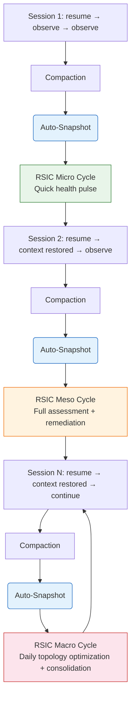
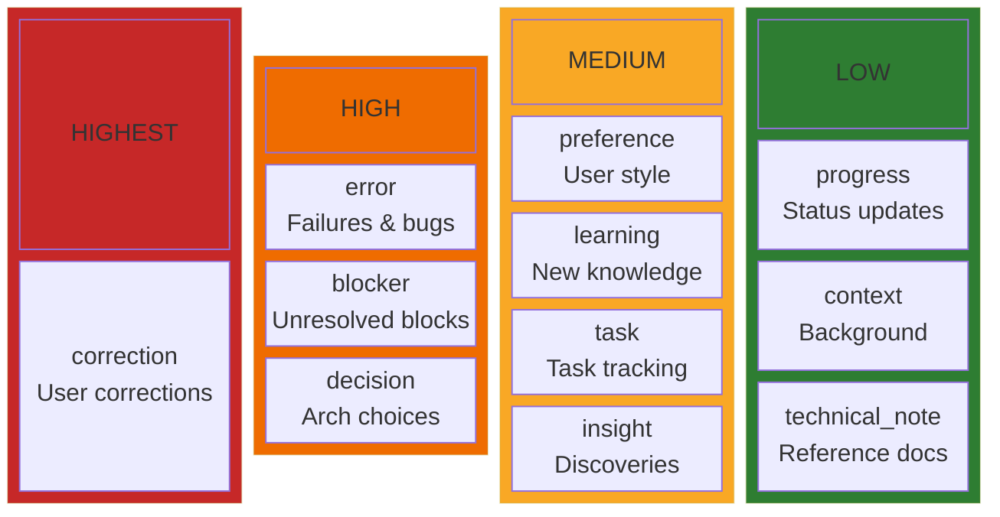
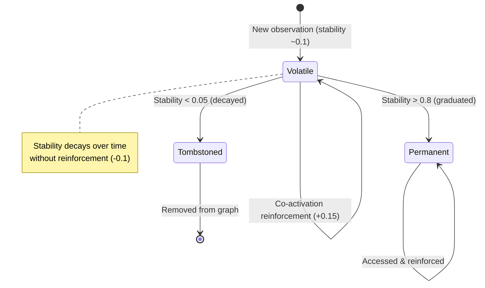
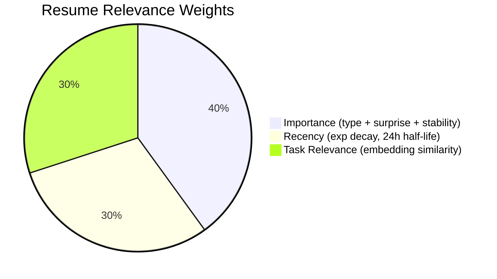
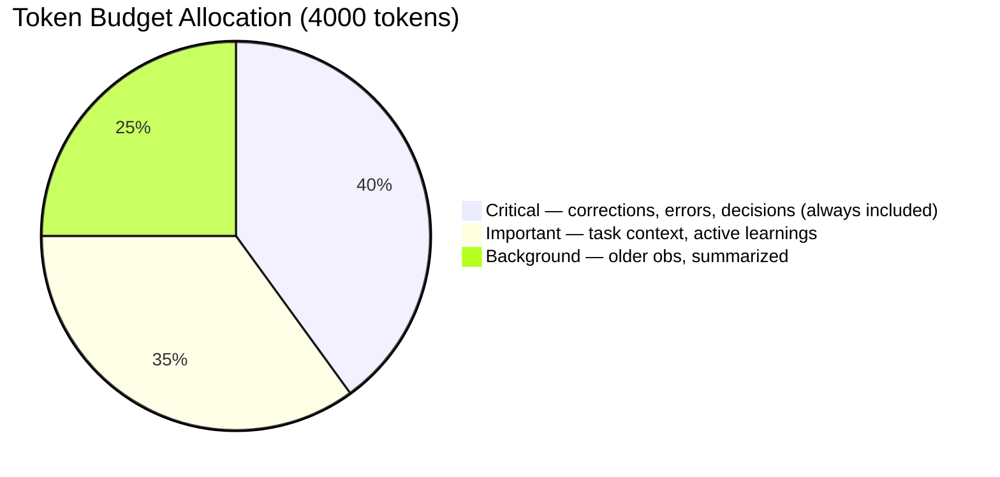
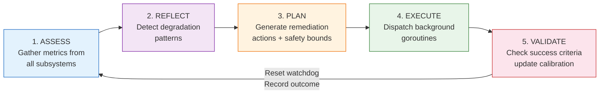
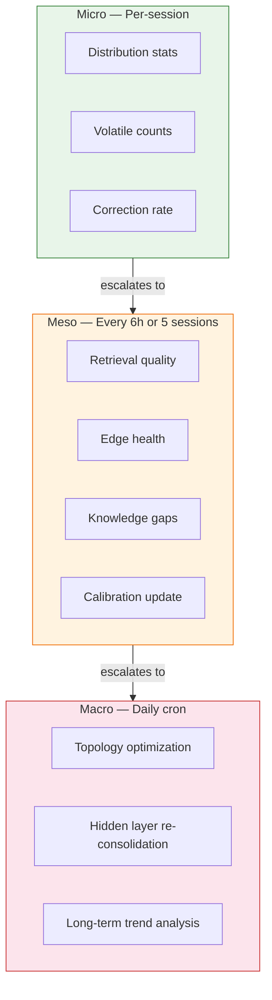
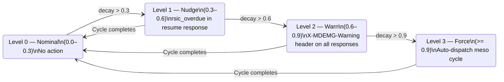
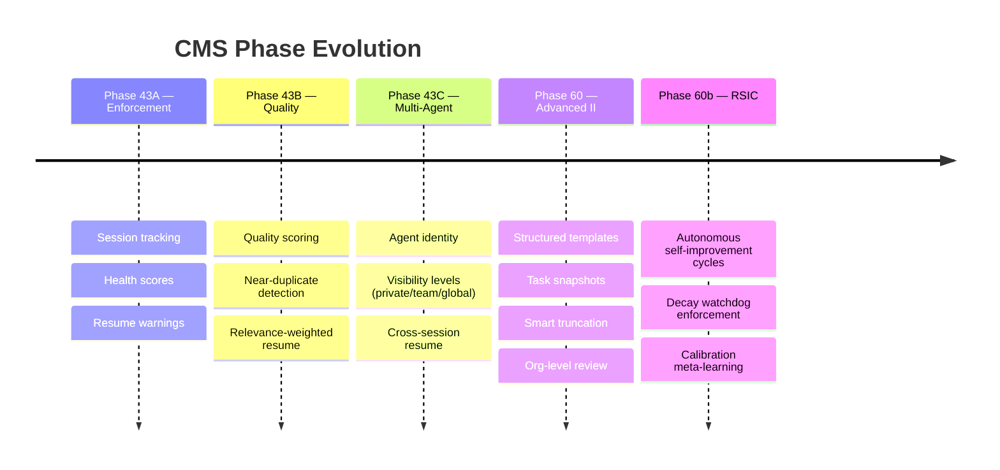

# CMS — Conversation Memory System

## Goal

The Conversation Memory System (CMS) provides **persistent memory for LLM coding agents** across context window boundaries. When an LLM's context window fills and compacts, all non-persistent state is lost. CMS solves this by capturing significant conversational events as structured observations stored in Neo4j, then restoring the most relevant context when a new session begins.

**Core problems solved:**
- Context loss on compaction (every 20-30 minutes of active work)
- Poor context selection (what matters most to restore?)
- Signal vs. noise (not all observations are equally valuable)
- Multi-agent isolation (private vs. shared knowledge)
- Cross-session continuity (work spans days/weeks, not just one session)
- Memory degradation over time (edge decay, stale knowledge, orphan accumulation)

CMS is not just passive storage — it actively maintains its own health. The **Recursive Self-Improvement Cycle (RSIC)** continuously monitors memory quality across retrieval, learning, conversation, and graph subsystems, then autonomously remediates detected issues (pruning decayed edges, triggering consolidation, graduating volatile observations, refreshing stale connections). A decay watchdog enforces cycle compliance: if self-improvement doesn't run within the configured period, escalating pressure culminates in automatic forced execution.

## How It Works

### The Memory Lifecycle



1. **Observe** — During a session, significant events are captured: decisions, corrections, learnings, errors, preferences, progress updates
2. **Store** — Each observation gets a semantic embedding, surprise score, and quality assessment, then persists in Neo4j
3. **Resume** — On session start, the system retrieves the most relevant observations (ranked by recency, importance, and task relevance), related themes, and emergent concepts
4. **Reinforce** — Observations accessed together strengthen co-activation edges (Hebbian learning), increasing their future retrieval priority
5. **Self-Improve** — Between sessions, RSIC assesses memory health, reflects on degradation patterns, plans remediation, executes repairs (edge pruning, consolidation, graduation), and validates that improvements hold

### Observation Types



### Surprise Detection

Novel observations persist longer. The system detects surprise through:
- **Correction patterns** — User says "No...", "Actually...", "That's wrong"
- **Term novelty** — Domain-specific terms not seen before
- **Embedding distance** — Semantically far from existing observations
- **Contradiction** — Conflicts with previously stored knowledge

### Volatile vs. Permanent Memory

New observations start as **volatile** (stability score ~0.1). Through co-activation reinforcement, stability increases. When stability exceeds 0.8, the observation **graduates** to permanent. If stability drops below 0.05, the observation is **tombstoned** (removed). This mimics biological memory consolidation.



### Resume Relevance Scoring

When restoring context, observations are ranked by:



- **Recency**: Exponential decay (half-life 24h)
- **Importance**: Based on type priority + surprise score + stability
- **Task relevance**: Embedding similarity to current task context

### Smart Truncation

Resume responses respect a token budget (default 4000 tokens). Observations are tiered:



## Key Features

### Multi-Agent Support (Phase 43C)
- Persistent `agent_id` on all operations
- **Private** observations: only visible to the owning agent
- **Team** observations: visible to all agents in the same space
- **Global** observations: organization-wide visibility
- Cross-session resume filtered by agent identity

### Structured Observation Templates (Phase 60)
JSON Schema-validated templates for common patterns:
- `task_handoff` — Current task, status, goals, blockers, next steps
- `decision` — Decision, rationale, alternatives, reversibility
- `error` — Error type, description, resolution, prevention
- `learning` — Topic, insight, confidence, applicability

### Task Context Snapshots (Phase 60)
Auto-capture full session state before compaction events. Includes active files, blockers, and next steps. Manually triggered or automatic on session end.

### Org-Level Review (Phase 60)
Valuable observations can be promoted from private to team/global visibility through a review workflow (flag → approve/reject).

### Session Health Monitoring (Phase 43A)
Tracks whether agents call `/resume` on session start and how actively they observe. Warning headers (`X-MDEMG-Warning: session-not-resumed`) alert when CMS is being underutilized.

### Quality Controls (Phase 43B)
- Near-duplicate detection (cosine similarity > 0.95 → merge)
- Multi-factor quality scoring (specificity + actionability + context-richness)
- Relevance-weighted resume ranking

### Recursive Self-Improvement Cycle — RSIC (Phase 60b)

CMS memory degrades over time: edges decay, observations go stale, knowledge gaps widen, and consolidation falls behind. RSIC is an autonomous 5-stage cycle that continuously monitors and repairs memory health without human intervention.

**The 5-Stage Cycle:**



**Three Cycle Tiers:**



**Automated Remediation Actions:**
- `prune_decayed_edges` — Remove low-weight learning edges approaching saturation
- `prune_excess_edges` — Trim hub nodes exceeding per-node edge cap
- `trigger_consolidation` — Run hidden layer consolidation when orphan ratio is high or consolidation is stale
- `graduate_volatile` — Promote stable volatile observations to permanent
- `tombstone_stale` — Remove observations not accessed in N days with low importance
- `refresh_stale_edges` — Recalculate stale co-activation edges

**Decay Watchdog:**

A background goroutine enforces cycle compliance. If the agent fails to run a self-improvement cycle within the configured period, escalating pressure forces execution:



**Calibration & Meta-Learning:**

RSIC tracks the historical success rate of each action type. Actions that consistently improve metrics gain higher confidence and are prioritized in future planning. Actions that fail are deprioritized below the minimum confidence threshold (default 0.3).

**Safety Bounds:**
- Max 5% of nodes pruned per cycle
- Max 10% of edges pruned per cycle
- Protected spaces (`mdemg-dev`) never modified destructively
- All actions bounded by configurable timeout per tier

## API Endpoints

### Core Operations
| Method | Path | Description |
|--------|------|-------------|
| POST | `/v1/conversation/observe` | Store an observation |
| POST | `/v1/conversation/correct` | Store an explicit correction |
| POST | `/v1/conversation/resume` | Restore context for a session |
| POST | `/v1/conversation/recall` | Semantic search over observations |
| POST | `/v1/conversation/consolidate` | Consolidate themes from observations |
| GET | `/v1/conversation/volatile/stats` | Volatile observation statistics |
| POST | `/v1/conversation/graduate` | Graduate volatile observations to permanent |
| GET | `/v1/conversation/session/health` | Session health score |

### Templates
| Method | Path | Description |
|--------|------|-------------|
| GET/POST | `/v1/conversation/templates` | List or create templates |
| GET/PUT/DELETE | `/v1/conversation/templates/{id}` | Template CRUD |

### Snapshots
| Method | Path | Description |
|--------|------|-------------|
| GET/POST | `/v1/conversation/snapshot` | List or create snapshots |
| GET | `/v1/conversation/snapshot/latest` | Latest snapshot for session |
| POST | `/v1/conversation/snapshot/cleanup` | Clean up old snapshots |
| GET/DELETE | `/v1/conversation/snapshot/{id}` | Get or delete snapshot |

### Org Reviews
| Method | Path | Description |
|--------|------|-------------|
| GET | `/v1/conversation/org-reviews` | List pending reviews |
| GET | `/v1/conversation/org-reviews/stats` | Review statistics |
| POST | `/v1/conversation/org-reviews/{id}/decision` | Approve or reject |
| POST | `/v1/conversation/observations/{id}/flag-org` | Flag for review |

### Self-Improvement Cycle (RSIC)
| Method | Path | Description |
|--------|------|-------------|
| POST | `/v1/self-improve/assess` | Trigger on-demand self-assessment |
| GET | `/v1/self-improve/report` | Get active task report |
| GET | `/v1/self-improve/report/{cycle_id}` | Get specific cycle report |
| POST | `/v1/self-improve/cycle` | Trigger full RSIC cycle (assess→validate) |
| GET | `/v1/self-improve/history` | Cycle history with outcomes |
| GET | `/v1/self-improve/calibration` | Calibration metrics and confidence scores |
| GET | `/v1/self-improve/health` | Watchdog status and health score |

## Architecture

### Storage (Neo4j)

Observations are stored as `MemoryNode` nodes in Neo4j with:
- `embedding` (1536-dim vector) for semantic search
- `surprise_score`, `stability_score`, `importance_score` for ranking
- `obs_type`, `visibility`, `agent_id` for filtering
- `volatile` flag for graduation lifecycle
- Co-activation edges (`CO_ACTIVATED_WITH`) for Hebbian reinforcement

### Key Packages

| Package | Purpose |
|---------|---------|
| `internal/conversation/service.go` | Core CMS service (observe, resume, recall) |
| `internal/conversation/cooler.go` | ContextCooler — volatile→permanent graduation |
| `internal/conversation/quality.go` | Observation quality scoring |
| `internal/conversation/dedup.go` | Near-duplicate detection |
| `internal/conversation/relevance.go` | Resume relevance scoring |
| `internal/conversation/truncation.go` | Smart truncation with token budgets |
| `internal/conversation/templates.go` | Structured observation templates |
| `internal/conversation/snapshot.go` | Task context snapshots |
| `internal/conversation/org_review.go` | Org-level review workflow |
| `internal/conversation/session_tracker.go` | Session health monitoring |
| `internal/conversation/types.go` | Shared types (Observation, AgentID, etc.) |
| `internal/ape/types_rsic.go` | RSIC types (reports, insights, actions, task specs) |
| `internal/ape/self_assess.go` | Assessment — gathers metrics from all subsystems |
| `internal/ape/self_reflect.go` | Reflection — pattern detection (8 insight types) |
| `internal/ape/improvement_plan.go` | Planning — maps insights to remediation actions |
| `internal/ape/task_spec.go` | Task specification builder with safety bounds |
| `internal/ape/task_dispatch.go` | Goroutine-based action executor |
| `internal/ape/task_monitor.go` | Task status tracking and cycle wait |
| `internal/ape/calibration.go` | Validation and per-action confidence tracking |
| `internal/ape/watchdog.go` | Decay watchdog with 4-level escalation |
| `internal/ape/cycle.go` | CycleOrchestrator — ties all 5 stages together |
| `internal/api/handlers_self_improve.go` | HTTP handlers for 7 RSIC endpoints |
| `internal/api/rsic_adapters.go` | Adapters bridging RSIC interfaces to concrete services |

### Protected Space

The `mdemg-dev` space contains Claude's conversation memory and is **protected from deletion**. The API refuses destructive operations on this space, and `reset-db` skips it entirely.

## Evolution



## Configuration

```bash
# Resume
CMS_RESUME_MAX_TOKENS=4000
CMS_RESUME_DEFAULT_STRATEGY=task_focused

# Scoring weights
CMS_RELEVANCE_WEIGHT_RECENCY=0.3
CMS_RELEVANCE_WEIGHT_IMPORTANCE=0.4
CMS_RELEVANCE_WEIGHT_TASK_RELEVANCE=0.3

# Templates & snapshots
CMS_TEMPLATES_ENABLED=true
CMS_SNAPSHOT_ON_SESSION_END=true
CMS_SNAPSHOT_ON_COMPACTION=true

# Volatile memory (Context Cooler)
STABILITY_INCREASE_PER_REINFORCEMENT=0.15
STABILITY_DECAY_RATE=0.1
TOMBSTONE_THRESHOLD=0.05
GRADUATION_STABILITY_THRESHOLD=0.8
REINFORCEMENT_WINDOW_HOURS=2

# Governance
CMS_ORG_REVIEW_REQUIRED=true

# RSIC — Cycle Periods
RSIC_MICRO_ENABLED=true
RSIC_MESO_PERIOD_HOURS=6
RSIC_MESO_PERIOD_SESSIONS=5
RSIC_MACRO_CRON="0 3 * * *"

# RSIC — Safety Bounds
RSIC_MAX_NODE_PRUNE_PCT=5
RSIC_MAX_EDGE_PRUNE_PCT=10
RSIC_ROLLBACK_WINDOW=3

# RSIC — Watchdog
RSIC_WATCHDOG_ENABLED=true
RSIC_WATCHDOG_CHECK_INTERVAL_SEC=60
RSIC_WATCHDOG_DECAY_RATE=1.0
RSIC_WATCHDOG_NUDGE_THRESHOLD=0.3
RSIC_WATCHDOG_WARN_THRESHOLD=0.6
RSIC_WATCHDOG_FORCE_THRESHOLD=0.9

# RSIC — Calibration
RSIC_CALIBRATION_WINDOW_DAYS=7
RSIC_MIN_CONFIDENCE_THRESHOLD=0.3
```
