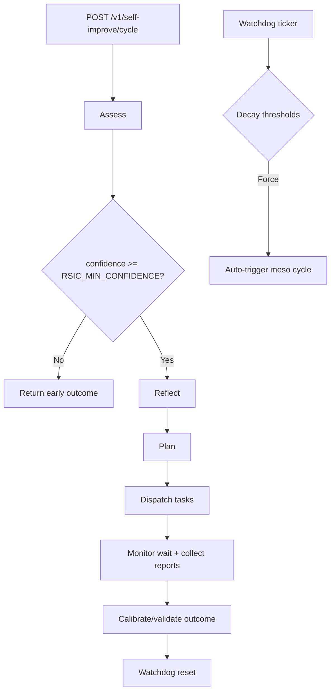

# RSIC Gap Analysis and Hardening Plan

Last updated: 2026-01-22

## Purpose

This document captures a focused gap analysis for the Recursive Self-Improvement Cycle (RSIC) infrastructure, with concrete remediation phases.

Scope reviewed:

- `internal/ape/*` (assess, reflect, plan, dispatch, monitor, calibrate, watchdog)
- `internal/api/handlers_self_improve.go`
- `internal/api/rsic_adapters.go`
- `internal/api/server.go`
- `internal/config/config.go`
- RSIC/UATS specs under `docs/api/api-spec/uats/specs/self_improve_*.uats.json`
- CI and local automation (`.github/workflows/ci.yml`, `Makefile`)

## Current RSIC Flow (Observed)

## Main Gaps Identified

1. **Runtime config knobs are only partially operational**
   - `RSIC_MESO_PERIOD_SESSIONS` and `RSIC_MACRO_CRON` are parsed but not used to schedule cycles.
   - `RSIC_MICRO_ENABLED` is logged but does not gate automatic per-request cycle execution.

2. **Safety bounds are declared, but enforcement is weak**
   - `RSICTaskSpec.Safety` exists, but action executors do not uniformly enforce max-node/max-edge blast-radius before mutation.
   - `ProtectedSpaces` and `DryRun` are declarative in task spec but not consistently enforced by dispatcher/action executors.

3. **Calibration and signal-learning state is volatile**
   - `Calibrator` history and `SignalLearner` are in-memory only.
   - Restarting the process drops learned effectiveness and historical calibration context.

4. **Session and space identity assumptions are hard-coded**
   - Watchdog and signal paths rely on hard-coded `"claude-core"` in multiple places.
   - Watchdog initialization uses fixed `"mdemg-dev"` default at server startup path.
   - This weakens multi-session and multi-space correctness.

5. **Adapter-level data type handling can suppress watchdog signal quality**
   - Consolidation age adapter path attempts string parsing for Neo4j datetime values.
   - Type mismatch risk can silently collapse consolidation-age signal to zero.

6. **Task lifecycle retention is unbounded in active maps**
   - `Dispatcher.activeTasks` keeps completed/failed tasks without explicit lifecycle cleanup policy.
   - Long-running instances can accumulate stale task metadata.

7. **Spec and docs drift exists around RSIC source-of-truth**
   - `AGENT_HANDOFF.md` references `docs/specs/phase60b-rsic.md`, but this spec path is not present.
   - API docs under `docs/development/API_REFERENCE.md` describe only a subset of RSIC endpoints, despite implementation exposing full endpoint set.

8. **Test and CI coverage is mostly contract-level, not behavior-level**
   - UATS checks endpoint shape/status but does not deeply validate RSIC outcome quality or guardrail enforcement.
   - CI runs UATS with `continue-on-error`, so RSIC contracts are not strict merge gates.

## Development Plan: RSIC Hardening Phases

### Phase 87: RSIC Orchestration Activation

Design package:

- `docs/specs/phase87-rsic-orchestration-activation.md`

Tasks:

- Wire `RSIC_MESO_PERIOD_SESSIONS` into session-driven meso trigger logic.
- Add scheduler path for `RSIC_MACRO_CRON` and expose health/status for macro schedule.
- Implement explicit micro-cycle trigger policy when `RSIC_MICRO_ENABLED=true` (with guardrails and backoff).
- Add endpoint-level indicators clarifying whether cycles were manual, watchdog-driven, session-driven, or macro-scheduled.

### Phase 88: RSIC Safety and Policy Enforcement

Tasks:

- Enforce `SafetyBounds` in all mutation executors before write operations.
- Implement protected-space policy check before destructive RSIC actions.
- Support deterministic dry-run mode with structured deltas for each action type.
- Add explicit rollback/snapshot integration tied to `RSIC_ROLLBACK_WINDOW`.

### Phase 89: RSIC Persistence and Multi-Space Correctness

Tasks:

- Persist calibration history and signal-effectiveness state to Neo4j (or durable storage layer).
- Remove hard-coded session identity assumptions and pass session context end-to-end.
- Scope watchdog/signal metrics by `{space_id, session_id}` and support multiple active spaces.
- Fix and test Neo4j datetime handling in consolidation-age adapter paths.

### Phase 90: RSIC Conformance and CI Gating

Tasks:

- Create RSIC behavior specs validating safety enforcement, action outcomes, and confidence-gated exits.
- Add RSIC-focused integration tests (not only contract schemas) for multi-space and watchdog-trigger paths.
- Add dedicated CI job(s) for RSIC conformance and remove permissive `continue-on-error` for RSIC-critical specs.
- Add Make targets for reproducible local RSIC verification.

### Phase 91: RSIC Observability and Operations

Tasks:

- Add RSIC metrics: cycle trigger source, action success/failure by type, confidence distribution, guardrail rejections.
- Add dashboard panels and alerts for repeated forced cycles, repeated failed actions, and calibration drift.
- Add operational runbook for RSIC incident triage, override, safe-mode, and replay.
- Document RSIC SLOs/SLIs and non-regression acceptance thresholds.

## Acceptance Criteria for RSIC Hardening

- RSIC scheduling knobs are demonstrably active and test-validated.
- Safety and dry-run policies are enforced before mutation for all action types.
- Calibration and signal effectiveness survive process restarts.
- Multi-session and multi-space behavior is deterministic and free of hard-coded identities.
- RSIC conformance tests are merge-gating in CI for core behavior paths.
