# MDEMG API Overview (gMEM)

<!-- markdownlint-disable MD060 -->

Quick reference for all HTTP API endpoints as Mermaid flowcharts (method, path, brief summary).  
**Options** (query/body/path params) and full request/response details: see `docs/development/API_REFERENCE.md`.  
Contract specs: `docs/api/api-spec/uats/specs/*.uats.json`.

**Base URL:** `http://localhost:9999` (default; port may be in `.mdemg.port` when using dynamic allocation.)

---

## Table of contents

- [[#Health & readiness]]
- [[#Memory operations]]
- [[#Codebase ingestion (background jobs)]]
- [[#Freshness & sync]]
- [[#Learning & Hebbian edges]]
- [[#Conversation Memory System (CMS)]]
- [[#CMS templates (Phase 60)]]
- [[#CMS snapshots (Phase 60)]]
- [[#CMS org reviews (Phase 60)]]
- [[#Self-improvement cycle — RSIC (Phase 60b)]]
- [[#Cleanup & edge consistency]]
- [[#Webhooks]]
- [[#Linear integration (Phase 44)]]
- [[#System, plugins & monitoring]]

---

## Health & readiness

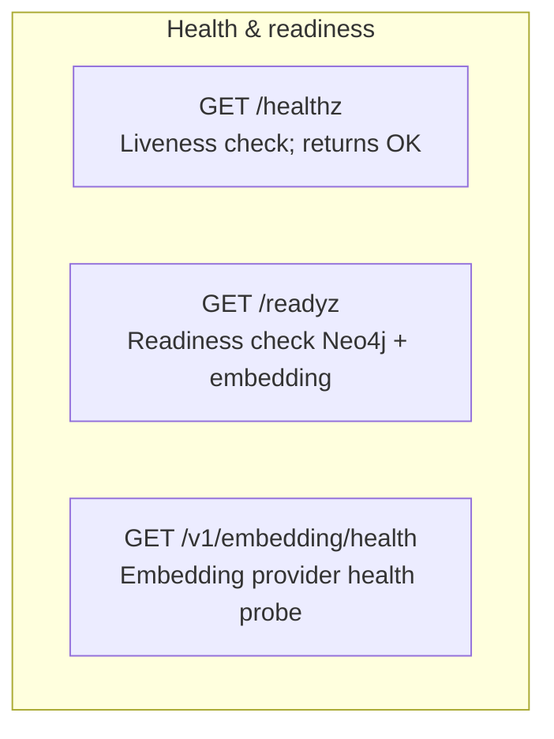

---

## Memory operations

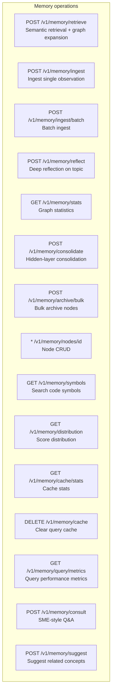

---

## Codebase ingestion (background jobs)

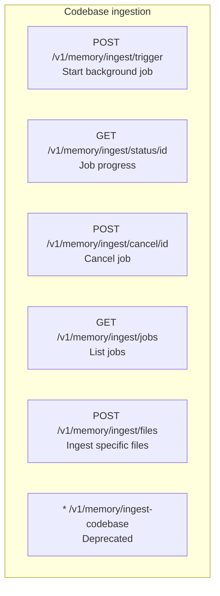

---

## Freshness & sync

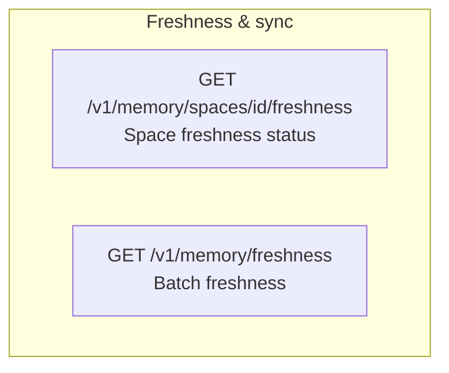

---

## Learning & Hebbian edges

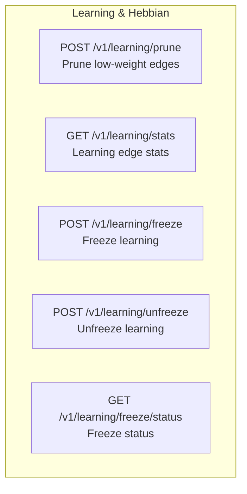

---

## Conversation Memory System (CMS)

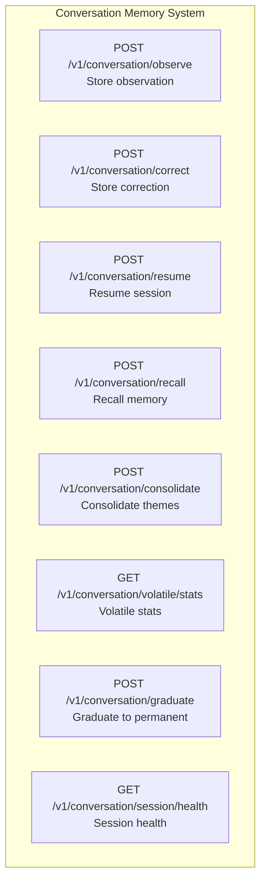

---

## CMS templates (Phase 60)

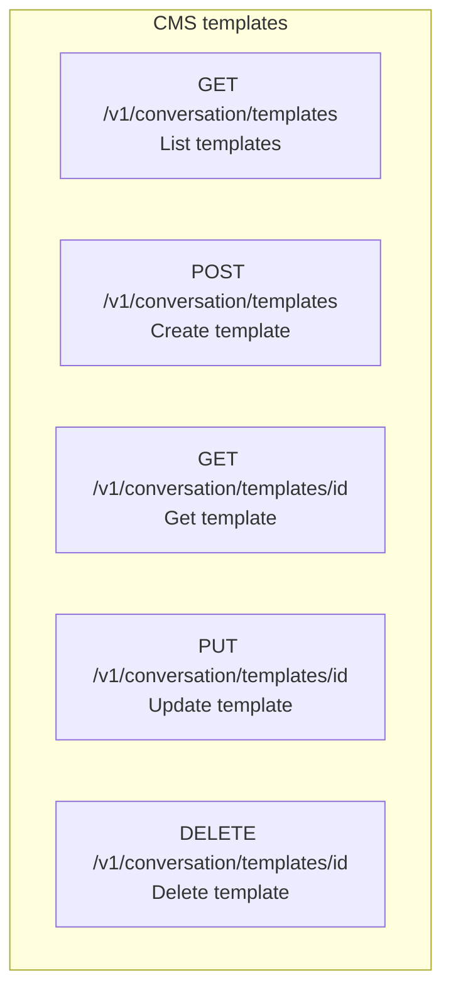

---

## CMS snapshots (Phase 60)

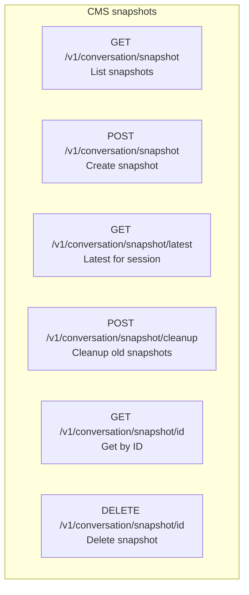

---

## CMS org reviews (Phase 60)

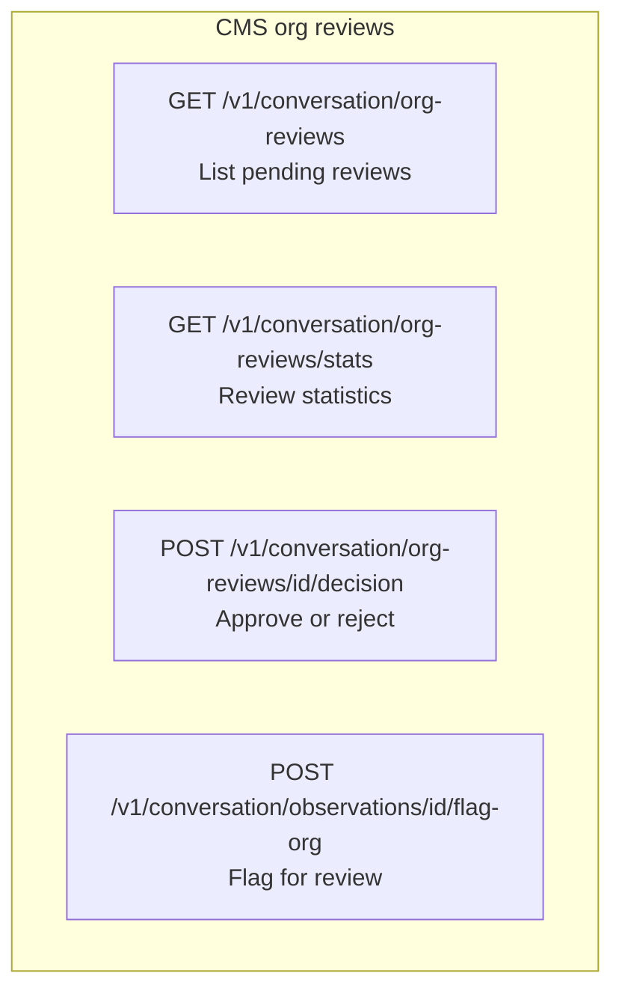

---

## Self-improvement cycle — RSIC (Phase 60b)

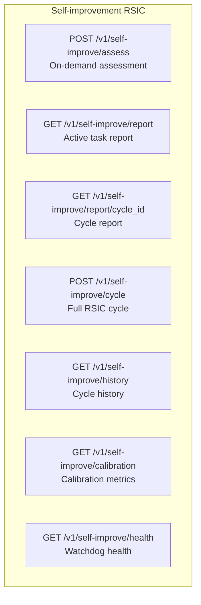

---

## Cleanup & edge consistency

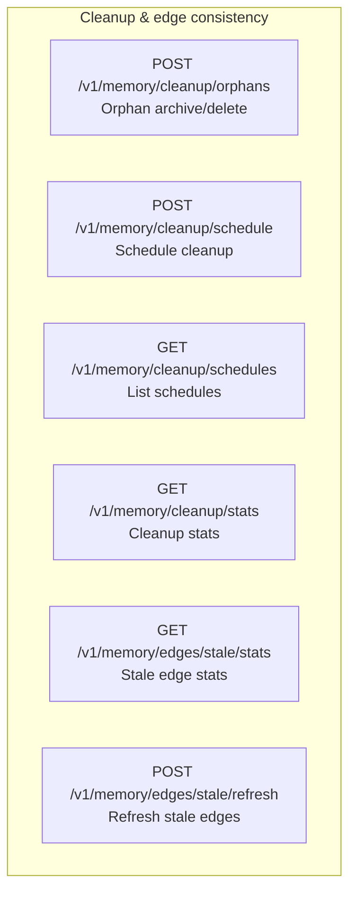

---

## Webhooks

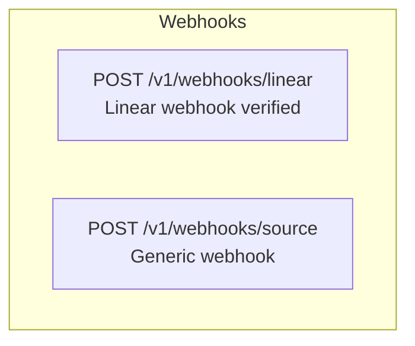

---

## Linear integration (Phase 44)

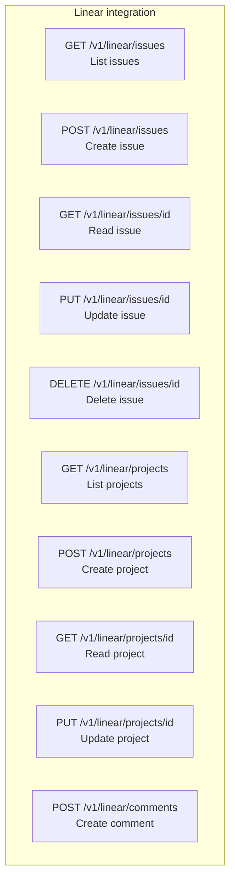

---

## System, plugins & monitoring

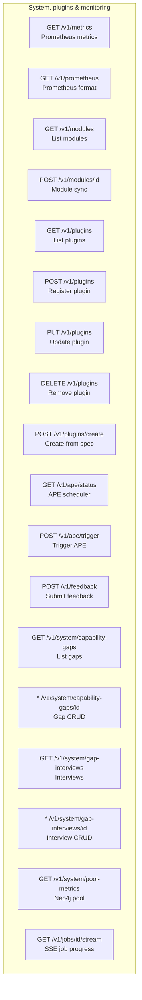

---

## Related docs

- **Full API reference:** `docs/development/API_REFERENCE.md`
- **UATS specs (per-endpoint):** `docs/api/api-spec/uats/specs/*.uats.json`
- **Contributing & testing:** `CONTRIBUTING.md`
