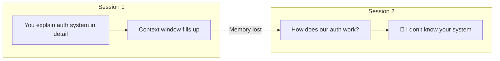
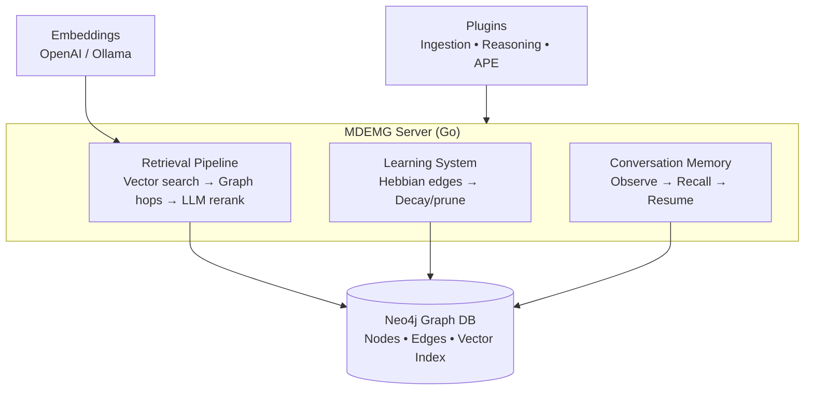
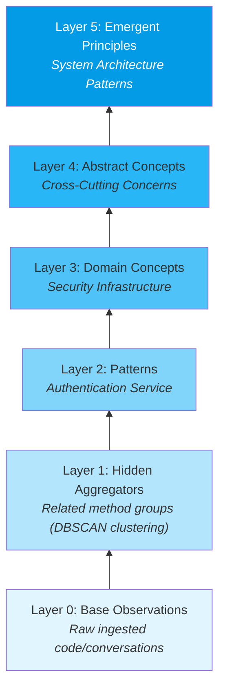

# Part 1: What is MDEMG?

> [!abstract] 15-minute overview
> Why MDEMG exists, what it stores (and doesn't), how it works, and why that matters for your daily workflow.

---

## The Core Problem: LLMs Have No Memory

When you work with AI coding assistants (Claude, GPT, Copilot), every session starts from zero:



> [!warning] The Real Cost
> 1. **Constant re-explanation** — "I told you this last week"
> 2. **Lost institutional knowledge** — "Why did we build it this way? The person who knew left"
> 3. **Repeated mistakes** — "We tried that before. It broke production"
> 4. **Multi-agent chaos** — Two agents refactoring the same code simultaneously

This is not a minor inconvenience. It fundamentally limits how useful AI can be for real work.

---

## MDEMG: The Solution

**Multi-Dimensional Emergent Memory Graph** — persistent, evolving memory for AI agents.

> [!tip] The Internal Dialog Analogy
> When humans think through problems, they draw on past experiences, domain expertise, and relationships between concepts. **MDEMG gives AI agents this same capability** — a persistent "inner voice" of accumulated domain knowledge.

### What MDEMG Does NOT Store

> [!danger] Rule of Thumb
> If you can find it on Stack Overflow or in official docs, **it does not belong in MDEMG**.

| Do NOT Store | Why |
|-------------|-----|
| Python syntax | LLM already knows this |
| How React hooks work | Universally documented |
| General best practices | Already in training data |
| Standard library APIs | LLM has this knowledge |

### What MDEMG DOES Store

**Domain-specific, organization-specific, task-specific knowledge:**

| Category | Examples |
|----------|----------|
| **Organizational Code Patterns** | "We use Repository pattern for data access in this codebase" |
| **Architectural Decisions** | "We chose Redis over Memcached because of X incident" |
| **Domain Procedures** | P&ID sequences, PLC logic, safety interlocks |
| **Project Context** | Deprecated APIs, why certain workarounds exist |
| **Problem/Solution History** | "Last time we saw this error, the root cause was X" |
| **Team Conventions** | PR review expectations, deployment checklists |

---

## How MDEMG Works



**Three main subsystems:**

| Subsystem | What It Does | Why It Matters |
|-----------|-------------|----------------|
| **Retrieval Pipeline** | Vector search + graph hops + LLM reranking | Find relevant memories by meaning, not just keywords |
| **Learning System** | Hebbian edges — "neurons that fire together, wire together" | Patterns emerge automatically from use |
| **Conversation Memory** | Session resume, observation capture, recall | Continuity across sessions — no more re-explaining |

---

## The Emergent Layer Architecture

MDEMG does not just store flat memories — it **builds hierarchical understanding**:



> [!note] Key Insight
> Higher-level concepts **emerge automatically** through Hebbian learning. You ingest raw code and conversations; MDEMG builds the conceptual hierarchy over time.

---

## Conversation Memory System (CMS)

The CMS maintains continuity across sessions:

### On Session Start → Resume

```bash
POST /v1/conversation/resume
{"space_id": "your-project", "session_id": "claude-core", "max_observations": 20}
```

Returns recent observations, active themes, emergent concepts.

### During Session → Observe

```bash
POST /v1/conversation/observe
{"space_id": "your-project", "session_id": "claude-core",
 "content": "User prefers conventional commits", "obs_type": "preference"}
```

Captures decisions, corrections, learnings, preferences, errors.

### The Result → Continuous Memory

- Session 1: Learn user preferences
- Session 2: **Already knows** user preferences
- Session N: Accumulated understanding grows

---

## What This Means For You

> [!success] Why Should I Care?
>
> | Your Role | How MDEMG Helps |
> |-----------|----------------|
> | **Developer** | AI remembers your codebase patterns, past decisions, and "why we did it this way" |
> | **New team member** | Ramp up faster — query institutional knowledge instead of hunting through Slack history |
> | **Tech lead** | Tribal knowledge becomes explicit and queryable, not locked in one person's head |
> | **Team** | AI agents share a memory substrate — no duplicate work, no conflicting assumptions |

---

## Extensibility: Sidecar Modules

MDEMG uses a **plugin-based architecture**. Modules run as sidecar processes communicating via gRPC over Unix sockets.

| Module Type | Purpose | Examples |
|-------------|---------|----------|
| **INGESTION** | Parse external sources into observations | Linear issues, Obsidian notes, Jira tickets |
| **REASONING** | Re-rank/filter retrieval results | Keyword boosters, domain-specific scoring |
| **APE** | Background autonomous tasks | Reflection, consistency checks, gap analysis |

> [!info] Key benefits
> Language-agnostic, fault-isolated, hot-reloadable. Full SDK docs in `docs/development/SDK_PLUGIN_GUIDE.md`.

---

## The Testing Challenge

With this much functionality:
- **25 language parsers** — each must extract symbols correctly
- **45+ API endpoints** — each must honor its contract
- **Multiple integration points** — plugins, hooks, scheduled jobs

> [!question] How do we ensure it all works?
> **Specification-driven testing:**
> - [[01-UPTS-DEEP-DIVE|UPTS]] — "This is what the Kotlin parser MUST extract from this file"
> - [[02-UATS-DEEP-DIVE|UATS]] — "This is what POST /v1/memory/retrieve MUST return"

---

## Current Stats

| Metric | Value |
|--------|-------|
| Total parsers | 25 (Go, Rust, Python, TypeScript, Java, C#, Kotlin, C++, C, CUDA, Protobuf, GraphQL, OpenAPI, SQL, Cypher, Terraform, YAML, TOML, JSON, INI, Makefile, Dockerfile, Shell, Markdown, XML) |
| UPTS-validated | 25 parsers (100%) |
| API endpoints | 45+ |
| UATS test variants | ~90 |
| Pass rate | 100% |

---

**Next:** [[01-UPTS-DEEP-DIVE|UPTS Deep Dive →]]
