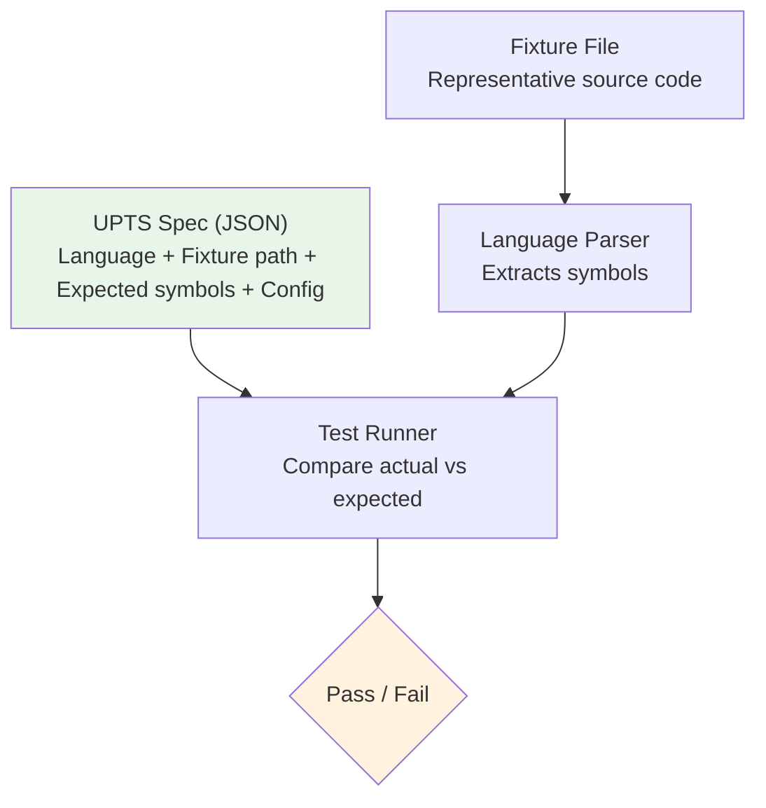

# Part 2: UPTS — Universal Parser Test Specification

> [!abstract] 18-minute deep dive
> How we validate 25 language parsers with a single spec format. Anatomy of a spec, live demo, and a complete walkthrough of adding a new parser.

---

## What is UPTS?

UPTS is a **language-agnostic test specification format** for validating MDEMG language parsers. Every parser — Go, Rust, Python, Kotlin, CUDA, SQL, Protobuf, all 25 — uses the same JSON spec structure.

### The Problem It Solves

Before UPTS, parser tests were inconsistent:

| Field | Go Parser | Python Parser | TypeScript Parser |
|-------|-----------|---------------|-------------------|
| Line number | `line` | `line_number` | `line` |
| Has signature? | No | Yes | No |
| Has value? | No | Yes | No |

> [!warning] The Result
> Each parser had its own test format. Adding a new language meant inventing a new test structure. No way to compare or automate.

### The UPTS Solution



---

## Directory Structure

```
docs/lang-parser/lang-parse-spec/upts/
├── schema/
│   └── upts.schema.json           # JSON Schema definition
├── specs/                          # One spec per language (25 total)
│   ├── go.upts.json
│   ├── rust.upts.json
│   ├── kotlin.upts.json
│   ├── protobuf.upts.json
│   ├── graphql.upts.json
│   ├── openapi.upts.json
│   └── ... (25 total)
├── fixtures/                       # Test source files
│   ├── go_test_fixture.go
│   ├── kotlin_test_fixture.kt
│   └── ... (25 total)
└── runners/
    └── upts_runner.py              # Python cross-validator
```

> [!info] Go-native harness
> `cmd/ingest-codebase/languages/upts_test.go` — this is what CI runs.

---

## Anatomy of a UPTS Spec

```json
{
  "upts_version": "1.0.0",
  "language": "kotlin",
  "variants": [".kt", ".kts"],

  "config": {
    "line_tolerance": 2,
    "require_all_symbols": true,
    "allow_extra_symbols": true,
    "validate_parent": true
  },

  "fixture": {
    "type": "file",
    "path": "../fixtures/kotlin_test_fixture.kt"
  },

  "expected": {
    "symbol_count": {"min": 50, "max": 60},
    "symbols": [
      {
        "name": "User",
        "type": "class",
        "line": 18,
        "exported": true
      },
      {
        "name": "findById",
        "type": "function",
        "line": 45,
        "exported": true,
        "parent": "UserRepository"
      }
    ]
  }
}
```

> [!tip] Key fields
> - **`config.line_tolerance`** — Allow +/-2 lines (comments shift things)
> - **`config.require_all_symbols`** — Every expected symbol must appear
> - **`config.allow_extra_symbols`** — Parser can find more than listed (won't fail)
> - **`config.validate_parent`** — Methods must report correct containing class

---

## Key Concepts

### Symbol Types

Parsers extract these symbol types:

| Type | Examples |
|------|----------|
| `constant` | `const val MAX = 100` |
| `function` | `fun calculate()` |
| `class` | `class User` |
| `struct` | `struct Point` |
| `interface` | `interface Repository` |
| `enum` | `enum class Status` |
| `enum_value` | `ACTIVE, INACTIVE` |
| `method` | `fun User.validate()` |
| `type` | `typealias UserId = String` |

### The 7 Canonical Patterns

Every parser should handle these:

| Pattern | Description | Example |
|---------|-------------|---------|
| P1_CONSTANT | Named constants | `const val X = 1` |
| P2_FUNCTION | Standalone functions | `fun calc()` |
| P3_CLASS_STRUCT | Classes/structs | `class User` |
| P4_INTERFACE_TRAIT | Interfaces/traits | `interface Repo` |
| P5_ENUM | Enumerations | `enum Status` |
| P6_METHOD | Methods inside classes | `fun User.save()` |
| P7_TYPE_ALIAS | Type aliases | `typealias ID = Int` |

### Parent Matching

For methods, `parent` must match the containing class/struct:

```json
{
  "name": "findById",
  "type": "method",
  "parent": "UserRepository"
}
```

---

## Running UPTS Tests

### All 25 parsers

```bash
go test ./cmd/ingest-codebase/languages/ -run TestUPTS -v
```

### Single language

```bash
go test ./cmd/ingest-codebase/languages/ -run TestUPTS/kotlin -v
```

### Python cross-validator

```bash
python runners/upts_runner.py validate \
    --spec specs/kotlin.upts.json \
    --parser ./bin/ingest-codebase
```

---

## Walkthrough: Adding a New Language Parser

> [!example] Worked Example: Adding a Zig Parser
> This walkthrough covers the complete process from empty file to passing CI.

### Step 1: Create the Parser

Create `cmd/ingest-codebase/languages/zig_parser.go`:

```go
package languages

import (
    "regexp"
    "strings"
)

func init() {
    Register(&ZigParser{})  // Auto-register
}

type ZigParser struct{}

func (p *ZigParser) Name() string        { return "zig" }
func (p *ZigParser) Extensions() []string { return []string{".zig"} }

func (p *ZigParser) CanParse(path string) bool {
    return strings.HasSuffix(strings.ToLower(path), ".zig")
}

func (p *ZigParser) ParseFile(root, path string, extractSymbols bool) ([]CodeElement, error) {
    content, err := ReadFileContent(path)
    if err != nil {
        return nil, err
    }
    var symbols []Symbol
    if extractSymbols {
        symbols = p.extractSymbols(content)
    }
    // ... build CodeElement
    return elements, nil
}

func (p *ZigParser) extractSymbols(content string) []Symbol {
    var symbols []Symbol
    lines := strings.Split(content, "\n")

    constRe := regexp.MustCompile(`^(pub\s+)?const\s+(\w+)\s*=`)
    funcRe := regexp.MustCompile(`^(pub\s+)?fn\s+(\w+)\s*\(`)

    for i, line := range lines {
        lineNum := i + 1
        trimmed := strings.TrimSpace(line)

        if m := constRe.FindStringSubmatch(trimmed); m != nil {
            symbols = append(symbols, Symbol{
                Name:     m[2],
                Type:     "constant",
                Line:     lineNum,
                Exported: strings.HasPrefix(trimmed, "pub"),
            })
        }
        // ... more patterns
    }
    return symbols
}
```

> [!tip] Pattern
> Every parser implements the `LanguageParser` interface: `Name()`, `Extensions()`, `CanParse()`, `ParseFile()`. Register in `init()`.

### Step 2: Create the Fixture

Create `docs/lang-parser/lang-parse-spec/upts/fixtures/zig_test_fixture.zig`:

```zig
// Zig Test Fixture - Covers all canonical patterns

const std = @import("std");

// P1: Constants
pub const MAX_BUFFER_SIZE: usize = 4096;
pub const VERSION = "1.0.0";
const INTERNAL_LIMIT: u32 = 100;

// P3: Struct
pub const User = struct {
    id: u64,
    name: []const u8,
    active: bool,

    // P6: Method
    pub fn init(id: u64, name: []const u8) User {
        return User{ .id = id, .name = name, .active = true };
    }

    pub fn deactivate(self: *User) void {
        self.active = false;
    }
};

// P2: Functions
pub fn calculateSum(a: i32, b: i32) i32 {
    return a + b;
}

fn internalHelper() void {
    // Private function
}

// P5: Enum
pub const Status = enum {
    active,
    inactive,
    pending,
};
```

> [!tip] Fixture design
> Include all 7 canonical patterns. Use predictable line numbers. Include both exported and private symbols.

### Step 3: Create the UPTS Spec

Create `docs/lang-parser/lang-parse-spec/upts/specs/zig.upts.json`:

```json
{
  "upts_version": "1.0.0",
  "language": "zig",
  "variants": [".zig"],
  "config": {
    "line_tolerance": 2,
    "require_all_symbols": true,
    "allow_extra_symbols": true,
    "validate_parent": true
  },
  "fixture": {
    "type": "file",
    "path": "../fixtures/zig_test_fixture.zig"
  },
  "expected": {
    "symbol_count": {"min": 12, "max": 18},
    "symbols": [
      {"name": "MAX_BUFFER_SIZE", "type": "constant", "line": 7, "exported": true},
      {"name": "VERSION", "type": "constant", "line": 8, "exported": true},
      {"name": "INTERNAL_LIMIT", "type": "constant", "line": 9, "exported": false},
      {"name": "User", "type": "struct", "line": 12, "exported": true},
      {"name": "init", "type": "method", "line": 18, "exported": true, "parent": "User"},
      {"name": "deactivate", "type": "method", "line": 22, "exported": true, "parent": "User"},
      {"name": "calculateSum", "type": "function", "line": 28, "exported": true},
      {"name": "internalHelper", "type": "function", "line": 32, "exported": false},
      {"name": "Status", "type": "enum", "line": 37, "exported": true}
    ]
  }
}
```

### Step 4: Run and Iterate

```bash
go build ./cmd/ingest-codebase/...
go test ./cmd/ingest-codebase/languages/ -run TestUPTS/zig -v
```

> [!warning] Common failures and fixes
> - **LINE_MISMATCH** — Adjust line numbers in spec or check parser line counting
> - **MISSING** — Add regex pattern to parser for that symbol type
> - **PARENT_MISMATCH** — Fix scope tracking in parser
> - **TYPE_MISMATCH** — Ensure parser uses correct symbol type string

### Step 5: Update Documentation

1. Add to table in `docs/lang-parser/lang-parse-spec/upts/README.md`
2. Add to table in `cmd/ingest-codebase/languages/README.md`
3. Add entry to `CHANGELOG.md`

---

## Common Pitfalls

> [!danger] Watch out for these

**Fixture path is relative to the spec file:**

```json
// WRONG — relative to upts/ root
"path": "fixtures/zig_test_fixture.zig"

// CORRECT — relative to specs/ directory
"path": "../fixtures/zig_test_fixture.zig"
```

**Line numbers are 1-indexed.** First line = line 1.

**Type compatibility:** `class` and `struct` are treated as equivalent, as are `interface` / `trait` / `protocol`.

**Export rules differ per language:**

| Language | Exported when... |
|----------|-----------------|
| Go | Capitalized name |
| Python | No leading underscore |
| Kotlin | No `private`/`internal` |
| Rust | `pub` keyword |
| Zig | `pub` keyword |

---

## Q&A: Anticipated Questions

> [!faq]- Why JSON and not YAML for specs?
> JSON has better tooling (schema validation, jq parsing) and avoids YAML's whitespace pitfalls. The tradeoff is slightly more verbose syntax.

> [!faq]- What if my parser finds more symbols than expected?
> That's fine if `allow_extra_symbols: true` (the default). Tests only fail if **expected** symbols are missing.

> [!faq]- How do I handle multi-line symbols?
> Use `line_end` in the spec. The parser should set `Symbol.EndLine`.

> [!faq]- Can I skip certain symbols in validation?
> Yes — mark as `"optional": true` in the spec. Missing optional symbols don't cause failure.

> [!faq]- What's the relationship between CodeElement and Symbol?
> **CodeElement** = a parseable unit (file, class, module) that goes into the graph.
> **Symbol** = extracted metadata (function name, constant value) that's searchable.

> [!faq]- How do I debug a failing test?
> Run with verbose output and look for `MISSING`, `LINE_MISMATCH`, or `PARENT_MISMATCH`:
> ```bash
> go test ./cmd/ingest-codebase/languages/ -run TestUPTS/kotlin -v 2>&1 | head -100
> ```

---

## Summary

> [!success] Key Takeaways
> 1. **UPTS = single source of truth** for parser validation
> 2. **Three components:** Parser + Fixture + Spec
> 3. **Workflow:** Create parser → Create fixture → Create spec → Iterate until green
> 4. **Run tests:** `go test -run TestUPTS`
> 5. **25/25 parsers passing** — that's the CI gate

---

**Next:** [[02-UATS-DEEP-DIVE|UATS Deep Dive →]]
