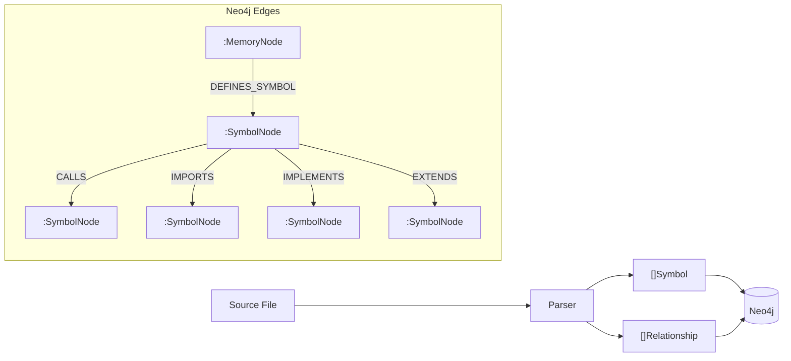
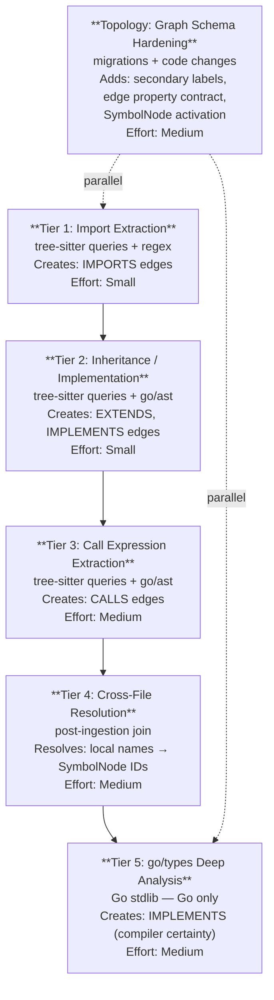
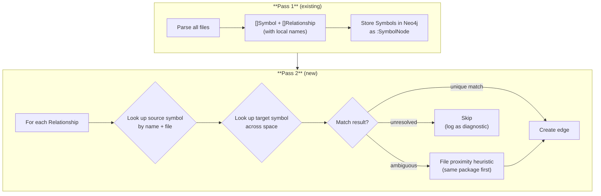

# Phase 75: Cross-File Relationship Extraction & Graph Topology Hardening

**Status:** Planned
**Priority:** High
**Date:** 2026-01-22 (revised 2026-01-22)
**Supersedes:** Original Phase 75 (LSP Enrichment Layer) — see [research analysis](../research/lsp-vs-upts-analysis.md) for background

---

## Table of Contents

1. [Executive Summary](#1-executive-summary)
2. [Problem Statement](#2-problem-statement)
3. [Why Not LSP](#3-why-not-lsp)
4. [Design Goals](#4-design-goals)
5. [Architecture: Tiered Approach](#5-architecture-tiered-approach)
6. [Tier 1 — Import Extraction via Tree-Sitter Queries](#6-tier-1--import-extraction-via-tree-sitter-queries)
7. [Tier 2 — Inheritance and Implementation](#7-tier-2--inheritance-and-implementation)
8. [Tier 3 — Call Expression Extraction](#8-tier-3--call-expression-extraction)
9. [Tier 4 — Two-Pass Cross-File Resolution](#9-tier-4--two-pass-cross-file-resolution)
10. [Tier 5 — go/types Deep Analysis (Go Only)](#10-tier-5--gotypes-deep-analysis-go-only)
11. [Topology Hardening: Graph Schema Improvements](#11-topology-hardening-graph-schema-improvements)
12. [New Relationship Edge Schema](#12-new-relationship-edge-schema)
13. [UPTS Schema Integration](#13-upts-schema-integration)
14. [Implementation Plan](#14-implementation-plan)
15. [API Endpoints](#15-api-endpoints)
16. [Retrieval Integration](#16-retrieval-integration)
17. [Test Plan](#17-test-plan)
18. [Acceptance Criteria](#18-acceptance-criteria)
19. [Files Changed](#19-files-changed)
20. [Configuration](#20-configuration)
21. [Risk Assessment](#21-risk-assessment)

---

## 1. Executive Summary

This phase does two things:

**A. Relationship Extraction** — MDEMG's parsers currently extract **declarations** (what exists) but not **relationships** (how things connect). The memory graph knows that `func Retrieve()` exists in `service.go` and `func ComputeActivation()` exists in `activation.go`, but has no edge connecting them — even though one calls the other. This phase adds `IMPORTS`, `EXTENDS`, `IMPLEMENTS`, and `CALLS` edges using the existing parser infrastructure, zero new external dependencies.

**B. Graph Topology Hardening** — A codebase audit revealed six structural issues with the current node/edge topology that reduce query performance, create semantic ambiguity, and leave `:SymbolNode` disconnected from the activation loop. This phase addresses all six:

| # | Issue | Fix |
|---|-------|-----|
| 1 | `:MemoryNode` is overloaded (18+ role_types on one label) | Add secondary Neo4j labels |
| 2 | `GENERALIZES` is semantically overloaded (code + conversation) | Split into domain-specific edges |
| 3 | `:SymbolNode` is disconnected from activation | Bring into CO_ACTIVATED_WITH loop |
| 4 | Tree-sitter is underutilized (switch-based walks) | Tree-sitter query patterns (`.scm` files) |
| 5 | Edge properties are inconsistent across types | Common edge property builder |
| 6 | Upper-layer dynamic edges (L4+) defined but not indexed | Either implement fully or remove |

**Key insight from code review:** The existing tree-sitter parsers already encounter relationship data during AST walks — they just don't capture it. The Python parser reads base classes into `Parent`. The tree-sitter walkers see `import_declaration`, `call_expression`, and `class_heritage` nodes. Moreover, `go-tree-sitter` (`github.com/smacker/go-tree-sitter`) already supports `NewQuery()` / `QueryCursor` / `NextMatch()` — the full tree-sitter query API — but MDEMG uses none of it, relying instead on manual `walkTree` + `switch` patterns.

---

## 2. Problem Statement

### 2.1 Current State: Relationship Gap


Each `:SymbolNode` is an island. The only edge is `DEFINES_SYMBOL` (MemoryNode → SymbolNode). There are no edges between symbols.

### 2.2 Desired State



### 2.3 Impact on Retrieval

Without relationship edges, spreading activation during retrieval is limited to file-level co-location. A query about "how does the retrieval pipeline work?" can find `service.go` symbols but cannot flow activation to `activation.go` or `scoring.go` — even though `Retrieve()` calls both `ComputeActivation()` and `Score()`.

With `CALLS` edges, activation flows naturally across the call graph, surfacing the complete pipeline.

### 2.4 Current Topology Problems (Audit Findings)

**Finding 1: `:MemoryNode` Label Overload**

Every node type — from raw file observations to abstract architectural principles — uses a single `:MemoryNode` label. Differentiation relies on `layer` (int) and `role_type` (string). Audited `role_type` values in the codebase:

| role_type | Used in | Layer |
|-----------|---------|-------|
| `leaf` / `observation` | Base data, files | 0 |
| `hidden` | DBSCAN cluster patterns | 1 |
| `concept` | Abstract concepts | 2+ |
| `concern` | Cross-cutting concerns | N/A |
| `config` | Configuration patterns | N/A |
| `comparison` | Side-by-side module comparisons | N/A |
| `temporal` | Temporal pattern nodes | N/A |
| `constraint` | Design constraints | N/A |
| `conversation_observation` | Conversation entries | 0 |
| `conversation_theme` | Conversation clusters | 1 |
| `emergent_concept` | Conversation abstractions | 2+ |
| `principle` | High-level guidelines (L4+) | 4+ |
| `pattern` | Recurring patterns (L4+) | 4+ |
| `hub` | High-degree connector (L4+) | 4+ |
| `bridge` | Cross-domain connector (L4+) | 4+ |
| `emergent` | Newly forming concepts (L4+) | 4+ |
| `established` | Stable concepts (L4+) | 4+ |
| `tension` / `synthesis` | Tradeoff/unified concepts (L4+) | 4+ |

That's **18+ role_types** on a single label with zero schema enforcement.

**Finding 2: `GENERALIZES` Semantic Overload**

`GENERALIZES` is used for both:
- Code files (L0) → code patterns (L1 hidden), in `createHiddenNodeWithEdges()`
- Conversation observations → conversation themes, in `createConversationThemeWithEdges()`

These are fundamentally different relationships sharing a name.

**Finding 3: `:SymbolNode` Disconnected from Activation**

`:SymbolNode` has **zero references** in `internal/retrieval/service.go` or `internal/retrieval/activation.go`. Symbols are stored and queryable but never participate in spreading activation, Hebbian learning, or the layer hierarchy.

**Finding 4: Tree-sitter Query API Unused**

`go-tree-sitter` supports declarative S-expression queries via `sitter.NewQuery()`, `QueryCursor.Exec()`, and `QueryCursor.NextMatch()`. These enable pattern matching without manual AST walks:

```scheme
;; Find all function calls in Go
(call_expression
  function: (identifier) @callee)

;; Find all class inheritance in Python
(class_definition
  name: (identifier) @class_name
  superclasses: (argument_list
    (identifier) @parent_class))
```

Currently, MDEMG uses only `walkTree()` with `switch` statements — hand-coded extraction for every language.

**Finding 5: Edge Property Inconsistency**

The schema spec (`02_Graph_Schema.md`) says all edges should carry: `edge_id`, `space_id`, `created_at`, `updated_at`, `version`, `status`, `weight`, `evidence_count`, `last_activated_at`, `decay_rate`. In practice:

| Edge Type | Has `edge_id` | Has `version` | Has `status` | Has `evidence_count` | Has `decay_rate` |
|-----------|:---:|:---:|:---:|:---:|:---:|
| `CO_ACTIVATED_WITH` | Yes | No | No | Yes | Yes |
| `ASSOCIATED_WITH` | Yes | No | No | Yes | No |
| `GENERALIZES` | Yes | No | No | No | No |
| `ABSTRACTS_TO` | Yes | No | No | No | No |
| `TEMPORALLY_ADJACENT` | Yes | No | Yes | Yes | Yes |
| `IMPLEMENTS_CONCERN` | Yes | No | No | No | No |
| `IMPLEMENTS_CONFIG` | Yes | No | No | No | No |
| `COMPARED_IN` | Yes | No | No | No | No |
| `SHARES_TEMPORAL_PATTERN` | Yes | No | No | No | No |
| `SHARES_UI_PATTERN` | Yes | No | No | No | No |
| `DEFINES_SYMBOL` | No | No | No | No | No |

`DEFINES_SYMBOL` has **zero** properties — it's a bare edge.

**Finding 6: Upper-Layer Dynamic Edges Not Indexed**

`internal/hidden/types.go` defines 10 `DynamicEdgeType` constants (`ANALOGOUS_TO`, `CONTRASTS_WITH`, `COMPOSES_WITH`, etc.) with `InferEdgeType()` and `InferNodeType()` algorithms. However:
- No Neo4j migration creates indexes for them
- `AllowedRelationshipTypes` in config doesn't include them
- Spreading activation ignores them (only uses `CO_ACTIVATED_WITH`)

---

## 3. Why Not LSP

The original Phase 75 spec proposed LSP (Language Server Protocol) servers in Docker containers. After [detailed research](../research/lsp-vs-upts-analysis.md) and codebase review, the decision is to use AST-native extraction instead.

| Factor | LSP Approach | AST-Native Approach |
|--------|-------------|---------------------|
| External dependencies | Docker + 3 container images (~1.5 GB) | **Zero** — uses existing `go/ast` and tree-sitter |
| Languages covered | 3 (Go, Python, TypeScript) | **9+** (all tree-sitter languages + regex parsers) |
| Speed (per file) | 50-100ms (JSON-RPC round trip) | **<1ms** (in-process AST walk) |
| Operational complexity | Container lifecycle, health checks, memory limits | **None** — runs inline during existing ingestion |
| Cross-file resolution | Full semantic (compiler-grade) | Partial (name-based matching, Tier 4) |
| Interface implementation (Go) | Full (`go/types` via gopls) | Full (`go/types` directly, Tier 5) |
| Import extraction | Overkill (LSP for a regex task) | **Direct** (tree-sitter query or regex) |

**LSP is reserved** for a future phase if Tiers 1-5 prove insufficient for specific use cases.

---

## 4. Design Goals

1. **Zero new dependencies** — All relationship extraction uses existing `go/ast`, tree-sitter grammars, and regex patterns already in the codebase
2. **Incremental** — Each tier is independently valuable and independently shippable
3. **Backward compatible** — Existing `ParseFile` returns remain unchanged; relationships are an additive field
4. **UPTS-aligned** — Uses the existing `Relationship` type already defined in `upts.schema.json`
5. **Performance neutral** — Import/inheritance extraction adds <1ms per file; call extraction adds <5ms
6. **Idempotent** — Re-ingestion produces the same edges (MERGE, not CREATE)
7. **Configurable** — Each relationship type can be enabled/disabled independently
8. **Query-driven** — Tree-sitter queries (`.scm` files) replace hard-coded switch patterns where feasible
9. **Property-consistent** — All new edges use a common property builder ensuring schema compliance
10. **Topology-correct** — Secondary labels and split edges fix the structural issues identified in audit

---

## 5. Architecture: Tiered Approach



Each tier builds on the previous but can be shipped independently. Tier 1 alone provides immediate value. Topology hardening can proceed in parallel.

---

## 6. Tier 1 — Import Extraction via Tree-Sitter Queries

### What It Does

Extracts import/include/require/use statements and creates `IMPORTS` edges.

### Key Change: Tree-Sitter Query Patterns

Instead of extending the existing `walkTree` + `switch` pattern in `parser.go`, this tier introduces a **query-driven extraction engine** using `go-tree-sitter`'s built-in query API.

#### Why Queries Over AST Walking

| Aspect | Current (walkTree + switch) | Proposed (tree-sitter queries) |
|--------|---------------------------|-------------------------------|
| Pattern definition | Go code in switch cases | Declarative `.scm` text files |
| Adding a new pattern | Edit Go code, recompile | Add/edit `.scm` file, no recompile* |
| Testability | Requires Go test harness | Query files can be tested with tree-sitter CLI |
| Readability | Scattered across 2000+ lines | One focused query per relationship type |
| Performance | O(n) full walk per language | Bytecode VM match, sublinear in practice |
| Composability | Monolithic per-language extractors | Mix-and-match query files |

*Query files are loaded at startup; runtime changes require restart.

#### API Confirmation

The `go-tree-sitter` library (already in `go.mod` as `github.com/smacker/go-tree-sitter`) provides:

```go
import sitter "github.com/smacker/go-tree-sitter"

// Create a query from an S-expression pattern
query, err := sitter.NewQuery([]byte(`
  (import_declaration
    source: (string) @import_source)
`), lang)

// Execute against parsed tree
cursor := sitter.NewQueryCursor()
cursor.Exec(query, tree.RootNode())

// Iterate matches
for {
    match, ok := cursor.NextMatch()
    if !ok { break }
    match = cursor.FilterPredicates(match, sourceCode)
    for _, capture := range match.Captures {
        name := query.CaptureNameForId(capture.Index)
        text := capture.Node.Content(sourceCode)
        // ... build Relationship struct
    }
}
```

### Query Files Per Language

Queries are stored as `.scm` files under `internal/symbols/queries/`:

```
internal/symbols/queries/
├── go/
│   ├── imports.scm          # import "pkg" / import (...)
│   ├── calls.scm            # func()
│   └── implements.scm       # (Tier 5: go/types, not tree-sitter)
├── python/
│   ├── imports.scm          # import X / from X import Y
│   ├── inheritance.scm      # class Foo(Bar)
│   └── calls.scm            # func()
├── typescript/
│   ├── imports.scm          # import { X } from './y'
│   ├── inheritance.scm      # class A extends B implements C
│   └── calls.scm            # func()
├── rust/
│   ├── imports.scm          # use std::collections::HashMap
│   ├── implements.scm       # impl Trait for Type
│   └── calls.scm            # func()
├── java/
│   ├── imports.scm          # import java.util.List
│   ├── inheritance.scm      # class A extends B implements C
│   └── calls.scm            # obj.method()
└── c_cpp/
    ├── imports.scm           # #include <header.h>
    ├── inheritance.scm       # class A : public B
    └── calls.scm             # func()
```

### Example Query Files

**`go/imports.scm`:**
```scheme
;; Match Go import declarations
;; Captures both single imports and grouped imports
(import_spec
  path: (interpreted_string_literal) @import_path)
```

**`python/imports.scm`:**
```scheme
;; Match Python import statements
(import_statement
  name: (dotted_name) @import_module)

;; Match Python from...import statements
(import_from_statement
  module_name: (dotted_name) @import_source
  name: (dotted_name) @import_name)
```

**`typescript/imports.scm`:**
```scheme
;; Match TypeScript/JavaScript import declarations
;; The string literal is a positional child (no named field)
(import_statement
  (string) @import_source)
```

**`c_cpp/imports.scm`:**
```scheme
;; Match C/C++ #include directives
(preproc_include
  path: [(system_lib_string) (string_literal)] @include_path)
```

**`rust/imports.scm`:**
```scheme
;; Match Rust use declarations
(use_declaration
  argument: (scoped_identifier) @use_path)

(use_declaration
  argument: (use_wildcard
    (scoped_identifier) @use_path))
```

**`java/imports.scm`:**
```scheme
;; Match Java import declarations
(import_declaration
  (scoped_identifier) @import_path)
```

### Query Engine Architecture

```go
// internal/symbols/query_engine.go

// RelationshipQuery defines a declarative relationship extraction pattern.
type RelationshipQuery struct {
    Language       Language
    RelType        string   // "IMPORTS", "CALLS", "EXTENDS", "IMPLEMENTS"
    Tier           int      // Which tier this belongs to (1-5)
    SourceCapture  string   // @source capture name (or empty for file-level)
    TargetCapture  string   // @target capture name
    Query          *sitter.Query // Compiled query
}

// QueryEngine loads .scm files and executes them against parsed trees.
type QueryEngine struct {
    queries map[Language][]RelationshipQuery
}

// NewQueryEngine loads all .scm files from the queries directory.
func NewQueryEngine(queriesDir string, languages map[Language]*sitter.Language) (*QueryEngine, error)

// ExtractRelationships runs all applicable queries against a parsed tree.
func (qe *QueryEngine) ExtractRelationships(
    lang Language,
    root *sitter.Node,
    content []byte,
    filePath string,
) []Relationship
```

### Fallback: Regex for Non-Tree-Sitter Parsers

The regex-based parsers (`cmd/ingest-codebase/languages/*.go`) continue to use regex for import extraction. The tree-sitter query engine handles the `internal/symbols/parser.go` path.

| Parser Path | Extraction Method |
|-------------|-------------------|
| `internal/symbols/parser.go` (tree-sitter, 9 langs) | Tree-sitter query API |
| `cmd/ingest-codebase/languages/go_parser.go` | `file.Imports` from `go/ast` |
| `cmd/ingest-codebase/languages/python_parser.go` | Existing regex (already matches imports) |
| `cmd/ingest-codebase/languages/typescript_parser.go` | New regex for `import ... from '...'` |

### Estimated Effort

Small-Medium — 2-3 days. Building the query engine + writing initial `.scm` files for imports.

---

## 7. Tier 2 — Inheritance and Implementation

### What It Does

Extracts class inheritance (`extends`), interface implementation (`implements`), and trait implementation using tree-sitter queries.

### Current State (Partially Exists)

**Python tree-sitter parser** (`internal/symbols/parser.go:1174-1179`):
```go
superclassNode := node.ChildByFieldName("superclasses")
if superclassNode != nil {
    bases := superclassNode.Content(content)
    // Already extracts base class into sym.Parent
}
```
This already detects `class Foo(Bar)` and stores `Bar` in `Parent`. It's one step from becoming an `EXTENDS` relationship.

### Query Files

**`python/inheritance.scm`:**
```scheme
;; Class inheriting from base classes
(class_definition
  name: (identifier) @class_name
  superclasses: (argument_list
    (identifier) @parent_class))
```

**`typescript/inheritance.scm`:**
```scheme
;; Class extending another class
(class_declaration
  name: (type_identifier) @class_name
  (class_heritage
    (extends_clause
      value: (identifier) @parent_class)))

;; Class implementing an interface
(class_declaration
  name: (type_identifier) @class_name
  (class_heritage
    (implements_clause
      (type_identifier) @interface_name)))
```

**`java/inheritance.scm`:**
```scheme
;; Class extending another class
(class_declaration
  name: (identifier) @class_name
  (superclass
    (type_identifier) @parent_class))

;; Class implementing interfaces
(class_declaration
  name: (identifier) @class_name
  (super_interfaces
    (type_list
      (type_identifier) @interface_name)))
```

**`rust/implements.scm`:**
```scheme
;; impl Trait for Type
(impl_item
  trait: (type_identifier) @trait_name
  type: (type_identifier) @impl_type)
```

**`c_cpp/inheritance.scm`:**
```scheme
;; C++ class inheritance
(class_specifier
  name: (type_identifier) @class_name
  (base_class_clause
    (type_identifier) @parent_class))
```

### Estimated Effort

Small — 1-2 days. Query files plus wiring into the query engine.

---

## 8. Tier 3 — Call Expression Extraction

### What It Does

Extracts function/method calls within each file and creates `CALLS` edges (file-local names, resolved to qualified names in Tier 4).

### Query Files

**`go/calls.scm`:**
```scheme
;; Direct function calls
(call_expression
  function: (identifier) @callee)

;; Method calls: receiver.Method()
(call_expression
  function: (selector_expression
    operand: (identifier) @receiver
    field: (field_identifier) @callee))
```

**`python/calls.scm`:**
```scheme
;; Direct function calls
(call
  function: (identifier) @callee)

;; Method calls: obj.method()
(call
  function: (attribute
    object: (identifier) @receiver
    attribute: (identifier) @callee))
```

**`typescript/calls.scm`:**
```scheme
;; Direct function calls
(call_expression
  function: (identifier) @callee)

;; Method calls: obj.method()
(call_expression
  function: (member_expression
    object: (identifier) @receiver
    property: (property_identifier) @callee))
```

### Scoping Rules

- Only extract calls **from** exported functions/methods (reduces noise)
- Only extract calls **to** identifiers that could be symbols (skip `len()`, `fmt.Println()`, stdlib)
- For method calls (`obj.Method()`), extract as `Type.Method` when receiver type is known
- Cap at **50 outgoing calls per function** to prevent fan-out on large functions

### Estimated Effort

Medium — 3-5 days. Query files + context-aware filtering + caller/callee scoping.

---

## 9. Tier 4 — Two-Pass Cross-File Resolution

### What It Does

Resolves file-local names in relationships to fully qualified `SymbolNode` entities in Neo4j.

### How It Works



### Resolution Strategy

1. **Same-file match** — highest confidence (e.g., private helper called within same file)
2. **Same-package match** — high confidence (e.g., Go functions in same package)
3. **Imported-package match** — medium confidence (resolved via IMPORTS edges from Tier 1)
4. **Global name match** — low confidence (only if exactly one match exists)
5. **Unresolved** — logged, not persisted

### Performance

- Runs once after all files are ingested (not per-file)
- Uses Neo4j's existing indexes for symbol lookup (`symbol_name_idx`, `symbol_filepath_idx`)
- Batch MERGE for edge creation (configurable batch size)

### Estimated Effort

Medium — 3-5 days. New post-ingestion resolution pass with Neo4j queries.

---

## 10. Tier 5 — go/types Deep Analysis (Go Only)

### What It Does

Uses Go's `go/types` standard library package to perform compiler-grade analysis of Go code:
- **Interface implementation resolution** — which concrete types satisfy which interfaces (impossible without the type checker because Go's implementation is implicit)
- **Type-checked call graph** — resolve method calls through interfaces to concrete implementations

### Why Go-Specific

Go is MDEMG's implementation language, so it gets the deepest analysis. The `go/types` package is part of Go's standard library — zero external dependencies.

### How It Works

```go
import (
    "go/types"
    "golang.org/x/tools/go/packages"
)

// Load packages with type information
cfg := &packages.Config{
    Mode: packages.NeedTypes | packages.NeedTypesInfo | packages.NeedSyntax,
    Dir:  projectRoot,
}
pkgs, _ := packages.Load(cfg, "./...")

// For each interface, find all implementors
for _, obj := range pkg.TypesInfo.Defs {
    if iface, ok := obj.Type().Underlying().(*types.Interface); ok {
        // Check all named types against this interface
        for _, named := range allNamedTypes {
            if types.Implements(named, iface) {
                // Create IMPLEMENTS edge
            }
        }
    }
}
```

### Dependencies

- `go/types` — Go standard library (already available)
- `golang.org/x/tools/go/packages` — Go module (lightweight, well-maintained)

### Estimated Effort

Medium — 3-5 days. Requires loading Go packages with type info, iterating type relationships.

---

## 11. Topology Hardening: Graph Schema Improvements

### 11.1 Secondary Neo4j Labels

**Problem:** 18+ `role_type` values on a single `:MemoryNode` label. Every query must filter by property value instead of label.

**Solution:** Add secondary labels to `:MemoryNode` nodes during creation. Neo4j supports multiple labels per node natively. This is additive — every node remains a `:MemoryNode` for backward compatibility.

| Current | New Labels | Created By |
|---------|-----------|------------|
| `role_type: 'hidden'` | `:MemoryNode:HiddenPattern` | `CreateHiddenNodes` |
| `role_type: 'concept'` | `:MemoryNode:Concept` | `CreateConceptNodes` |
| `role_type: 'concern'` | `:MemoryNode:Concern` | `CreateConcernNodes` |
| `role_type: 'config'` | `:MemoryNode:ConfigPattern` | `CreateConfigNodes` |
| `role_type: 'comparison'` | `:MemoryNode:Comparison` | `createComparisonNodeWithEdges` |
| `role_type: 'temporal'` | `:MemoryNode:TemporalPattern` | `createTemporalNodeWithEdges` |
| `role_type: 'constraint'` | `:MemoryNode:Constraint` | `CreateConstraintNodes` |
| `role_type: 'conversation_observation'` | `:MemoryNode:ConversationObs` | `createObservationNode` |
| `role_type: 'conversation_theme'` | `:MemoryNode:ConversationTheme` | `createConversationThemeWithEdges` |
| `role_type: 'emergent_concept'` | `:MemoryNode:EmergentConcept` | `createEmergentConceptWithEdges` |

**Performance benefit:** `MATCH (n:HiddenPattern {space_id: $s})` uses a `NodeByLabelScan` — significantly faster than `MATCH (n:MemoryNode {space_id: $s}) WHERE n.role_type = 'hidden'` which requires property filtering on every MemoryNode.

**Neo4j guidance:** Keep labels under 5 per node for optimal performance. This approach adds exactly 1 secondary label per node (total: 2 labels — `:MemoryNode` + specific type).

**Backward compatibility:** All existing queries using `MATCH (n:MemoryNode ...)` continue to work unchanged. New queries can optionally use the specific label for performance.

**Migration:** A Cypher migration retroactively applies labels to existing nodes:

```cypher
// V0014__secondary_labels.cypher
// Apply secondary labels based on existing role_type values

MATCH (n:MemoryNode)
WHERE n.role_type = 'hidden'
SET n:HiddenPattern;

MATCH (n:MemoryNode)
WHERE n.role_type = 'concept'
SET n:Concept;

// ... etc for each role_type
```

### 11.2 Split `GENERALIZES` Into Domain-Specific Edges

**Problem:** `GENERALIZES` connects both code→patterns and conversation observations→themes. Same edge type, different semantics.

**Solution:** Keep `GENERALIZES` for code/file nodes. Introduce `THEME_OF` for conversation observation → conversation theme connections.

| Current | New |
|---------|-----|
| `(obs:conversation_observation)-[:GENERALIZES]->(theme:conversation_theme)` | `(obs:ConversationObs)-[:THEME_OF]->(theme:ConversationTheme)` |
| `(base:leaf)-[:GENERALIZES]->(hidden:hidden)` | `(base:MemoryNode)-[:GENERALIZES]->(hidden:HiddenPattern)` (unchanged) |

**Migration:** Rename existing conversation GENERALIZES edges:

```cypher
// Convert conversation GENERALIZES to THEME_OF
MATCH (o:MemoryNode {role_type: 'conversation_observation'})-[old:GENERALIZES]->(t:MemoryNode {role_type: 'conversation_theme'})
CREATE (o)-[new:THEME_OF]->(t)
SET new = properties(old)
DELETE old;
```

**Code changes:** Update `createConversationThemeWithEdges()` and all conversation queries in `internal/conversation/service.go` and `internal/hidden/service.go`.

### 11.3 Bring `:SymbolNode` Into the Activation Loop

**Problem:** SymbolNodes are stored but never participate in spreading activation, Hebbian learning, or the layer hierarchy.

**Solution:** Add `CO_ACTIVATED_WITH` edges between `:SymbolNode` entities that are co-retrieved.

When the retrieval pipeline returns results that include SymbolNode data (via the `DEFINES_SYMBOL` path), the Hebbian learning write-back should create `CO_ACTIVATED_WITH` edges between co-retrieved symbols, just as it does for MemoryNodes.

**Implementation approach (low-risk):**

1. During `IngestObservation`, when symbols are saved via `SaveSymbols()`, also store the `space_id` on the `DEFINES_SYMBOL` edge (currently bare)
2. During retrieval, when results include file-level MemoryNodes, look up their symbols and include symbol IDs in the co-activation candidate set
3. Apply the existing Hebbian update formula to create/strengthen `CO_ACTIVATED_WITH` edges between symbol pairs

This is additive — SymbolNodes keep their separate label, existing queries are unaffected, but symbols now build learned connections over time.

### 11.4 Common Edge Property Builder

**Problem:** Edge property sets are inconsistent. `DEFINES_SYMBOL` has zero properties. `GENERALIZES` is missing `version`, `status`, `evidence_count`, `decay_rate`.

**Solution:** Create a Go helper that generates the base property map for any new edge, and apply it uniformly.

```go
// internal/models/edge_properties.go

// BaseEdgeProperties returns the minimum required properties for any edge.
// All new edge-creation code MUST use this function.
func BaseEdgeProperties(spaceID string) map[string]any {
    return map[string]any{
        "edge_id":          uuid.New().String(),
        "space_id":         spaceID,
        "created_at":       time.Now(),
        "updated_at":       time.Now(),
        "version":          1,
        "status":           "active",
        "weight":           1.0,
        "evidence_count":   1,
    }
}
```

All existing edge-creation Cypher in `internal/hidden/service.go` (10+ CREATE edge statements) should be audited to use this pattern. New Phase 75 edges (IMPORTS, CALLS, etc.) use it from day one.

### 11.5 Dynamic Edge Type Resolution

**Problem:** `types.go` defines 10 `DynamicEdgeType` constants and inference algorithms, but no migration creates indexes and `AllowedRelationshipTypes` doesn't include them.

**Solution:** Two options:
- **Option A (Recommended):** Add a migration that creates relationship indexes for the 4 most commonly inferred types (`ANALOGOUS_TO`, `CONTRASTS_WITH`, `COMPOSES_WITH`, `BRIDGES`) and add them to `StructuralEdgeTypes` config.
- **Option B:** Remove the unused constants and defer until upper-layer clustering is actually producing these edges.

This decision can be made when implementation begins, based on whether upper-layer consolidation is actively producing L4+ nodes.

---

## 12. New Relationship Edge Schema

### New Relationship Types

| Type | From → To | Description | Tier |
|------|-----------|-------------|------|
| `IMPORTS` | `:SymbolNode` → `:SymbolNode` | File/module A imports module B | 1 |
| `EXTENDS` | `:SymbolNode` → `:SymbolNode` | Class A extends class B | 2 |
| `IMPLEMENTS` | `:SymbolNode` → `:SymbolNode` | Type A implements interface B | 2, 5 |
| `CALLS` | `:SymbolNode` → `:SymbolNode` | Function A calls function B | 3 |
| `THEME_OF` | `:ConversationObs` → `:ConversationTheme` | Observation clusters into theme | Topology |

### Edge Properties (Common Contract)

All relationship edges carry the base properties from `BaseEdgeProperties()` plus type-specific fields:

```cypher
{
  // Base (all edges)
  edge_id: "uuid",
  space_id: "mdemg-dev",
  created_at: datetime(),
  updated_at: datetime(),
  version: 1,
  status: "active",
  weight: 1.0,
  evidence_count: 1,

  // Relationship-specific
  source: "parser",              // Always "parser" (vs future "lsp" if added later)
  tier: 1,                       // Which tier produced this edge (1-5)
  confidence: 0.9,               // Resolution confidence (1.0 = same-file, 0.5 = global match)
  extracted_at: datetime()        // When the edge was first extracted
}
```

Additional per-type properties:

| Type | Extra Properties |
|------|-----------------|
| `IMPORTS` | `import_path` (full import string) |
| `EXTENDS` | — |
| `IMPLEMENTS` | `resolution_method` ("ast", "tree_sitter_query", or "go_types") |
| `CALLS` | `call_count` (times A calls B in same function body) |
| `THEME_OF` | `similarity_score` (cosine similarity to theme centroid) |

### Cypher Migration

```cypher
// V0013__relationship_edges.cypher

// Indexes for relationship edge lookup
CREATE INDEX rel_imports_space IF NOT EXISTS
FOR ()-[r:IMPORTS]-() ON (r.space_id);

CREATE INDEX rel_extends_space IF NOT EXISTS
FOR ()-[r:EXTENDS]-() ON (r.space_id);

CREATE INDEX rel_implements_space IF NOT EXISTS
FOR ()-[r:IMPLEMENTS]-() ON (r.space_id);

CREATE INDEX rel_calls_space IF NOT EXISTS
FOR ()-[r:CALLS]-() ON (r.space_id);

// Index for the new THEME_OF edge
CREATE INDEX rel_theme_of_space IF NOT EXISTS
FOR ()-[r:THEME_OF]-() ON (r.space_id);
```

---

## 13. UPTS Schema Integration

The UPTS schema (`upts.schema.json`) already defines a `Relationship` type:

```json
{
  "source": "MyService",
  "relation": "IMPLEMENTS",
  "target": "ServiceInterface"
}
```

With supported relation types: `DEFINES_METHOD`, `EXTENDS`, `IMPLEMENTS`, `IMPORTS`, `CONTAINS`.

### Changes to Parser Interface

Add `Relationships` field to `CodeElement`:

```go
// In cmd/ingest-codebase/languages/interface.go
type CodeElement struct {
    // ... existing fields ...
    Relationships []Relationship `json:"relationships,omitempty"` // NEW
}

// Relationship represents a detected relationship between symbols.
// Aligns with UPTS schema $defs/Relationship.
type Relationship struct {
    Source     string  `json:"source"`              // Source symbol name
    Relation   string  `json:"relation"`            // IMPORTS, EXTENDS, IMPLEMENTS, CALLS, CONTAINS
    Target     string  `json:"target"`              // Target symbol/module name
    Line       int     `json:"line,omitempty"`       // Line where relationship was detected
    Confidence float64 `json:"confidence,omitempty"` // 0.0-1.0, resolution confidence
}
```

This addition is fully backward compatible — existing parsers return empty `Relationships` slices.

### Changes to Symbol Types

Add `CALLS` to the UPTS schema relationship enum:

```json
"relation": {
  "type": "string",
  "enum": ["DEFINES_METHOD", "EXTENDS", "IMPLEMENTS", "IMPORTS", "CONTAINS", "CALLS"]
}
```

### Changes to `internal/symbols/types.go`

Add a `Relationship` struct that mirrors the CodeElement one but is used by the tree-sitter parser path:

```go
// Relationship represents a detected relationship between code symbols.
type Relationship struct {
    Source     string  `json:"source"`
    Relation   string  `json:"relation"`
    Target     string  `json:"target"`
    SourceFile string  `json:"source_file"`
    TargetFile string  `json:"target_file,omitempty"` // Known after Tier 4 resolution
    Line       int     `json:"line,omitempty"`
    Confidence float64 `json:"confidence,omitempty"`
    Tier       int     `json:"tier"`
}
```

---

## 14. Implementation Plan

### Task Breakdown

- [ ] **75.1 — Tree-sitter query engine** (`internal/symbols/query_engine.go`)
  - Load `.scm` files from `internal/symbols/queries/` directory
  - Compile queries per language via `sitter.NewQuery()`
  - Execute queries and emit `[]Relationship`
  - Unit tests with sample source files

- [ ] **75.2 — Add `Relationship` type to parser interface** (`cmd/ingest-codebase/languages/interface.go`, `internal/symbols/types.go`)
  - Add `Relationship` struct
  - Add `Relationships []Relationship` field to `CodeElement` and `FileSymbols`
  - Update UPTS schema to include `CALLS` relation
  - Backward compatible — zero breakage

- [ ] **75.3 — Tier 1: Import query files** (`internal/symbols/queries/*/imports.scm`)
  - Write `.scm` queries for Go, Python, TypeScript, Rust, Java, C/C++
  - Wire into query engine
  - Tests: verify import extraction for each language

- [ ] **75.4 — Tier 1: Import extraction for regex parsers** (`cmd/ingest-codebase/languages/*.go`)
  - Go: walk `file.Imports` (already parsed by `go/parser`)
  - Python: convert existing regex matches to `IMPORTS` relationships
  - TypeScript: add regex for `import ... from '...'`

- [ ] **75.5 — Tier 2: Inheritance/implementation query files** (`internal/symbols/queries/*/inheritance.scm`)
  - Write `.scm` queries for Python, TypeScript, Java, Rust, C++
  - Wire into query engine
  - Tests: verify EXTENDS/IMPLEMENTS for each language

- [ ] **75.6 — Tier 3: Call expression query files** (`internal/symbols/queries/*/calls.scm`)
  - Write `.scm` queries for Go, Python, TypeScript, Java, Rust
  - Apply scoping rules: only exported callers, skip stdlib, cap at 50 per function
  - Tests: verify CALLS extraction with scoping

- [ ] **75.7 — Common edge property builder** (`internal/models/edge_properties.go`)
  - Implement `BaseEdgeProperties()` function
  - Audit all existing edge-creation in `internal/hidden/service.go` (10+ CREATE statements)
  - Fix `DEFINES_SYMBOL` to include base properties
  - Tests: verify all edge types carry required properties

- [ ] **75.8 — Relationship Neo4j Writer** (`internal/symbols/relationships.go`)
  - New `SaveRelationships` method on `Store`
  - Uses `BaseEdgeProperties()` for all edges
  - Batch MERGE for `IMPORTS`, `EXTENDS`, `IMPLEMENTS`, `CALLS` edges
  - Idempotent — safe to re-run
  - Configurable batch size

- [ ] **75.9 — Tier 4: Cross-file resolution pass** (`internal/symbols/resolver.go`)
  - Post-ingestion: resolve local names to qualified `SymbolNode` IDs
  - Resolution strategy: same-file → same-package → imported-package → global
  - Log unresolved relationships as diagnostics
  - Create resolved edges in Neo4j

- [ ] **75.10 — Tier 5: go/types analysis** (`internal/symbols/go_types.go`)
  - Load Go packages with `golang.org/x/tools/go/packages`
  - Resolve interface implementations via `types.Implements()`
  - Create `IMPLEMENTS` edges with `resolution_method: "go_types"`, `confidence: 1.0`
  - Optional — only runs when `GO_TYPES_ANALYSIS_ENABLED=true`

- [ ] **75.11 — Secondary labels migration** (`migrations/V0014__secondary_labels.cypher`)
  - Apply secondary labels to all existing MemoryNodes based on `role_type`
  - Create indexes on new labels
  - Update `CreateHiddenNodes`, `CreateConceptNodes`, etc. to add labels on creation

- [ ] **75.12 — Split GENERALIZES for conversation edges**
  - New `THEME_OF` edge type for conversation observation → theme
  - Migration to convert existing conversation `GENERALIZES` to `THEME_OF`
  - Update all conversation queries in `internal/conversation/service.go` and `internal/hidden/service.go`

- [ ] **75.13 — SymbolNode activation integration** (`internal/retrieval/service.go`, `internal/learning/`)
  - Include symbol IDs in co-activation candidate set during retrieval
  - Create `CO_ACTIVATED_WITH` edges between co-retrieved symbols
  - Add `space_id` property to `DEFINES_SYMBOL` edges

- [ ] **75.14 — Cypher migrations** (`migrations/V0013__relationship_edges.cypher`)
  - Relationship edge indexes
  - Idempotent (IF NOT EXISTS)

- [ ] **75.15 — Retrieval integration** (`internal/retrieval/`)
  - Include `CALLS`, `IMPORTS`, `IMPLEMENTS`, `EXTENDS` in bounded expansion
  - Configurable activation decay per edge type
  - Per-node degree caps for new edge types

- [ ] **75.16 — API: Relationship Stats Endpoint** (`internal/api/`)
  - `GET /v1/symbols/relationships?space_id=X` — counts by type
  - `GET /v1/symbols/{id}/relationships` — edges for a specific symbol

- [ ] **75.17 — Dynamic edge type resolution** (decision point)
  - Option A: Add migration + config for `ANALOGOUS_TO`, `CONTRASTS_WITH`, `COMPOSES_WITH`, `BRIDGES`
  - Option B: Remove unused `DynamicEdgeType` constants from `types.go`
  - Decision deferred to implementation time based on upper-layer consolidation status

- [ ] **75.18 — Tests**
  - Unit tests for query engine (load `.scm`, execute, verify captures)
  - Unit tests for each tier's extraction logic per language
  - Integration test: ingest Go codebase → verify IMPORTS/CALLS/IMPLEMENTS edges
  - Integration test: secondary labels applied correctly
  - Integration test: THEME_OF edges replace conversation GENERALIZES
  - Regression test: existing symbol extraction unaffected
  - Regression test: retrieval API returns same results when relationship features disabled

- [ ] **75.19 — Documentation**
  - Update `CLAUDE.md` with new relationship edge types and secondary labels
  - Update `docs/architecture/02_Graph_Schema.md` with new edge types, secondary labels, THEME_OF
  - Update `docs/gMEM-API.md` with new endpoints
  - Update UPTS schema docs
  - Document query file format and how to add new `.scm` patterns

---

## 15. API Endpoints

| Method | Path | Description |
|--------|------|-------------|
| `GET` | `/v1/symbols/relationships` | Relationship edge counts by type for a space |
| `GET` | `/v1/symbols/{id}/relationships` | All relationship edges for a specific symbol |

### Example: Get relationship stats

```bash
curl localhost:8080/v1/symbols/relationships?space_id=mdemg-dev | jq
```

```json
{
  "data": {
    "space_id": "mdemg-dev",
    "totals": {
      "IMPORTS": 342,
      "EXTENDS": 15,
      "IMPLEMENTS": 28,
      "CALLS": 1247
    },
    "by_tier": {
      "1": 342,
      "2": 43,
      "3": 1247
    },
    "unresolved": 89
  }
}
```

### Example: Get relationships for a symbol

```bash
curl localhost:8080/v1/symbols/abc123/relationships | jq
```

```json
{
  "data": {
    "symbol_id": "abc123",
    "symbol_name": "Retrieve",
    "outgoing": [
      {"type": "CALLS", "target_name": "ComputeActivation", "target_file": "activation.go", "confidence": 0.95},
      {"type": "CALLS", "target_name": "Score", "target_file": "scoring.go", "confidence": 0.95}
    ],
    "incoming": [
      {"type": "CALLS", "source_name": "HandleRetrieve", "source_file": "handlers.go", "confidence": 0.9}
    ]
  }
}
```

---

## 16. Retrieval Integration

### Bounded Expansion

New edge types participate in graph expansion during retrieval. When a query activates `:SymbolNode` A, activation flows along `CALLS`, `IMPORTS`, `IMPLEMENTS`, `EXTENDS` edges to connected symbols.

Add these to `AllowedRelationshipTypes` and `StructuralEdgeTypes` in config:

```go
// config.go defaults
StructuralEdgeTypes: []string{
    "ASSOCIATED_WITH", "GENERALIZES", "ABSTRACTS_TO",
    "CALLS", "IMPORTS", "IMPLEMENTS", "EXTENDS",  // NEW
}
```

### Activation Weight by Edge Type

Note: these edges participate in **graph expansion** (finding neighbors) but spreading activation still only propagates through `CO_ACTIVATED_WITH` edges. This is the existing design principle: structural edges expand the candidate set, learned edges drive activation differentiation.

### Degree Caps

To prevent fan-out through highly-connected nodes (e.g., `fmt.Println` called from 200 functions):

| Edge Type | Max Outgoing per Node | Max Incoming per Node |
|-----------|-----------------------|-----------------------|
| `CALLS` | 50 | 100 |
| `IMPORTS` | 30 | 200 |
| `IMPLEMENTS` | 20 | 50 |
| `EXTENDS` | 5 | 50 |

---

## 17. Test Plan

### Unit Tests

- [ ] Query engine: load `.scm` files, compile queries, verify no errors
- [ ] Query engine: execute import queries against sample Go/Python/TypeScript/Rust/Java/C source
- [ ] Go import extraction — verify `import "fmt"` → `IMPORTS` relationship
- [ ] Python import extraction — verify `from os import path` → `IMPORTS` relationship
- [ ] TypeScript import extraction — verify `import { X } from './y'` → `IMPORTS` relationship
- [ ] Python class inheritance — verify `class Foo(Bar)` → `EXTENDS` relationship
- [ ] TypeScript class implements — verify `class A implements B` → `IMPLEMENTS` relationship
- [ ] Go call expression — verify `ComputeActivation()` → `CALLS` relationship
- [ ] Resolution strategy — verify same-file > same-package > imported > global
- [ ] Edge property validation — verify all edges carry `BaseEdgeProperties` fields
- [ ] Secondary label application — verify nodes get correct secondary labels

### Integration Tests

- [ ] Ingest MDEMG Go codebase → verify IMPORTS edges between packages
- [ ] Ingest MDEMG Go codebase → verify CALLS edges in retrieval pipeline
- [ ] Verify relationship edges participate in graph expansion during retrieval
- [ ] Verify re-ingestion is idempotent (no duplicate edges)
- [ ] Verify secondary labels visible in Neo4j Browser (`MATCH (n:HiddenPattern) RETURN count(n)`)
- [ ] Verify THEME_OF edges replace conversation GENERALIZES
- [ ] Verify SymbolNode CO_ACTIVATED_WITH edges form after retrieval queries

### Regression Tests

- [ ] Existing symbol extraction produces identical results
- [ ] Retrieval API returns same results when relationship features disabled
- [ ] Existing conversation consolidation works with THEME_OF edge type

---

## 18. Acceptance Criteria

- [ ] Tree-sitter query engine loads and executes `.scm` files for 6+ languages
- [ ] At least `IMPORTS` relationships extracted for Go, Python, TypeScript, Rust, Java, C/C++
- [ ] `EXTENDS` and `IMPLEMENTS` extracted for Python, TypeScript, Java, Rust
- [ ] `CALLS` extracted for at least Go, Python, TypeScript
- [ ] Cross-file resolution resolves >80% of relationships in MDEMG codebase
- [ ] New edges visible in Neo4j Browser
- [ ] Graph expansion traverses new edges during retrieval
- [ ] Re-ingestion does not duplicate edges
- [ ] Existing ingestion speed degradation <10%
- [ ] All relationship edges carry common base properties + provenance metadata
- [ ] Secondary labels applied to all MemoryNodes (migration + creation code)
- [ ] `THEME_OF` replaces conversation `GENERALIZES` edges
- [ ] SymbolNodes participate in Hebbian learning (CO_ACTIVATED_WITH edges form)
- [ ] `DEFINES_SYMBOL` edges carry base properties (no more bare edges)
- [ ] At least 3 `.scm` query files per supported language

---

## 19. Files Changed

### New Files

| File | Purpose |
|------|---------|
| `internal/symbols/query_engine.go` | Tree-sitter query engine (loads `.scm` files, executes queries) |
| `internal/symbols/queries/*/imports.scm` | Import extraction queries per language |
| `internal/symbols/queries/*/inheritance.scm` | Inheritance/implementation queries per language |
| `internal/symbols/queries/*/calls.scm` | Call expression queries per language |
| `internal/symbols/relationships.go` | Relationship Neo4j writer (batch MERGE) |
| `internal/symbols/resolver.go` | Cross-file name resolution (Tier 4) |
| `internal/symbols/go_types.go` | go/types interface resolution (Tier 5) |
| `internal/models/edge_properties.go` | Common edge property builder |
| `migrations/V0013__relationship_edges.cypher` | Indexes for relationship edges |
| `migrations/V0014__secondary_labels.cypher` | Secondary labels + THEME_OF migration |

### Modified Files

| File | Change |
|------|--------|
| `cmd/ingest-codebase/languages/interface.go` | Add `Relationship` struct, add to `CodeElement` |
| `cmd/ingest-codebase/languages/go_parser.go` | Extract imports from `file.Imports` |
| `cmd/ingest-codebase/languages/python_parser.go` | Convert existing import matches to Relationships |
| `cmd/ingest-codebase/languages/typescript_parser.go` | Add import regex extraction |
| `internal/symbols/parser.go` | Integrate query engine alongside existing extraction |
| `internal/symbols/store.go` | Add `SaveRelationships` method, fix `DEFINES_SYMBOL` properties |
| `internal/symbols/types.go` | Add `Relationship` struct |
| `internal/hidden/service.go` | Add secondary labels to node creation, use `BaseEdgeProperties()`, split GENERALIZES |
| `internal/hidden/types.go` | Decision on DynamicEdgeType constants (keep or remove) |
| `internal/conversation/service.go` | Update conversation queries for THEME_OF edge type |
| `internal/retrieval/service.go` | Include new edge types in bounded expansion, SymbolNode activation |
| `internal/config/config.go` | Add relationship extraction config vars, update edge type defaults |
| `docs/architecture/02_Graph_Schema.md` | Document new edges, secondary labels, THEME_OF |
| `docs/lang-parser/lang-parse-spec/upts/schema/upts.schema.json` | Add `CALLS` to relation enum |

---

## 20. Configuration

```bash
# Relationship extraction toggles
REL_EXTRACT_IMPORTS=true         # Tier 1: Import extraction (default: on)
REL_EXTRACT_INHERITANCE=true     # Tier 2: Extends/Implements (default: on)
REL_EXTRACT_CALLS=true           # Tier 3: Call expressions (default: on)
REL_CROSS_FILE_RESOLVE=true      # Tier 4: Cross-file resolution (default: on)
GO_TYPES_ANALYSIS_ENABLED=false  # Tier 5: go/types deep analysis (default: off)

# Query engine
REL_QUERIES_DIR=internal/symbols/queries  # Path to .scm query files

# Limits
REL_MAX_CALLS_PER_FUNCTION=50   # Cap outgoing CALLS per function
REL_BATCH_SIZE=500              # Edges per Neo4j transaction
REL_RESOLUTION_TIMEOUT_SEC=60   # Max time for cross-file resolution

# Topology hardening
SECONDARY_LABELS_ENABLED=true    # Apply secondary labels to MemoryNodes (default: on)
SYMBOL_ACTIVATION_ENABLED=true   # Include SymbolNodes in Hebbian learning (default: on)
THEME_OF_EDGE_ENABLED=true       # Use THEME_OF instead of GENERALIZES for conversation (default: on)
```

---

## 21. Risk Assessment

| Risk | Likelihood | Impact | Mitigation |
|------|-----------|--------|------------|
| Call extraction creates too many edges (noisy) | Medium | Medium | Cap per-function (50), only exported callers, skip stdlib |
| Cross-file resolution is ambiguous (multiple matches) | Medium | Low | Confidence scoring, prefer same-package, log unresolved |
| Performance regression during ingestion | Low | Medium | Each tier adds <5ms/file; benchmark before/after |
| `go/types` requires module-aware loading | Low | Low | Use `golang.org/x/tools/go/packages` which handles modules |
| Tree-sitter grammar differences across versions | Low | Low | Pin tree-sitter grammars in go.mod |
| Tree-sitter query patterns don't match expected nodes | Medium | Low | Test each `.scm` file against sample source; fallback to manual extraction |
| Secondary labels migration on large graph is slow | Low | Medium | Run during maintenance window; migration is idempotent |
| THEME_OF migration breaks conversation queries | Low | High | Feature flag `THEME_OF_EDGE_ENABLED`; dual-path queries during transition |
| SymbolNode CO_ACTIVATED_WITH creates edge explosion | Medium | Medium | Apply same degree caps as MemoryNode (MaxNeighborsPerNode) |

---

## Appendix A: Comparison with Original Phase 75 (LSP)

| Aspect | Original (LSP) | Revised (AST-Native + Topology) |
|--------|---------------|-------------------------------|
| Tasks | 11 | 19 (more granular, includes topology fixes) |
| Dependencies | Docker + 3 container images | Zero new (go/types is stdlib) |
| Languages | 3 | 9+ |
| New files | 11 | 10 + query files |
| API endpoints | 4 | 2 |
| Operational complexity | High (container lifecycle) | None |
| Cross-file accuracy | ~100% (compiler-grade) | ~80% (name matching + go/types for Go) |
| Time to first value | Weeks (container setup) | Days (Tier 1 import extraction) |
| Topology improvements | None | 6 structural fixes |

## Appendix B: Edge Type Complete Inventory (Current + Proposed)

| Edge Type | Status | Between | Properties Present | Properties Missing |
|-----------|--------|---------|-------------------|-------------------|
| `CO_ACTIVATED_WITH` | Existing | MemoryNode ↔ MemoryNode | edge_id, space_id, weight, evidence_count, decay_rate, last_activated_at, surprise_factor | version, status |
| `ASSOCIATED_WITH` | Existing | MemoryNode ↔ MemoryNode | edge_id, space_id, weight, similarity, dim_semantic, evidence_count | version, status, decay_rate |
| `GENERALIZES` | Existing | MemoryNode → MemoryNode | edge_id, space_id, weight | version, status, evidence_count, decay_rate |
| `ABSTRACTS_TO` | Existing | MemoryNode → MemoryNode | edge_id, space_id, weight | version, status, evidence_count, decay_rate |
| `TEMPORALLY_ADJACENT` | Existing | MemoryNode → MemoryNode | edge_id, space_id, weight, dim_temporal, decay_rate, evidence_count, status | version |
| `IMPLEMENTS_CONCERN` | Existing | MemoryNode → MemoryNode | edge_id, space_id, weight, concern_type | version, status, evidence_count, decay_rate |
| `IMPLEMENTS_CONFIG` | Existing | MemoryNode → MemoryNode | edge_id, space_id, weight | version, status, evidence_count, decay_rate |
| `COMPARED_IN` | Existing | MemoryNode → MemoryNode | edge_id, space_id, weight | version, status, evidence_count, decay_rate |
| `SHARES_TEMPORAL_PATTERN` | Existing | MemoryNode → MemoryNode | edge_id, space_id, weight | version, status, evidence_count, decay_rate |
| `SHARES_UI_PATTERN` | Existing | MemoryNode → MemoryNode | edge_id, space_id, weight | version, status, evidence_count, decay_rate |
| `DEFINES_SYMBOL` | Existing | MemoryNode → SymbolNode | **None** | All |
| `HAS_OBSERVATION` | Existing | MemoryNode → Observation | space_id, created_at | edge_id, version, status, weight, evidence_count, decay_rate |
| `IMPORTS` | **New (Tier 1)** | SymbolNode → SymbolNode | Full base + import_path, tier, confidence | — |
| `EXTENDS` | **New (Tier 2)** | SymbolNode → SymbolNode | Full base + tier, confidence | — |
| `IMPLEMENTS` | **New (Tier 2/5)** | SymbolNode → SymbolNode | Full base + resolution_method, tier, confidence | — |
| `CALLS` | **New (Tier 3)** | SymbolNode → SymbolNode | Full base + call_count, tier, confidence | — |
| `THEME_OF` | **New (Topology)** | MemoryNode → MemoryNode | Full base + similarity_score | — |

## Appendix C: Tree-sitter Query Syntax Reference

Tree-sitter queries use S-expression syntax with capture names:

```scheme
;; Pattern: (node_type field_name: (child_type) @capture_name)

;; Exact node type match
(import_declaration)

;; With named field
(import_declaration
  source: (string) @source)

;; Nested patterns
(class_declaration
  name: (type_identifier) @class
  (class_heritage
    (extends_clause
      value: (identifier) @parent)))

;; Anonymous node (token text)
(import_declaration "from" @keyword)

;; Alternation
[(import_statement) (import_from_statement)] @import

;; Predicates (filter by content)
(identifier) @name
(#match? @name "^[A-Z]")

;; Negation
(call_expression
  function: (identifier) @func
  (#not-match? @func "^(len|print|append|make|new)$"))
```

Full reference: [tree-sitter.github.io/tree-sitter/using-parsers/queries/](https://tree-sitter.github.io/tree-sitter/using-parsers/queries/)
