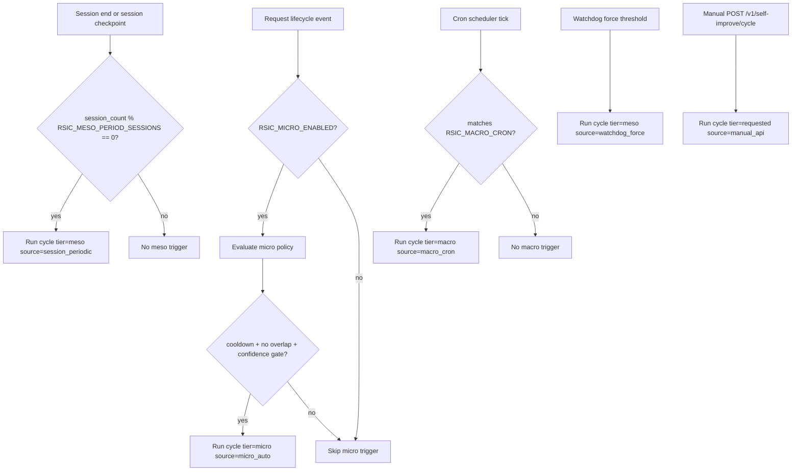
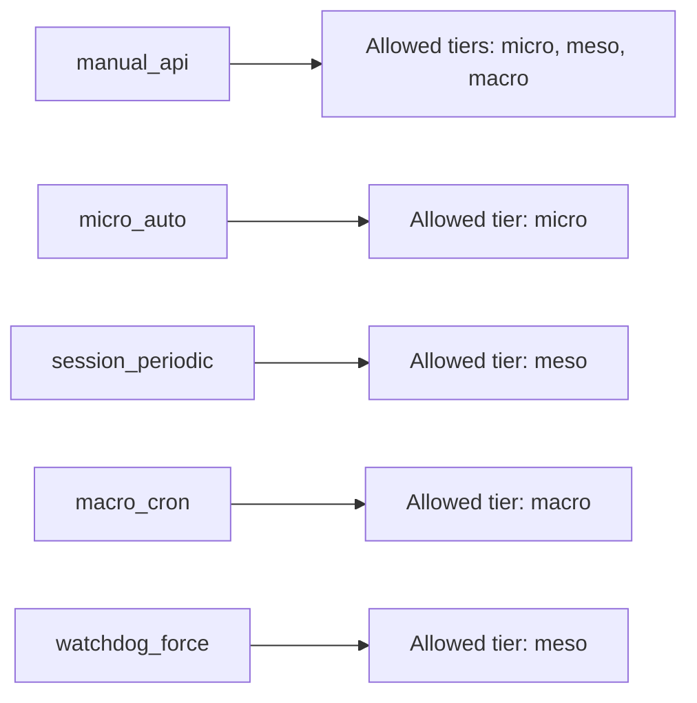
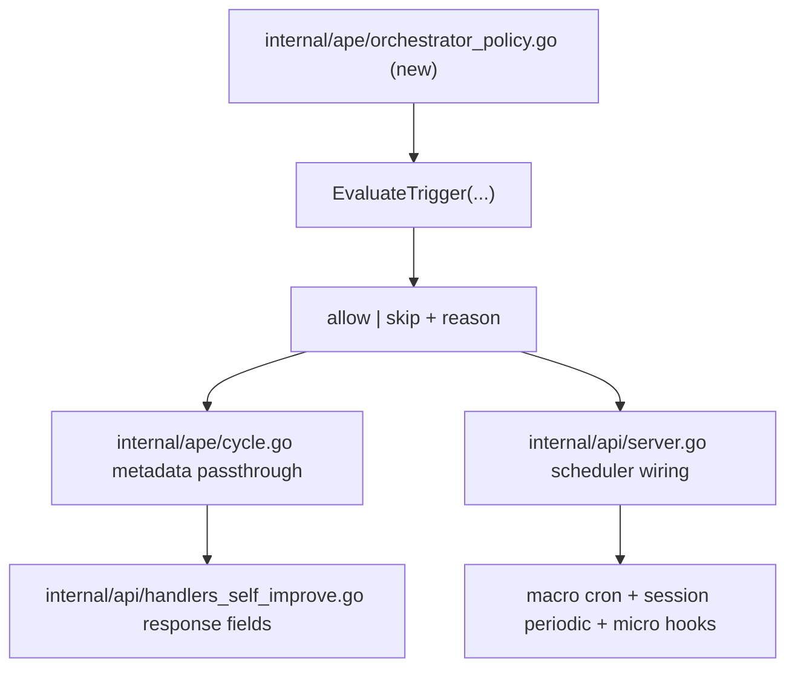
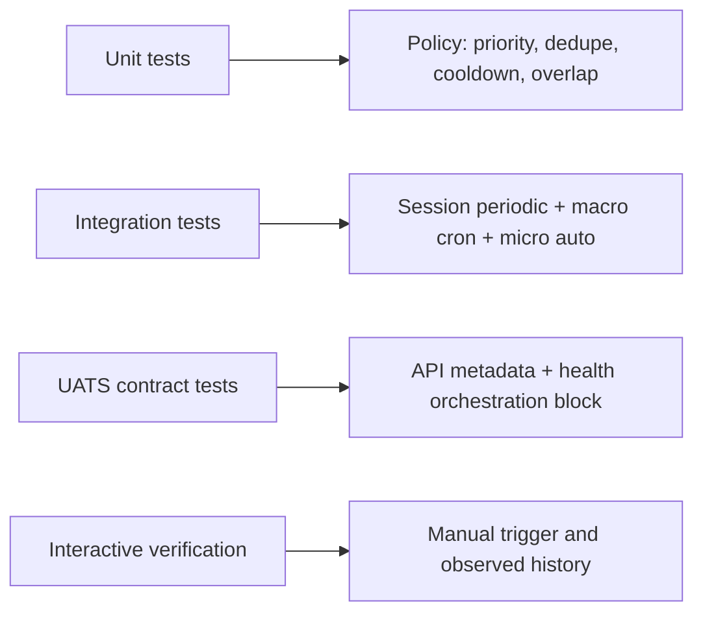

# Phase 87: RSIC Orchestration Activation

**Status**: Complete
**Priority**: Critical
**Date**: 2026-01-22
**Depends On**: `docs/development/RSIC_GAP_ANALYSIS.md`
**Related Handoff Section**: `AGENT_HANDOFF.md` -> `RSIC Critical Infrastructure Gap Analysis (Addendum)`

---

## Purpose

Phase 87 activates RSIC orchestration knobs that are already present in config but not fully operational, and standardizes trigger semantics so every cycle has a deterministic source, policy, and audit trail.

This phase is orchestration-only:

- It **does not** introduce Phase 88 safety-policy enforcement changes.
- It **does not** introduce Phase 89 persistence changes.
- It **does** make trigger behavior observable and test-gated.

---

## Scope

- Activate session-driven meso triggers from `RSIC_MESO_PERIOD_SESSIONS`.
- Activate macro cron triggers from `RSIC_MACRO_CRON`.
- Activate micro auto-trigger policy behind `RSIC_MICRO_ENABLED`.
- Add trigger-source visibility to RSIC API surfaces and outcomes.
- Add idempotency, cooldown, and overlap guards to prevent cycle storms.

---

## Design Goals

- Keep existing RSIC endpoints compatible (`/v1/self-improve/*`).
- Add trigger metadata without breaking current consumers.
- Provide deterministic trigger priority and conflict handling.
- Make orchestration state visible via `GET /v1/self-improve/health`.
- Make behavior testable in unit, integration, and UATS layers.

---

## Orchestration Model



---

## Trigger Source Contract

Every cycle execution must carry a `trigger_source` and `trigger_id`.



### Required Metadata

- `trigger_source`: `manual_api | micro_auto | session_periodic | macro_cron | watchdog_force`
- `trigger_id`: stable ID for dedupe window (format: `<source>:<space_id>:<bucket>`)
- `triggered_at`: UTC timestamp
- `policy_version`: starts at `phase87-v1`

### Deterministic Priority

If multiple triggers are eligible at the same time for the same `space_id`:

1. `watchdog_force`
2. `manual_api`
3. `macro_cron`
4. `session_periodic`
5. `micro_auto`

Lower-priority triggers are skipped when an equal-or-higher priority cycle is running or started within cooldown.

---

## Trigger Policy Semantics

### Global Guards

- **No overlap by tier+space**: one active cycle per `{space_id, tier}`.
- **Cooldown per source**: default 5 minutes (`RSIC_TRIGGER_COOLDOWN_SEC`, new).
- **Dedupe window**: repeated identical `trigger_id` ignored for 10 minutes (`RSIC_TRIGGER_DEDUPE_SEC`, new).

### Micro Auto Policy

Micro auto execution is eligible only when all are true:

- `RSIC_MICRO_ENABLED=true`
- no active micro cycle for `space_id`
- cooldown satisfied for `micro_auto`
- optional request quality hints exceed threshold (initially reuse `RSIC_MIN_CONFIDENCE` from assess stage)

### Session Periodic Meso Policy

- Maintain `session_counter` per `{space_id}`.
- On session checkpoint/end: increment counter.
- If `session_counter % RSIC_MESO_PERIOD_SESSIONS == 0`, trigger meso cycle.
- Counter and last trigger snapshot are visible in health payload.

### Macro Cron Policy

- Run scheduler using `RSIC_MACRO_CRON`.
- On tick, schedule `tier=macro` for each eligible active space.
- Skip spaces with active macro run or within macro cooldown.

### Watchdog Force Policy (existing behavior, normalized metadata)

- Existing watchdog trigger remains.
- Trigger must now emit source metadata as `watchdog_force`.

---

## API Design (Backward Compatible)

### POST `/v1/self-improve/cycle` (extended)

Existing request remains valid:

```json
{
  "space_id": "mdemg-dev",
  "tier": "meso"
}
```

New optional request fields:

```json
{
  "space_id": "mdemg-dev",
  "tier": "meso",
  "trigger_source": "manual_api",
  "idempotency_key": "manual:mdemg-dev:2026-01-22T10:30"
}
```

Response adds orchestration fields:

```json
{
  "cycle_id": "rsic-meso-abc12345",
  "tier": "meso",
  "space_id": "mdemg-dev",
  "actions_executed": 2,
  "success_count": 2,
  "failed_count": 0,
  "trigger_source": "manual_api",
  "trigger_id": "manual_api:mdemg-dev:2026-01-22T10:30",
  "triggered_at": "2026-01-22T10:30:12Z",
  "policy_version": "phase87-v1"
}
```

### GET `/v1/self-improve/health` (extended)

Add orchestration status block:

```json
{
  "status": "ok",
  "active_tasks": 0,
  "watchdog": {},
  "orchestration": {
    "micro_enabled": false,
    "meso_period_sessions": 10,
    "macro_cron": "0 3 * * 0",
    "cooldown_sec": 300,
    "dedupe_sec": 600,
    "last_triggers": [
      {
        "space_id": "mdemg-dev",
        "tier": "meso",
        "trigger_source": "watchdog_force",
        "triggered_at": "2026-01-22T09:10:00Z"
      }
    ],
    "session_counters": [
      {
        "space_id": "mdemg-dev",
        "count": 17,
        "next_meso_at": 20
      }
    ],
    "scheduler": {
      "macro_next_run": "2026-01-23T03:00:00Z",
      "enabled": true
    }
  }
}
```

### GET `/v1/self-improve/history` (optional query extension)

Optional filters:

- `trigger_source`
- `tier`
- `space_id`

This allows verification of trigger distribution in tests and operations.

---

## Internal Interfaces and Implementation Plan



### Planned File-Level Changes

- `internal/ape/types_rsic.go`
  - add `TriggerSource` enum.
  - add trigger metadata fields to `CycleOutcome`.
- `internal/ape/cycle.go`
  - accept `trigger_source` and `trigger_id` context/options.
  - propagate metadata into outcome/history.
- `internal/ape` (new file, recommended: `orchestration_policy.go`)
  - source priority resolution.
  - dedupe/cooldown/overlap logic.
- `internal/api/handlers_self_improve.go`
  - support optional `trigger_source` and `idempotency_key` on manual endpoint.
  - include orchestration metadata in response.
- `internal/api/server.go`
  - activate macro cron scheduler wiring.
  - wire session-periodic trigger calls at session lifecycle hook points.
  - wire micro policy checks where request/session events are tracked.
- `internal/config/config.go`
  - add `RSIC_TRIGGER_COOLDOWN_SEC` and `RSIC_TRIGGER_DEDUPE_SEC`.

---

## Acceptance Test Package



### Unit Tests (Go)

- `TestTriggerPriority_ResolvesDeterministically`
- `TestTriggerDedupe_SkipsDuplicateWithinWindow`
- `TestTriggerCooldown_EnforcesPerSourceCooldown`
- `TestTriggerOverlap_SkipsWhenTierSpaceActive`
- `TestTriggerSourceTierValidation_RejectsInvalidPair`

### Integration Tests (Go)

- `TestSessionPeriodicMeso_TriggersAtConfiguredInterval`
- `TestMacroCronScheduler_EmitsMacroTrigger`
- `TestMicroAutoPolicy_RespectsEnableFlagAndCooldown`
- `TestWatchdogForce_MetadataMappedToTriggerSource`
- `TestHistoryIncludesTriggerMetadata`

### UATS Specs (new/updated)

- Update `self_improve_cycle.uats.json`
  - assert `trigger_source`, `trigger_id`, `policy_version`.
- Update `self_improve_health.uats.json`
  - assert `orchestration` block shape.
- Add `self_improve_history_filter_trigger_source.uats.json`
  - assert filtering works and response shape is stable.
- Add `self_improve_cycle_idempotency.uats.json`
  - same idempotency key returns deduped behavior (non-duplicating cycle start).

### Draft UATS Artifacts (Prepared)

The following implementation-ready draft specs are staged outside the active UATS suite:

- `docs/api/api-spec/uats/drafts/self_improve_cycle_trigger_metadata.phase87.uats.json`
- `docs/api/api-spec/uats/drafts/self_improve_health_orchestration.phase87.uats.json`
- `docs/api/api-spec/uats/drafts/self_improve_history_trigger_source_filter.phase87.uats.json`
- `docs/api/api-spec/uats/drafts/self_improve_cycle_idempotency.phase87.uats.json`

### Interactive Testing Checklist (Required Before Marking Complete)

- Start server with:
  - `RSIC_MICRO_ENABLED=true`
  - `RSIC_MESO_PERIOD_SESSIONS=2`
  - `RSIC_MACRO_CRON=*/5 * * * *`
- Trigger manual cycle and verify `trigger_source=manual_api`.
- Simulate session checkpoints and verify meso trigger every second session.
- Wait for cron window and verify macro trigger recorded in history.
- Confirm `GET /v1/self-improve/health` shows orchestration status and next cron run.

---

## Acceptance Criteria

- [ ] `RSIC_MESO_PERIOD_SESSIONS` drives session-based meso triggers in runtime.
- [ ] `RSIC_MACRO_CRON` drives macro scheduling in runtime.
- [ ] `RSIC_MICRO_ENABLED` gates micro auto-trigger behavior in runtime.
- [ ] Every cycle outcome has `trigger_source`, `trigger_id`, `triggered_at`, `policy_version`.
- [ ] `GET /v1/self-improve/health` exposes orchestration state and scheduler status.
- [ ] Dedupe/cooldown/overlap guardrails prevent cycle storms.
- [ ] Unit + integration + UATS coverage exists for orchestration semantics.
- [ ] Interactive testing is completed and verified by user before status is set to Complete.

---

## Rollout and Status Policy

Phase 87 status progression:

- `In Review` -> design approved.
- `Awaiting Testing` -> implementation merged, interactive testing pending.
- `Complete` -> only after user-verified interactive behavior.

Current phase status: **Complete**.
