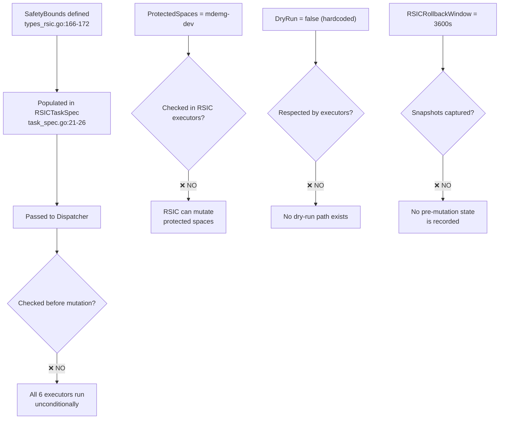
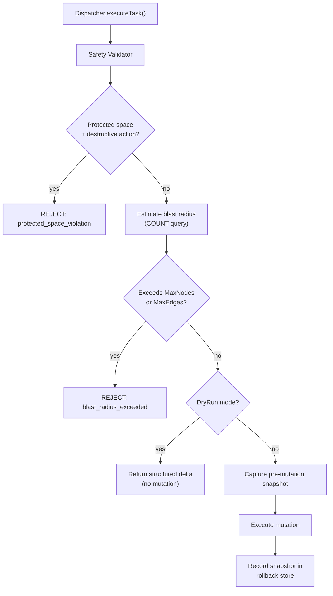
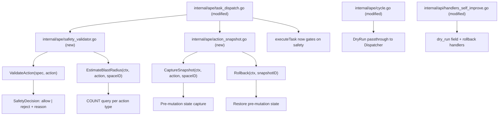
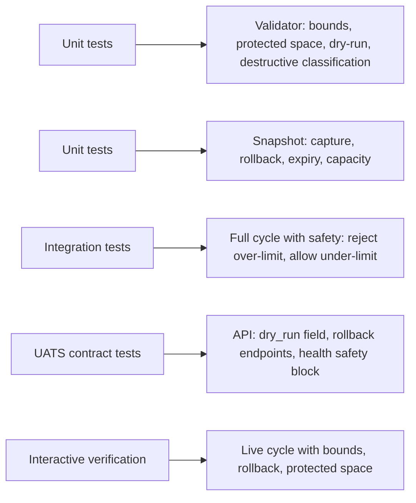

# Phase 88: RSIC Safety and Policy Enforcement

**Status**: In Review
**Priority**: Critical
**Date**: 2026-02-16
**Depends On**: Phase 87 (`docs/specs/phase87-rsic-orchestration-activation.md`)
**Related Handoff Section**: `AGENT_HANDOFF.md` → `RSIC Hardening Phases`
**Gap References**: `docs/development/RSIC_GAP_ANALYSIS.md` — Gap #2 (Safety Bounds), partial Gap #3 (DryRun/ProtectedSpaces)

---

## Purpose

Phase 88 activates the safety infrastructure that Phase 60b declared but never wired into the execution layer. Today, `SafetyBounds` (max nodes, max edges, protected spaces, dry-run) is populated in every `RSICTaskSpec` but **no executor checks it before mutating Neo4j**. The rollback window config exists but captures no snapshots.

This phase is safety-only:

- It **does not** introduce Phase 89 persistence changes (calibration/signal state to Neo4j).
- It **does not** introduce Phase 90 conformance CI changes.
- It **does** make every RSIC mutation blast-radius–bounded, dry-run–capable, protected-space–aware, and snapshot-backed within the rollback window.

---

## Scope

- Wire `SafetyBounds` enforcement into the Dispatcher before every mutation executor.
- Add blast-radius estimation (COUNT queries) before destructive actions.
- Enforce `ProtectedSpaces` policy — block destructive actions, allow constructive/maintenance.
- Implement deterministic dry-run mode with structured deltas per action type.
- Capture pre-mutation snapshots tied to `RSIC_ROLLBACK_WINDOW`.
- Add rollback API endpoint to revert the most recent RSIC action.
- Surface safety status in the health endpoint.

---

## Design Goals

- Every mutation executor must pass through a safety validator before writing.
- Blast-radius estimation must use lightweight COUNT queries, not full data fetches.
- Dry-run mode must return the exact delta that would occur, without side effects.
- Protected-space enforcement must be consistent with existing API-level protections (`handlers.go:IsProtectedSpace`).
- Rollback must be best-effort (capture what's feasible, not full transactional guarantees).
- All safety decisions must be auditable in cycle outcomes and history.
- Backward compatible: existing cycle requests without `dry_run` behave identically (safety enforced silently).

---

## Current State (Why This Is Critical)



### Action Classification

| Action | Executor | Mutation Type | Risk |
|--------|----------|---------------|------|
| `prune_decayed_edges` | `executePruneDecayed` | Edge deletion | High — irreversible data loss |
| `prune_excess_edges` | `executePruneExcess` | Edge deletion | High — irreversible data loss |
| `tombstone_stale` | `executeTombstoneStale` | Node archive (property set) | Medium — reversible but disruptive |
| `trigger_consolidation` | `executeConsolidation` | Node/edge creation | Low — additive only |
| `graduate_volatile` | `executeGraduateVolatile` | Node property update | Low — promotion, reversible |
| `refresh_stale_edges` | `executeRefreshStaleEdges` | Edge property update | Low — timestamp bump only |

---

## Safety Enforcement Model



### Action Safety Policy

| Action | Destructive? | Protected Space Policy | Blast Radius Check |
|--------|-------------|----------------------|-------------------|
| `prune_decayed_edges` | Yes | Block on protected spaces | MaxEdgesAffected |
| `prune_excess_edges` | Yes | Block on protected spaces | MaxEdgesAffected |
| `tombstone_stale` | Yes | Block on protected spaces | MaxNodesAffected |
| `trigger_consolidation` | No (additive) | Allow | Skip (constructive) |
| `graduate_volatile` | No (promotion) | Allow | Skip (constructive) |
| `refresh_stale_edges` | No (maintenance) | Allow | Skip (maintenance) |

### Blast Radius Estimation Queries

Each destructive action gets a paired COUNT query executed before the mutation:

- **prune_decayed_edges**: `MATCH ()-[e:CO_ACTIVATED_WITH|ASSOCIATED_WITH {space_id: $spaceId}] WHERE e.weight < $threshold RETURN count(e) AS affected`
- **prune_excess_edges**: `MATCH (n:MemoryNode {space_id: $spaceId})-[e:CO_ACTIVATED_WITH]-() WITH n, e ORDER BY e.weight ASC WITH n, collect(e) AS edges WHERE size(edges) > $maxPerNode RETURN sum(size(edges) - $maxPerNode) AS affected`
- **tombstone_stale**: `MATCH (n:MemoryNode {space_id: $spaceId}) WHERE n.updated_at < $cutoff AND NOT n.archived RETURN count(n) AS affected`

If `affected > SafetyBounds.MaxNodesAffected` (or `MaxEdgesAffected`), the action is rejected with a structured reason.

---

## Dry-Run Mode

### Request Extension

`POST /v1/self-improve/cycle` gains an optional `dry_run` field:

```json
{
  "space_id": "mdemg-dev",
  "tier": "meso",
  "dry_run": true
}
```

### Dry-Run Response

When `dry_run: true`, the full cycle runs through Assess → Reflect → Plan → Spec, then each action is estimated but not executed:

```json
{
  "cycle_id": "rsic-meso-abc12345",
  "tier": "meso",
  "space_id": "mdemg-dev",
  "dry_run": true,
  "actions_planned": 3,
  "actions_executed": 0,
  "trigger_source": "manual_api",
  "policy_version": "phase87-v1",
  "safety_version": "phase88-v1",
  "deltas": [
    {
      "action": "prune_decayed_edges",
      "would_execute": true,
      "estimated_affected": 47,
      "safety_limit": 100,
      "within_bounds": true,
      "protected_space_blocked": false
    },
    {
      "action": "tombstone_stale",
      "would_execute": true,
      "estimated_affected": 12,
      "safety_limit": 50,
      "within_bounds": true,
      "protected_space_blocked": false
    },
    {
      "action": "trigger_consolidation",
      "would_execute": true,
      "estimated_affected": 0,
      "safety_limit": -1,
      "within_bounds": true,
      "protected_space_blocked": false,
      "note": "constructive action, no blast-radius limit"
    }
  ]
}
```

When a destructive action targets a protected space:

```json
{
  "action": "prune_decayed_edges",
  "would_execute": false,
  "estimated_affected": 47,
  "safety_limit": 100,
  "within_bounds": true,
  "protected_space_blocked": true,
  "rejection_reason": "space mdemg-dev is protected from destructive RSIC actions"
}
```

---

## Rollback Model

### Snapshot Capture

Before each mutation, the Dispatcher captures:

```go
type ActionSnapshot struct {
    SnapshotID   string            `json:"snapshot_id"`
    CycleID      string            `json:"cycle_id"`
    Action       string            `json:"action"`
    SpaceID      string            `json:"space_id"`
    CapturedAt   time.Time         `json:"captured_at"`
    AffectedIDs  []string          `json:"affected_ids"`
    PreState     []NodeEdgeState   `json:"pre_state"`
    Reversible   bool              `json:"reversible"`
    ExpiresAt    time.Time         `json:"expires_at"`
}
```

**Capture strategy by action:**

| Action | Capture Method | Reversibility |
|--------|---------------|---------------|
| `prune_decayed_edges` | Edge IDs + weights + timestamps before deletion | Full — can recreate edges |
| `prune_excess_edges` | Edge IDs + weights + endpoints before deletion | Full — can recreate edges |
| `tombstone_stale` | Node IDs + `archived` flag before update | Full — unset archived flag |
| `trigger_consolidation` | Created node/edge IDs after execution | Partial — can delete created items |
| `graduate_volatile` | Node IDs + `layer` before promotion | Full — can revert layer |
| `refresh_stale_edges` | Edge IDs + `updated_at` before update | Full — can restore timestamps |

### Snapshot Storage

- In-memory map keyed by `snapshot_id` (consistent with Phase 87's in-memory orchestration state).
- Snapshots expire after `RSIC_ROLLBACK_WINDOW` seconds (default: 3600).
- Maximum 50 snapshots retained (oldest evicted on overflow).
- Periodic cleanup via existing `CleanupExpired()` pattern from orchestration policy.

### Rollback API

**POST `/v1/self-improve/rollback`**

Request:

```json
{
  "snapshot_id": "snap-abc12345",
  "space_id": "mdemg-dev"
}
```

Response (success):

```json
{
  "rolled_back": true,
  "snapshot_id": "snap-abc12345",
  "action": "prune_decayed_edges",
  "restored_count": 47,
  "rolled_back_at": "2026-02-16T14:30:00Z"
}
```

Response (expired):

```json
{
  "rolled_back": false,
  "error": "snapshot expired or not found",
  "rollback_window_sec": 3600
}
```

**GET `/v1/self-improve/rollback`** (list available snapshots)

Response:

```json
{
  "snapshots": [
    {
      "snapshot_id": "snap-abc12345",
      "cycle_id": "rsic-meso-abc12345",
      "action": "prune_decayed_edges",
      "space_id": "mdemg-dev",
      "captured_at": "2026-02-16T14:00:00Z",
      "expires_at": "2026-02-16T15:00:00Z",
      "affected_count": 47,
      "reversible": true
    }
  ],
  "count": 1,
  "rollback_window_sec": 3600
}
```

---

## Health Endpoint Extension

**GET `/v1/self-improve/health`** adds `safety` block:

```json
{
  "status": "ok",
  "active_tasks": 0,
  "watchdog": {},
  "orchestration": {},
  "safety": {
    "enforcement_active": true,
    "safety_version": "phase88-v1",
    "bounds": {
      "max_nodes_affected": 50,
      "max_edges_affected": 100,
      "protected_spaces": ["mdemg-dev"]
    },
    "rollback": {
      "window_sec": 3600,
      "snapshots_held": 3,
      "oldest_snapshot_age_sec": 1200
    },
    "recent_rejections": [
      {
        "action": "prune_decayed_edges",
        "reason": "blast_radius_exceeded",
        "estimated": 150,
        "limit": 100,
        "rejected_at": "2026-02-16T13:45:00Z"
      }
    ]
  }
}
```

---

## Cycle Outcome Extension

Every `CycleOutcome` gains safety audit fields (all `omitempty` for backward compat):

```json
{
  "cycle_id": "rsic-meso-abc12345",
  "tier": "meso",
  "space_id": "mdemg-dev",
  "actions_executed": 2,
  "success_count": 2,
  "failed_count": 0,
  "trigger_source": "manual_api",
  "policy_version": "phase87-v1",
  "safety_version": "phase88-v1",
  "safety_summary": {
    "actions_checked": 3,
    "actions_allowed": 2,
    "actions_rejected": 1,
    "rejections": [
      {
        "action": "prune_decayed_edges",
        "reason": "blast_radius_exceeded",
        "estimated_affected": 150,
        "limit": 100
      }
    ],
    "snapshots_created": 2
  }
}
```

---

## Internal Interfaces and Implementation Plan



### Planned File-Level Changes

- **`internal/ape/safety_validator.go`** (new, ~200 lines)
  - `SafetyDecision` struct (Allowed, Reason, EstimatedAffected, Limit).
  - `ActionDelta` struct for dry-run deltas.
  - `SafetyValidator` struct with config reference and Neo4j session for COUNT queries.
  - `NewSafetyValidator(cfg, neo4jDriver)` constructor.
  - `ValidateAction(ctx, spec *RSICTaskSpec, action string, spaceID string)` → SafetyDecision.
  - `EstimateBlastRadius(ctx, action string, spaceID string)` → (int, error).
  - `IsDestructiveAction(action string)` → bool.
  - `BuildDelta(ctx, spec, action, spaceID)` → ActionDelta (for dry-run).

- **`internal/ape/action_snapshot.go`** (new, ~250 lines)
  - `ActionSnapshot` struct (SnapshotID, CycleID, Action, SpaceID, AffectedIDs, PreState, ExpiresAt).
  - `NodeEdgeState` struct (ID, Type, Properties map).
  - `SnapshotStore` struct with mutex-protected map, max capacity, TTL from config.
  - `NewSnapshotStore(rollbackWindowSec int)` constructor.
  - `CaptureSnapshot(ctx, neo4jSession, cycleID, action, spaceID)` → (*ActionSnapshot, error).
  - `Rollback(ctx, neo4jSession, snapshotID)` → (*RollbackResult, error).
  - `ListSnapshots()` → []ActionSnapshot.
  - `CleanupExpired()` — evict expired entries.
  - Per-action capture helpers: `captureEdgeState`, `captureNodeState`.

- **`internal/ape/types_rsic.go`** (modified)
  - Add `SafetyVersion = "phase88-v1"` const.
  - Add `SafetySummary` struct to `CycleOutcome`.
  - Add `SafetyRejection` struct.
  - Add `DestructiveActions` set (map of action → bool).

- **`internal/ape/task_dispatch.go`** (modified)
  - Add `safetyValidator *SafetyValidator` and `snapshotStore *SnapshotStore` fields.
  - Add `SetSafetyValidator()` and `SetSnapshotStore()` setters.
  - Modify `executeTask()`: call `ValidateAction` before each action executor.
  - On rejection: record in task report, skip executor, continue to next action.
  - On allow + not dry-run: call `CaptureSnapshot`, then execute, then store snapshot.
  - On allow + dry-run: call `BuildDelta`, accumulate deltas, skip executor.
  - Propagate `SafetySummary` back through cycle outcome.

- **`internal/ape/cycle.go`** (modified)
  - Extend `RunCycleOpts` with `DryRun bool`.
  - When dry-run: run Assess→Reflect→Plan→Spec normally, then pass dry-run flag to Dispatcher.
  - Collect deltas from Dispatcher, return in outcome.
  - Add `SafetyVersion` and `SafetySummary` to outcome population.

- **`internal/api/handlers_self_improve.go`** (modified)
  - `handleSelfImproveCycle`: parse `dry_run` from request, pass to `RunCycleOpts`.
  - New `handleSelfImproveRollback` (POST): parse snapshot_id, delegate to SnapshotStore.
  - New `handleSelfImproveRollbackList` (GET): list available snapshots.
  - `handleSelfImproveHealth`: add `safety` block from validator/snapshot state.

- **`internal/api/server.go`** (modified)
  - Create `SafetyValidator` and `SnapshotStore` after RSIC Dispatcher init.
  - Wire `SetSafetyValidator()` and `SetSnapshotStore()` on Dispatcher.
  - Register rollback route: `POST /v1/self-improve/rollback`, `GET /v1/self-improve/rollback`.
  - Add `snapshotStore` to Server struct for health endpoint access.

---

## Acceptance Test Package



### Unit Tests (Go)

- `TestIsDestructiveAction_ClassifiesCorrectly`
- `TestValidateAction_BlocksProtectedSpaceDestructive`
- `TestValidateAction_AllowsProtectedSpaceConstructive`
- `TestEstimateBlastRadius_ReturnsCount`
- `TestValidateAction_RejectsOverLimit`
- `TestValidateAction_AllowsUnderLimit`
- `TestBuildDelta_ReturnsStructuredDelta`
- `TestSnapshotCapture_StoresPreMutationState`
- `TestSnapshotRollback_RestoresState`
- `TestSnapshotExpiry_RemovesAfterWindow`
- `TestSnapshotCapacity_EvictsOldest`
- `TestDryRunCycle_ExecutesNoMutations`
- `TestSafetySummary_AccumulatesRejections`
- `TestSafetyVersion_IncludedInOutcome`

### Integration Tests (Go)

- `TestFullCycleWithSafety_RejectsOverLimit`
- `TestFullCycleWithSafety_AllowsUnderLimit`
- `TestDryRunCycle_ReturnsDeltas`
- `TestProtectedSpaceCycle_BlocksDestructiveOnly`
- `TestRollbackAfterPrune_RestoresEdges`
- `TestRollbackExpired_ReturnsError`

### UATS Specs (new/updated)

- Update `self_improve_cycle.uats.json`
  - Add variant: `dry_run=true` returns deltas, `actions_executed=0`.
  - Assert `safety_version` field present in response.
- Update `self_improve_health.uats.json`
  - Assert `safety` block shape (enforcement_active, bounds, rollback).
- Add `self_improve_rollback_list.phase88.uats.json`
  - Assert GET returns snapshots array shape.
- Add `self_improve_cycle_dry_run.phase88.uats.json`
  - Assert dry-run response shape with deltas array.

### Draft UATS Artifacts (To Prepare)

- `docs/api/api-spec/uats/drafts/self_improve_cycle_dry_run.phase88.uats.json`
- `docs/api/api-spec/uats/drafts/self_improve_rollback_list.phase88.uats.json`
- `docs/api/api-spec/uats/drafts/self_improve_health_safety.phase88.uats.json`

---

## Interactive Testing Checklist (Required Before Marking Complete)

- Start server with default config (safety enforcement active by default).
- Trigger manual cycle on non-protected space and verify `safety_version` in response.
- Trigger dry-run cycle (`dry_run: true`) and verify deltas array with no mutations.
- Trigger cycle that would exceed blast radius and verify rejection in safety_summary.
- Trigger destructive cycle on `mdemg-dev` and verify protected-space rejection.
- Trigger constructive cycle (consolidation) on `mdemg-dev` and verify it succeeds.
- Check `GET /v1/self-improve/health` for safety block with bounds and rollback info.
- Execute a prune cycle, then `GET /v1/self-improve/rollback` to list snapshots.
- Execute `POST /v1/self-improve/rollback` with snapshot ID and verify restoration.
- Wait for rollback window to expire and verify snapshot is cleaned up.

---

## Acceptance Criteria

- [ ] Every mutation executor in `task_dispatch.go` passes through `SafetyValidator` before writing.
- [ ] Destructive actions on protected spaces are rejected with clear reason.
- [ ] Constructive/maintenance actions on protected spaces are allowed.
- [ ] Blast-radius estimation rejects actions exceeding `MaxNodesAffected` / `MaxEdgesAffected`.
- [ ] `dry_run: true` on `/v1/self-improve/cycle` returns structured deltas with zero mutations.
- [ ] Pre-mutation snapshots are captured for every executed action.
- [ ] `POST /v1/self-improve/rollback` reverts the specified snapshot's mutations.
- [ ] `GET /v1/self-improve/rollback` lists available snapshots within rollback window.
- [ ] Snapshots expire after `RSIC_ROLLBACK_WINDOW` seconds.
- [ ] `GET /v1/self-improve/health` includes `safety` block with bounds, rollback state, recent rejections.
- [ ] Every cycle outcome includes `safety_version` and `safety_summary`.
- [ ] Unit + integration + UATS coverage exists for safety enforcement.
- [ ] Interactive testing is completed and verified by user before status is set to Complete.

---

## Rollout and Status Policy

Phase 88 status progression:

- `In Review` → design approved.
- `Awaiting Testing` → implementation merged, interactive testing pending.
- `Complete` → only after user-verified interactive behavior.

Current phase status: **In Review**.
